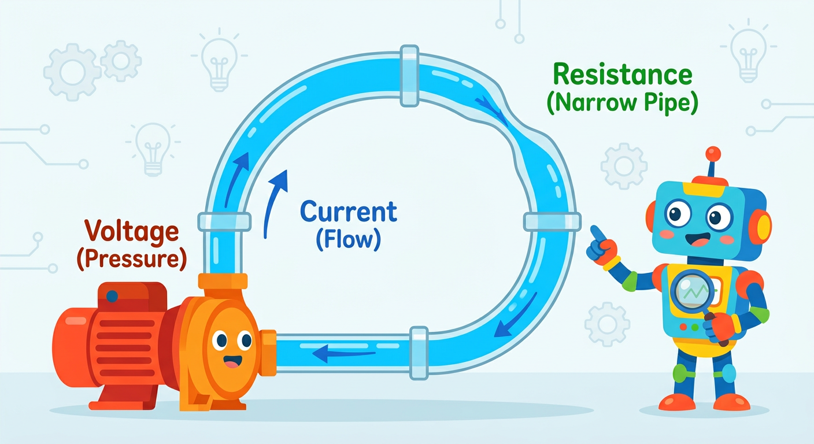
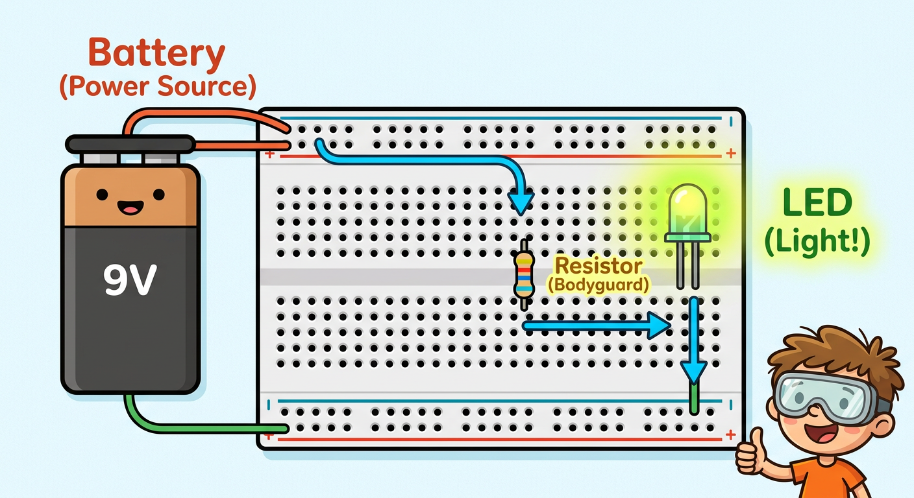
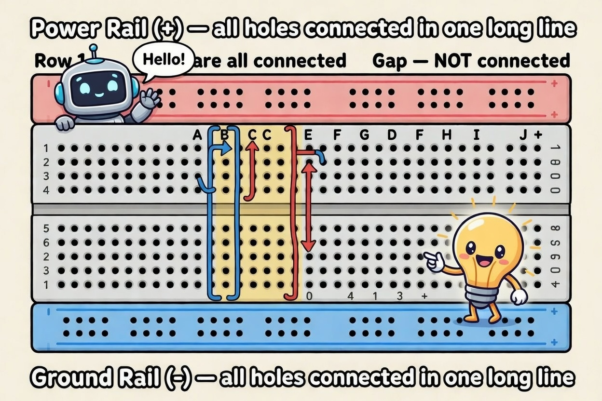
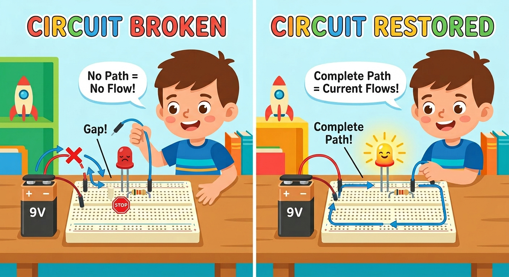
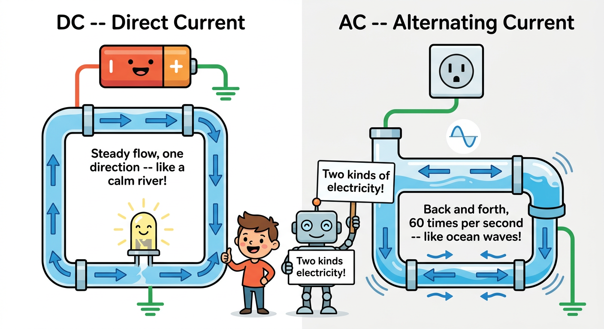

# Lesson 1: What is Electricity?

**Module:** 1 -- Electronic Components Basics
**Difficulty:** Star-1 Beginner
**Session Time:** 45--53 minutes
**Age:** 6--12 years
**XP Available:** 250 XP

---

## Your Mission Today

Welcome, Circuit Explorer! You are about to go on an incredible journey into the invisible world of ELECTRICITY. Your very first mission: make a tiny light glow using nothing but a battery, a wire, and a component called an LED. Are you ready? Let's go!

---

## Learning Objectives

By the end of this lesson, you will be able to:
- Explain electricity as the flow of tiny particles called electrons
- Know what voltage, current, and circuit mean -- in your own words
- Successfully light up your very first LED
- Understand why a complete loop (circuit) is needed

---

## What You Need

| Item | Qty |
|------|-----|
| 9V battery | 1 |
| 9V battery clip with wires | 1 |
| LED (any color) | 1 |
| 330-ohm resistor | 1 |
| Jumper wires | 2 |
| Breadboard | 1 |
| A piece of wire (or foil strip) | 1 |

---

## How to Teach This Lesson

### Step 1: Hook -- The Magic Light (5 min)

**Before explaining anything**, hand the kid a battery, an LED, and a wire.

Say:
> "Can you make this LED light up? You can only use what is in your hand."

Let them experiment. They might:
- Touch the LED legs to the battery terminals (works! but not safe long-term without a resistor)
- Get confused about which leg is which

**The goal is curiosity first.** After a minute or two, guide them gently.

> "You just made electricity flow! Let us figure out why that worked -- and how to do it safely."

**Award: +20 XP for trying the experiment, even if it did not work the first time!**

---

### Step 2: The Water Analogy (8 min)



Draw this on paper or a whiteboard together:

```
  +------------------------------+
  |                              |
 [Pump]  --water-->  [Narrow pipe]  -->  [Water wheel]
  |                              |
  +------------------------------+

  Pump        = Battery
  Water       = Electrons (electricity)
  Water pressure = Voltage (V)
  Water flow rate = Current (A)
  Narrow pipe = Resistor (slows flow)
  Water wheel = LED / component doing work
  Full loop   = Circuit
```


**Ask the kids:**
- "What happens if we cut the pipe?" (Water stops. Circuit is broken. LED goes off.)
- "What if we make the pipe really narrow?" (Less water flows. Less current. Dimmer LED.)
- "What if we have a really powerful pump?" (More pressure. More current. Brighter LED... or it breaks!)

**Key words to introduce:**

| Word | Kid-Friendly Definition |
|------|------------------------|
| **Voltage (V)** | How hard the battery "pushes" electricity |
| **Current (A)** | How much electricity is actually flowing |
| **Resistance (ohms)** | Something that slows the electricity down |
| **Circuit** | A complete loop -- electricity must go in a circle |



**Award: +20 XP for answering at least 2 of the 3 questions!**

---

### Step 3: The Circuit on a Breadboard (15 min)

**First, explain the breadboard:**



```
  Breadboard top view:

  + + + + + + + + + +    <-- Power rail (+ connected along the whole row)
  - - - - - - - - - -    <-- Ground rail (- connected along the whole row)

  a b c d e   f g h i j
  [ ][ ][ ][ ][ ]   [ ][ ][ ][ ][ ]   <-- Row 1 (a through e connected together)
  [ ][ ][ ][ ][ ]   [ ][ ][ ][ ][ ]   <-- Row 2
  [ ][ ][ ][ ][ ]   [ ][ ][ ][ ][ ]   <-- Row 3
  ...
```

Say:
> "The breadboard is like a pegboard where wires and components snap in. Connected holes share electricity -- like water pipes that are joined."

**Build the circuit together, step by step:**

```
Circuit diagram:

  9V (+) ---- [330-ohm resistor] ---- LED (+leg) ---- LED (-leg) ---- 9V (-)

  On breadboard:
  1. Battery clip: red wire to + rail, black wire to - rail
  2. Resistor: one leg in + rail, other leg in row 5
  3. LED: long leg (anode +) in row 5, short leg (cathode -) in row 7
  4. Wire: row 7 to - rail
```


**Go slowly.** Have the kid place each component themselves. Describe what you are doing as you go:
> "This resistor is like the narrow pipe -- it protects the LED from getting too much electricity."

**Power it on together!**

When the LED lights up: celebrate! High five! Take a photo.

**Award: +50 XP for building your first circuit!**

---

### Step 4: Experiment Time (10 min)

Now let them explore:

**Experiment A -- Break the Circuit**
> "Pull out the resistor. What happens?"
(LED goes off. Circuit is broken.)

**Experiment B -- Reverse the LED**
> "Flip the LED around. What happens?"
(LED goes off. Electricity can only flow one way through an LED!)
> "This is called **polarity**. The LED is picky about which direction electricity flows."

**Experiment C -- The Missing Wire**
Remove one jumper wire.
> "Why did it stop working?"
(The loop is broken. Electricity has nowhere to go.)

**Experiment D -- Touch the wire to complete the circuit**
Remove one wire and have the kid hold both bare ends together with their fingers.
> "You ARE part of the circuit right now! Electricity is flowing through you (a tiny, tiny, completely safe amount)."



**Award: +30 XP for completing at least 3 of the 4 experiments!**

---

### Step 5: Two Kinds of Electricity -- AC and DC (5--8 min)

Now that you have built a circuit with a battery, here is a cool secret: **there are actually TWO kinds of electricity!**

**Kind 1: DC -- Direct Current**

Remember our water analogy? Your battery is like a pump that pushes water in ONE direction, all the time. It never stops. It never reverses. That is **Direct Current** -- or **DC** for short.

> "The battery you just used makes DC. The electrons march in one direction, like a line of ants carrying crumbs back to the nest -- always the same way!"

> 🤯 **Fun Fact:** The “Father of DC electricity” is generally considered to be: **⚡ Thomas Edison** 

---

**Kind 2: AC -- Alternating Current**

Now imagine a different kind of pump. Instead of pushing water one way, it pushes forward... then pulls backward... then pushes forward... then pulls backward -- over and over, really fast! The water sloshes back and forth inside the pipe.

That is **Alternating Current** -- or **AC**. The electricity in your wall outlets at home is AC!

> "How fast does it switch? About **60 times every single second!** (In some countries, 50 times per second.) That is so fast you could never see it -- but your lights and appliances do not mind at all!"

> 🤯 **Fun Fact:** The “Father of AC (Alternating Current)” is generally considered to be: **⚡ Nikola Tesla** 

---



Here is what DC and AC look like if you could see them:

```
  DC (Direct Current) -- Steady, like a calm river

  Voltage
    |
    |  ______________________________
    |
    |________________________________ Time


  AC (Alternating Current) -- Back and forth, like ocean waves!

  Voltage
    |      /\      /\      /\
    |     /  \    /  \    /  \
    |    /    \  /    \  /    \
    |---/------\/------\/------\--- Time
```

**So why do we use BOTH?**

- **DC** is great for small electronics: batteries, LEDs, phones, tablets, robots, Arduino boards -- basically everything you will build in this course! DC is steady and easy to control.
- **AC** is what power stations send through wires to your house. Why? Because AC is much easier to send over really long distances without losing energy. Think of it like this: AC is better for the long road trip, but DC is better once you arrive home.

> "That phone charger plugged into the wall? It is secretly a converter! It takes the AC from the wall and turns it into DC for your phone. Cool, right?"

**Connect it to YOUR circuit:**

> "The battery you just used makes DC -- that is why we can control it so safely! The electrons in your circuit are flowing one direction, nice and steady, through the resistor and the LED. You are a DC expert now!"

**Award: +20 XP for learning about AC and DC!**

> **Parent/Instructor Safety Note:** Reinforce electrical safety here. Remind kids: "We ONLY experiment with batteries and low-voltage DC in this course. **Never** touch, open, or put anything into a wall outlet -- wall outlets carry AC at high voltage (120V or 230V), which is very dangerous. Only a grown-up should handle anything plugged into the wall."

---

### Step 6: Sneak Peek -- The Magic Measurement Wand (2 min)

If you have a multimeter handy, hold it up:

> "Next lesson, you are going to meet this. It is called a multimeter, but we call it the **Magic Measurement Wand**. It can SEE invisible electricity. It can tell you how strong a battery is, how much a resistor blocks, and whether electricity can flow through ANYTHING."

> "Want to know if your pencil conducts electricity? This Wand will tell you. Want to know if your battery is dead? This Wand knows. Get excited -- it is your new best friend!"

**Award: +10 XP just for being curious about the Wand!**

---

### Step 7: Wrap Up and Quiz (5 min)

Ask these questions out loud (not a written test -- keep it fun):

**Question 1:** "What does a battery do?"
(Pushes electricity around the circuit)
**+20 XP for a correct answer!**

**Question 2:** "Why do we need a complete loop?"
(So electricity has somewhere to go)
**+20 XP for a correct answer!**

**Question 3:** "What happens if I remove the resistor?"
(Too much current -- LED could burn out)
**+20 XP for a correct answer!**

**Bonus question for older kids (10+):**
> "If the battery is 9V and the LED needs 2V, where does the extra 7V go?"
(Into the resistor -- it "uses up" the leftover voltage as heat)
**+30 XP bonus!**

---

## Fun Extras (Optional)

### Make It Glow in the Dark
Turn off the lights and show off the glowing LED. Kids love this!

### The Lemon Battery
Stick a copper coin and a zinc nail into a lemon. Can it light the LED?
> "A lemon is a battery! Sour = chemistry = electricity. In our next lesson, you will learn to use the Magic Measurement Wand to measure exactly how many volts a lemon makes!"

---

## Lesson 1 Complete!

```
  =============================================

     CIRCUIT STARTER BADGE UNLOCKED!

     Skills unlocked:
     [check] Know what voltage, current, and resistance mean
     [check] Built your first LED circuit
     [check] Understand what a circuit loop is

  =============================================
```

**XP Breakdown:**
| Activity | XP |
|----------|-----|
| Hook experiment | 20 |
| Water analogy questions | 20 |
| Build first circuit | 50 |
| Experiments (3 of 4) | 30 |
| AC vs DC | 20 |
| Wand sneak peek | 10 |
| Quiz (3 questions) | 60 |
| Bonus question | 30 |
| **TOTAL POSSIBLE** | **240** |

---

## Coming Up Next...

In **Lesson 2**, you will meet your **Magic Measurement Wand** -- the multimeter! You will discover its three superpowers and use it to test whether coins, pencils, and even your own finger can conduct electricity. Get ready!

---

## Troubleshooting

| Problem | Likely Cause | Fix |
|---------|-------------|-----|
| LED does not light up | LED reversed | Flip the LED around |
| LED does not light up | Bad connection | Check each wire in the breadboard |
| LED flickers | Loose wire | Press wires firmly into the breadboard |
| LED very dim | Wrong resistor | Try a smaller resistor (e.g., 100 ohms) |
| Nothing works | Battery dead | You will learn to test this with the Wand in Lesson 2! |

---

## Parent/Instructor Notes

- For ages 6--8: Skip the bonus question. Focus entirely on the hands-on experience. The key win is "I made a light turn on!"
- For ages 9--12: Encourage them to explain WHY the LED goes off when they flip it (polarity concept).
- The "Sneak Peek" of the multimeter at the end builds anticipation for Lesson 2 and sets up the "Magic Measurement Wand" framing.
- Track XP on paper or a whiteboard. Kids respond incredibly well to seeing their score go up. Consider making a poster-sized XP tracker for the wall.

---

## Navigation

| | |
|:---|---:|
| [← Module Overview](README.md) | [Lesson 2: Meet the Magic Measurement Wand →](lesson-02-meet-the-multimeter.md) |
