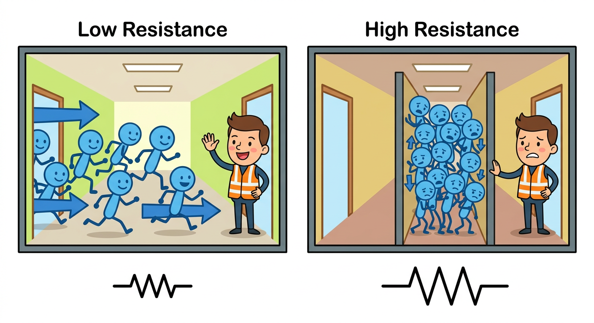
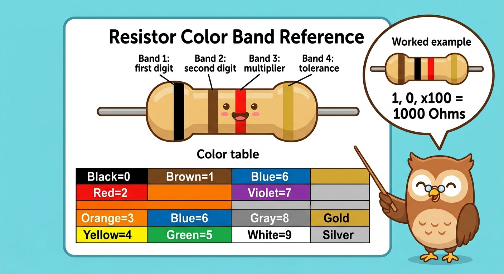

# Lesson 3: Resistors -- The Traffic Controllers of Electronics

**Module:** 1 -- Electronic Components Basics
**Difficulty:** Star-1 Beginner
**Session Time:** 40--45 minutes
**Age:** 6--12 years
**XP Available:** 350 XP

---

## Your Mission Today

Circuit Explorer, it is time to meet one of the most common components in all of electronics: the **resistor**. These tiny striped cylinders are hiding a secret code, and today you are going to crack it. Plus, you will use your Magic Measurement Wand to prove you decoded it correctly!

---

## Learning Objectives

By the end of this lesson, you will be able to:
- Explain what a resistor does and why circuits need them
- Read resistor values using the color band code
- Use your Magic Measurement Wand to measure resistance
- See how resistance changes LED brightness

---

## What You Need

| Item | Qty |
|------|-----|
| Resistors: 100-ohm, 330-ohm, 1k-ohm, 4.7k-ohm, 10k-ohm | 2 each |
| LEDs (any color) | 3 |
| 9V battery + clip | 1 |
| Breadboard | 1 |
| Multimeter (your Magic Measurement Wand!) | 1 |
| Jumper wires | 5 |
| Paper + colored pencils (for color code activity) | 1 set |

---

## How to Teach This Lesson

### Step 1: Hook -- The Burned LED (5 min)

Start with a story (or demonstration if you have a spare LED):

> "Last lesson we used a resistor to protect our LED. What do you think happens if we connect the LED directly to 9V with NO resistor?"

If you have a spare LED and are comfortable doing it: connect an LED directly to 9V briefly. It will flash very bright and likely burn out.

> "That LED just got way too much electricity -- like drinking from a fire hose instead of a regular tap. The resistor is the LED's bodyguard."

**Or use this safer demo:** Connect an LED with a 10k-ohm resistor (very dim), then swap to 100 ohms (much brighter). Ask:
> "Why is it brighter with this resistor? Which one lets more electricity through?"

**Award: +10 XP for watching the demo and answering the question!**

---

### Step 2: What Does a Resistor Do? (8 min)

**The Hallway Analogy:**

Draw on paper:

```
   Wide hallway             Narrow hallway
   (low resistance)         (high resistance)

   ====   ====              == crowd ==
   people can walk fast     people squeeze through slowly
   = lots of current        = less current
```



> "A resistor is like making a hallway narrower. More resistance = harder for electricity to squeeze through = less current flows."

**Show them a real resistor:**
- Small cylinder, two legs
- Colored bands painted on
- All resistors look basically the same -- the bands are how you tell them apart

**The unit:** Ohms -- named after Georg Simon Ohm, a German physicist.

Fun fact:
> "Georg Ohm discovered the relationship between voltage, current, and resistance in 1827. His boss laughed at him and called it wrong. He was right. They named the unit after him."

**Award: +10 XP for learning the hallway analogy!**

---

### Step 3: The Color Code -- Cracking the Secret (12 min)

This is the most fun part. Make it feel like a **spy decoder activity**.

**The Color Code:**

| Color  | Number | Memory Trick |
|--------|--------|-------------|
| Black  | 0 | **B**lack = **0** -- dark, nothing |
| Brown  | 1 | **B**rown = **1** -- 1 brownie |
| Red    | 2 | **R**ed = **2** -- 2 roses |
| Orange | 3 | **O**range = **3** -- 3 oranges |
| Yellow | 4 | **Y**ellow = **4** -- 4 yellow bananas |
| Green  | 5 | **G**reen = **5** -- 5 green apples |
| Blue   | 6 | **Bl**ue = **6** -- 6 blueberries |
| Violet | 7 | **V**iolet = **7** -- 7 purple grapes |
| Gray   | 8 | **G**ray = **8** -- 8 gray elephants |
| White  | 9 | **W**hite = **9** -- 9 white clouds |



**How to read a 4-band resistor:**

```
   +-----------------------------------+
   |  Band 1  Band 2  Band 3  Band 4   |
   |  (1st    (2nd    (multi- (toler-  |
   |  digit)  digit)  plier)  ance)    |
   +-----------------------------------+

Example: Orange - Orange - Red - Gold
           3         3      x100   +/-5%
         = 3,300 ohms = 3.3k ohms
```

**Step-by-step reading:**
1. Band 1 = first digit
2. Band 2 = second digit
3. Band 3 = multiply by this power of 10
   - Black = x1, Brown = x10, Red = x100, Orange = x1000, Yellow = x10,000
4. Band 4 = tolerance (gold = +/-5%, silver = +/-10%)

**Activity -- Resistor Decoder Card:**

Have the kid make their own decoder card on paper:

```
MY RESISTOR DECODER
--------------------
B B R O Y G Bl V Gy W
0 1 2 3 4 5  6  7  8 9
```

Now decode these together:
- Brown-Black-Red-Gold = 1-0-x100 = **1,000 ohms = 1k ohms**
- Yellow-Violet-Orange-Gold = 4-7-x1000 = **47,000 ohms = 47k ohms**
- Red-Red-Brown-Gold = 2-2-x10 = **220 ohms**

**Award: +40 XP for making the decoder card!**
**Award: +10 XP for each resistor decoded correctly (30 XP max)!**

---

### Step 4: Hands-On -- The Brightness Experiment (10 min)

**Build this circuit on the breadboard:**

```
  9V (+) ---- [RESISTOR] ---- LED (+) ---- LED (-) ---- 9V (-)
```

**Round 1:** Use 100-ohm resistor. Observe brightness.
**Round 2:** Swap for 330 ohms. Is it brighter or dimmer?
**Round 3:** Swap for 1k ohm. How about now?
**Round 4:** Try 10k ohms. Can you even see it glow?


Fill in this table together:

```
| Resistor  | Brightness (1-5) | Feels warm? |
|-----------|-----------------|-------------|
| 100 ohm   |                 |             |
| 330 ohm   |                 |             |
| 1k ohm    |                 |             |
| 10k ohm   |                 |             |
```

**Ask:**
> "So what does a resistor control?" (How much current flows -- which changes how bright the LED is)
> "Which resistor is safest for the LED?" (330 ohm to 1k ohm -- not too bright, not dead)

**Award: +30 XP for completing all 4 rounds of the brightness experiment!**

---

### Step 5: Wand Check -- Verify the Color Code! (8 min)

> "You cracked the color code like a spy. But how do you know the code told the TRUTH? Time to use your Magic Measurement Wand!"

**How to measure resistance with the Wand:**

1. Make sure the resistor is NOT connected to a battery or circuit
2. Turn the dial to the ohm symbol (the horseshoe shape)
3. Touch the red probe to one leg, black probe to the other
4. Read the display!

**Activity -- Code vs Wand Challenge:**

Measure all 5 resistors. Compare to what the color code says.

```
| Resistor (color code says) | Wand reads | Match? | Points |
|---------------------------|-----------|--------|--------|
| 100 ohm                    |           |        | +10 XP |
| 330 ohm                    |           |        | +10 XP |
| 1k ohm                     |           |        | +10 XP |
| 4.7k ohm                   |           |        | +10 XP |
| 10k ohm                    |           |        | +10 XP |
```

> "They are not exactly the same -- and that is OK! Real resistors have a small tolerance (5% error is fine). Your Wand shows the REAL value. The color code gives the APPROXIMATE value."

**Fun Wand Tricks (bonus):**
- Measure the resistance of a pencil line drawn on paper (graphite conducts!)
- Draw a thick line and a thin line -- which has more resistance?
- Try to measure an eraser (insulator -- "OL" or very high!)

**Award: +50 XP for measuring all 5 resistors!**
**Award: +20 XP bonus for trying the pencil trick!**

---

## Fun Game: Resistor Bingo (Optional Extension)

Make a 3x3 bingo card with resistor values:

```
+--------+--------+--------+
| 100 ohm | 1k ohm | 47k ohm|
+--------+--------+--------+
| 330 ohm | FREE   | 10k ohm|
+--------+--------+--------+
| 220 ohm | 4.7k   | 22k ohm|
+--------+--------+--------+
```

Draw resistors from a bag one by one. Kids decode the color bands and mark their card. **For extra accuracy, verify each one with the Wand!**

---

## Quick Quiz -- Earn Bonus XP!

**Question 1:** What does a resistor do?
- A) Stores electricity
- B) Limits how much current flows
- C) Makes electricity flow backwards

**(Correct: B -- +20 XP!)**

**Question 2:** If you want a DIMMER LED, should you use a bigger or smaller resistor?
- A) Bigger (more resistance = less current = dimmer)
- B) Smaller

**(Correct: A -- +20 XP!)**

**Question 3:** You decoded a resistor as 330 ohms from its color bands. Your Wand reads 327 ohms. Is the resistor broken?
- A) Yes, it is broken!
- B) No -- that is within the normal tolerance. It is perfectly fine!

**(Correct: B -- +20 XP!)**

---

## Lesson 3 Complete!

```
  =============================================

     COLOR CODE CRACKER BADGE UNLOCKED!

     Skills unlocked:
     [check] Read resistor color codes
     [check] Measure resistance with the Wand
     [check] Understand brightness vs resistance
     [check] Verified color code with the Wand

  =============================================
```

**XP Breakdown:**
| Activity | XP |
|----------|-----|
| Hook demo | 10 |
| Hallway analogy | 10 |
| Decoder card | 40 |
| Decode 3 resistors | 30 |
| Brightness experiment | 30 |
| Wand Check (5 resistors) | 50 |
| Pencil trick bonus | 20 |
| Quiz (3 questions) | 60 |
| **TOTAL POSSIBLE** | **250** |

---

## Coming Up Next...

In **Lesson 4**, you will unlock the **Magic Triangle** -- Ohm's Law! You will discover the formula that connects voltage, current, and resistance, and use it to PREDICT exactly how bright an LED will glow before you even build the circuit!

---

## Troubleshooting

| Problem | Fix |
|---------|-----|
| Cannot read color bands | Use a magnifying glass; hold under good light |
| Wand reads 0 ohms | Probe leads are touching each other -- separate them |
| Wand reads "OL" or "1" | Resistance too high for current range -- switch to a higher range |
| LED burns out | Resistor too small -- use 330 ohms minimum with 9V |

---

## Navigation

| | |
|:---|---:|
| [← Lesson 2: Meet the Magic Measurement Wand](lesson-02-meet-the-multimeter.md) | [Lesson 4: Ohm's Law →](lesson-04-ohms-law.md) |
