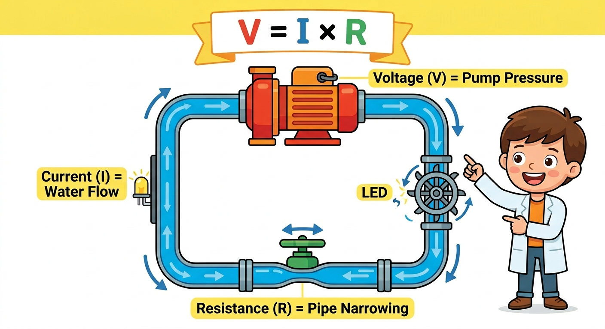
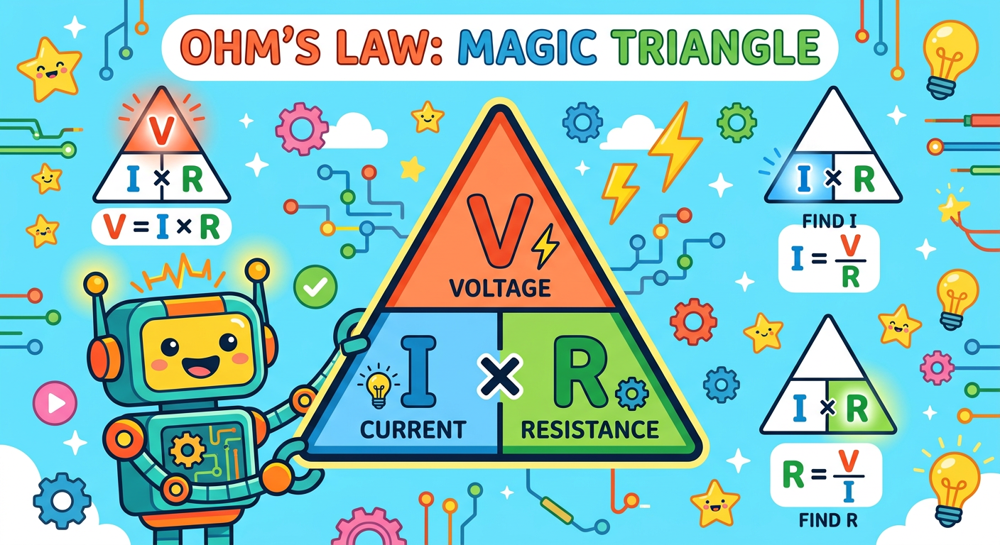
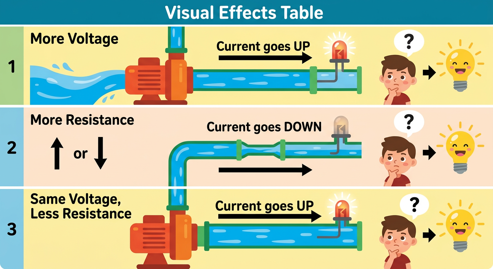

# Lesson 4: Ohm's Law -- The Magic Triangle

**Module:** 1 -- Electronic Components Basics
**Difficulty:** Star-1 Beginner
**Session Time:** 40--45 minutes
**Age:** 6--12 years
**XP Available:** 300 XP

---

## Your Mission Today

Circuit Explorer, you already know about voltage, current, and resistance. You have measured them with your Magic Measurement Wand. But here is the BIG secret: those three are actually connected by a magical rule called **Ohm's Law**. Learn this one rule and you will be able to PREDICT what happens in any circuit before you even build it. Today you become an electricity fortune teller!

---

## Learning Objectives

By the end of this lesson, you will be able to:
- State Ohm's Law in words and as a formula: V = I x R
- Rearrange the formula to solve for any of the three values
- Use the Ohm's Law Triangle trick to remember all three forms
- Predict how changing voltage or resistance affects current (and brightness)
- Verify your predictions using real circuits and your Magic Measurement Wand

---

## What You Need

| Item | Qty |
|------|-----|
| 9V battery + clip | 1 |
| Breadboard | 1 |
| LEDs (any color) | 2 |
| Resistors: 100-ohm, 330-ohm, 1k-ohm, 10k-ohm | 1 each |
| Multimeter (your Magic Measurement Wand!) | 1 |
| Jumper wires | 5 |
| Paper + pencil (for calculations and triangle) | 1 set |

---

## How to Teach This Lesson

### Step 1: Hook -- The Brightness Mystery (5 min)

Set up the LED circuit from Lesson 3: 9V battery, resistor, LED on the breadboard.

Start with the 330-ohm resistor. The LED glows nicely.

> "Remember how different resistors made the LED brighter or dimmer? You SAW it happen. But what if I told you there is a formula that lets you CALCULATE exactly how bright the LED will be -- BEFORE you even plug it in?"

Swap to the 1k-ohm resistor. The LED gets dimmer.

> "You could have predicted that! And by the end of today, you WILL be able to predict it. You are about to learn the single most important rule in all of electronics."

Pause for dramatic effect.

> "It is called **Ohm's Law**. And once you know it, you will have a superpower that every engineer on the planet uses every single day."

**Award: +10 XP for watching the demo and being curious!**

---

### Step 2: The Water Analogy -- Pressure, Flow, and Pipes (8 min)

> "Let us go back to our favorite analogy -- the water system!"

Draw this on paper together:

```
  WATER SYSTEM                      ELECTRICAL CIRCUIT
  ============                      ==================

  +-------------------------------+
  |                               |
 [PUMP]  -->  [NARROW PIPE]  -->  [WATER WHEEL]
  |                               |
  +-------------------------------+

  Water pressure  =  Voltage (V)     -- how hard the pump pushes
  Water flow rate =  Current (I)     -- how much water flows per second
  Pipe narrowness =  Resistance (R)  -- how much the pipe blocks the flow
```



Now ask these questions one at a time:

> "Imagine a pump pushing water through a pipe. What happens if we turn the pump up HIGHER?"

(More pressure = more water flows = bigger splash at the water wheel)

> "That is exactly what happens in a circuit. More voltage = more current = brighter LED!"

> "Now what if we make the pipe NARROWER but keep the pump the same?"

(Harder for water to squeeze through = less water flows = smaller splash)

> "Same in a circuit. More resistance = less current = dimmer LED!"

> "And what if we crank the pump way up but also make the pipe way narrower?"

(The extra push gets cancelled out by the extra blocking -- the flow might stay the same!)

> "That is the BIG idea. Voltage PUSHES current. Resistance BLOCKS current. They work against each other. And Ohm's Law is the rule that tells you exactly how they balance out."

**Key vocabulary:**

| Word | Kid-Friendly Definition |
|------|------------------------|
| **Ohm's Law** | The rule that connects voltage, current, and resistance |
| **V (Voltage)** | The push -- like water pressure from the pump |
| **I (Current)** | The flow -- like how much water moves through the pipe |
| **R (Resistance)** | The block -- like how narrow the pipe is |

**Award: +20 XP for understanding the water analogy!**

---

### Step 3: The Formula and the Magic Triangle (10 min)

> "Here it is. The most famous formula in electronics:"

Write this big on paper:

```
  ╔═══════════════════════════════════╗
  ║                                   ║
  ║         V  =  I  x  R            ║
  ║                                   ║
  ║   Voltage = Current x Resistance  ║
  ║                                   ║
  ╚═══════════════════════════════════╝
```

> "This says: the voltage across something equals the current flowing through it TIMES the resistance. Simple!"

**But wait -- sometimes you want to find current, or resistance instead. That is where the MAGIC TRIANGLE comes in!**

Draw the triangle on paper:



```
         /\
        /  \
       / V  \
      /      \
     /--------\
    /  I  | R  \
   /______|_____\

   To find V:  Cover V  -->  you see I x R   -->  V = I x R
   To find I:  Cover I  -->  you see V over R -->  I = V / R
   To find R:  Cover R  -->  you see V over I -->  R = V / I
```

> "Here is the trick. Draw this triangle. When you need to find one of the three, just COVER it with your finger! Whatever you can still see is the formula you need."

**Activity -- Draw Your Own Triangle:**

Have the kid draw the Ohm's Law Triangle on a piece of paper. Make it big. Decorate it. This is their cheat sheet forever.

Practice together:

> "Cover V with your finger. What do you see?"
(I x R -- so V = I x R)

> "Cover I. What do you see?"
(V on top, R on bottom -- so I = V / R)

> "Cover R. What do you see?"
(V on top, I on bottom -- so R = V / I)

**Let us try real numbers!**

> "If a 9V battery pushes current through a 1,000-ohm resistor, how much current flows?"

Walk through it together:
1. We want to find I (current)
2. Cover I in the triangle
3. We see V / R
4. I = 9V / 1000 ohms = 0.009 amps = 9 milliamps

> "9 milliamps! That is a tiny trickle of current -- enough to light an LED gently."

**Try another:**

> "If 0.02 amps of current flows through a 330-ohm resistor, what is the voltage across it?"

1. We want to find V (voltage)
2. Cover V in the triangle
3. We see I x R
4. V = 0.02 x 330 = 6.6 volts

> "The resistor is using up 6.6 volts! That makes sense because our battery is 9V and the LED uses some too."

**Award: +30 XP for drawing the triangle and solving both practice problems!**

---

### Step 4: The Parameter Effects -- What Changes What? (5 min)

> "Now let us build a cheat sheet that tells you what happens when you change things."

Draw this table together on paper:

```
  ╔════════════════════════════════════════════════════════════════╗
  ║               PARAMETER EFFECTS CHEAT SHEET                   ║
  ╠══════════════════╦═════════════════════╦══════════════════════╣
  ║  What You Change ║  What Happens       ║  LED Result          ║
  ╠══════════════════╬═════════════════════╬══════════════════════╣
  ║  V goes UP       ║  I goes UP          ║  Brighter!           ║
  ║  (R stays same)  ║  (more push = more  ║                      ║
  ║                  ║   flow)             ║                      ║
  ╠══════════════════╬═════════════════════╬══════════════════════╣
  ║  R goes UP       ║  I goes DOWN        ║  Dimmer!             ║
  ║  (V stays same)  ║  (more blocking =   ║                      ║
  ║                  ║   less flow)        ║                      ║
  ╠══════════════════╬═════════════════════╬══════════════════════╣
  ║  V goes UP  AND  ║  I can STAY SAME    ║  Same brightness!    ║
  ║  R goes UP       ║  (extra push        ║  (if the increase    ║
  ║  (both change)   ║   cancelled by      ║   is balanced)       ║
  ║                  ║   extra blocking)   ║                      ║
  ╠══════════════════╬═════════════════════╬══════════════════════╣
  ║  I goes UP       ║  Either V went UP   ║  Brighter!           ║
  ║                  ║  or R went DOWN     ║                      ║
  ║                  ║  (or both)          ║                      ║
  ╚══════════════════╩═════════════════════╩══════════════════════╝
```

**Use the water analogy to explain each row:**

> "Row 1: Crank the pump harder, same pipe -- more water flows. Brighter LED!"
>
> "Row 2: Same pump, but make the pipe narrower -- less water gets through. Dimmer LED!"
>
> "Row 3: Crank the pump harder AND make the pipe narrower -- they cancel each other out. Same flow! Same brightness!"
>
> "Row 4: If you see more water flowing, either the pump got stronger or the pipe got wider -- or both!"

**Award: +20 XP for copying the parameter effects table!**

---

### Step 5: Experiment 1 -- The Resistor Swap (8 min)

> "Time to prove Ohm's Law with your own hands! We are going to keep the voltage the same and swap resistors to see how current changes."

**Build this circuit on the breadboard:**

```
  9V (+) ---- [RESISTOR] ---- LED (+) ---- LED (-) ---- 9V (-)
```

**Round 1: 100-ohm resistor**

Observe the brightness. Now use your Magic Measurement Wand to measure the voltage ACROSS the resistor:
1. Turn the Wand to DCV (voltage mode)
2. Touch the red probe to one side of the resistor
3. Touch the black probe to the other side
4. Write down the voltage

**Round 2: 330-ohm resistor** -- Swap it in, observe, measure.
**Round 3: 1k-ohm resistor** -- Swap it in, observe, measure.
**Round 4: 10k-ohm resistor** -- Swap it in, observe, measure.

Fill in this table:

```
| Resistor | Brightness (1-5) | Voltage Across Resistor | Calculated Current (I = V/R) |
|----------|-----------------|------------------------|------------------------------|
| 100 ohm  |                 |                        |                              |
| 330 ohm  |                 |                        |                              |
| 1k ohm   |                 |                        |                              |
| 10k ohm  |                 |                        |                              |
```



> "Look at your table! As resistance goes UP, current goes DOWN, and the LED gets DIMMER. Ohm's Law predicted this -- and your Magic Measurement Wand proved it!"

For the calculated current column, use the triangle:
> "Cover I. You see V / R. Take the voltage your Wand measured and divide by the resistance. That is how much current is flowing!"

**Walk through an example together:**
> "If the Wand reads 7 volts across the 330-ohm resistor: I = 7V / 330 ohms = 0.021 amps = 21 milliamps. That is the current flowing through the LED right now!"

**Award: +40 XP for completing all 4 rounds and filling in the table!**

---

### Step 6: Experiment 2 -- Predict Before You Build! (5 min)

> "Now for the REAL test. Can you use Ohm's Law to PREDICT which resistor to use before you build the circuit? If you can, you are thinking like a real engineer!"

**The Challenge:**

> "I want the LED to be MEDIUM brightness -- not too bright, not too dim. From Experiment 1, you saw that about 15 to 20 milliamps gives a nice glow. If the battery is 9V and the LED uses about 2V, that means 7V goes across the resistor. Which resistor should we use?"

Help them work through it:

1. We want I = about 0.02 amps (20 milliamps)
2. Voltage across resistor = about 7V
3. Cover R in the triangle: R = V / I
4. R = 7V / 0.02A = 350 ohms
5. We do not have a 350-ohm resistor, but 330 ohms is close!

> "You just PREDICTED the answer! Now plug in the 330-ohm resistor and see."

The LED should glow at a nice medium brightness.

> "Use your Magic Measurement Wand to measure the voltage across the resistor. Is it close to 7V?"

If the kid is ready for a harder challenge:

> "What resistor would you pick for a very dim LED -- maybe 5 milliamps?"
> R = 7V / 0.005A = 1,400 ohms. The closest we have is 1k ohm. Try it!

**Award: +30 XP for successfully predicting a resistor value and verifying it!**

---

### Step 7: Experiment 3 -- Ohm's Law Detective (4 min)

> "Final mission! You are an Ohm's Law Detective. I will give you two clues, and you need to figure out the missing piece. Use your Magic Triangle!"

**Case 1: Find the Current**
> "A 9V battery pushes electricity through a 1,000-ohm resistor. How much current flows?"
- Cover I: I = V / R = 9 / 1000 = 0.009A = 9 milliamps

**Case 2: Find the Voltage**
> "You measure 0.03 amps flowing through a 100-ohm resistor. What voltage is pushing it?"
- Cover V: V = I x R = 0.03 x 100 = 3 volts

**Case 3: Find the Resistance**
> "A 6V battery is pushing 0.02 amps of current. How much resistance is in the way?"
- Cover R: R = V / I = 6 / 0.02 = 300 ohms

> "You solved all three cases! You used the same triangle, but covered a different letter each time. THAT is the power of Ohm's Law!"

**For older kids (10+), add this bonus case:**

**Bonus Case: The Broken Circuit**
> "Your LED is way too bright and getting hot. The Wand reads 8.5V across a 100-ohm resistor. How much current is flowing? Is that too much for the LED?"
- I = 8.5V / 100 ohms = 0.085A = 85 milliamps
- Most LEDs are rated for 20 milliamps max. That is over 4 times too much! The LED could burn out!
> "What resistor would fix it?"
- R = 8.5V / 0.02A = 425 ohms. Use a 470-ohm resistor (a common standard value) to be safe!

**Award: +30 XP for solving all 3 detective cases!**
**Award: +20 XP bonus for solving the bonus case!**

---

## Quick Quiz -- Earn Bonus XP!

**Question 1:** What is Ohm's Law?
- A) V = I + R
- B) V = I x R
- C) V = I / R

**(Correct: B -- +20 XP!)**

**Question 2:** If you increase the resistance but keep voltage the same, what happens to the current?
- A) Current goes UP
- B) Current stays the SAME
- C) Current goes DOWN

**(Correct: C -- more resistance blocks more current, so less flows -- +20 XP!)**

**Question 3:** You have a 9V battery and a 1,000-ohm resistor. Using the Magic Triangle, how much current flows?
- A) 9,000 amps
- B) 0.009 amps (9 milliamps)
- C) 0.9 amps

**(Correct: B -- I = V/R = 9/1000 = 0.009A -- +20 XP!)**

---

## Lesson 4 Complete!

```
  =============================================

     OHM'S LAW WIZARD BADGE UNLOCKED!

     Skills unlocked:
     [check] Know Ohm's Law: V = I x R
     [check] Use the Magic Triangle to find V, I, or R
     [check] Predict how changing V or R affects current
     [check] Verified predictions with the Magic Measurement Wand
     [check] Solved Ohm's Law detective cases

  =============================================
```

**XP Breakdown:**
| Activity | XP |
|----------|-----|
| Hook demo | 10 |
| Water analogy | 20 |
| Triangle + practice problems | 30 |
| Parameter effects table | 20 |
| Experiment 1: Resistor swap (4 rounds) | 40 |
| Experiment 2: Predict and verify | 30 |
| Experiment 3: Detective cases (3 cases) | 30 |
| Detective bonus case | 20 |
| Quiz (3 questions) | 60 |
| **TOTAL POSSIBLE** | **260** |

> Note for instructors: the XP header says 300 XP Available to give kids a target to aspire to with enthusiastic participation. The structured activities above total 260 XP. Award the remaining 40 XP at your discretion for exceptional curiosity, helping others, or creative questions during the lesson.

---

## Coming Up Next...

In **Lesson 5**, we explore **Capacitors -- The Tiny Energy Tanks**. You will charge up a component that STORES electricity and then release it all at once to flash an LED. You will watch your Magic Measurement Wand as the voltage slowly drains away -- like watching a bathtub empty! Get ready!

---

## Troubleshooting

| Problem | Fix |
|---------|-----|
| LED does not light up | Check LED polarity -- long leg goes toward the + side |
| Wand reads 0V across resistor | Make sure the circuit is powered -- is the battery connected? |
| Wand reads the full 9V across resistor | The LED might be burned out -- try a new LED |
| Calculated current does not match expected brightness | Real LEDs are not perfectly linear -- small differences are normal |
| Kid struggles with division | Use simple numbers first (9V / 9 ohms = 1A) and work up to harder ones |
| Kid confused by milliamps | Explain: milli means one-thousandth, so 9 milliamps = 0.009 amps -- like millimeters vs meters |
| LED burns out during experiment | Always start with higher resistance (1k or 10k) and work down to be safe |

---

## Navigation

| | |
|:---|---:|
| [← Lesson 3: Resistors](lesson-03-resistors.md) | [Lesson 5: Capacitors →](lesson-05-capacitors.md) |
