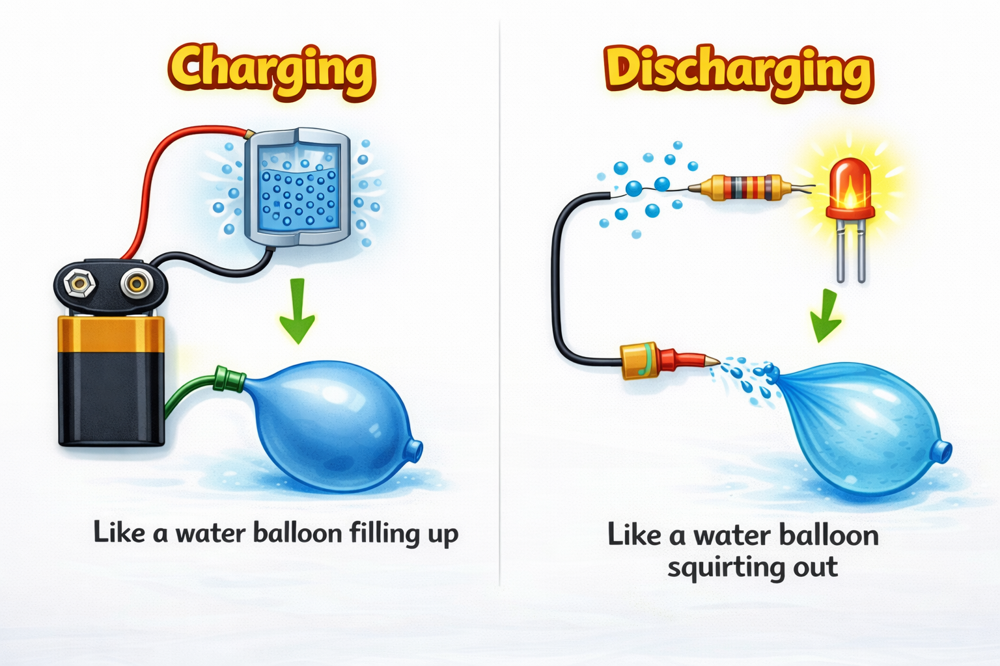
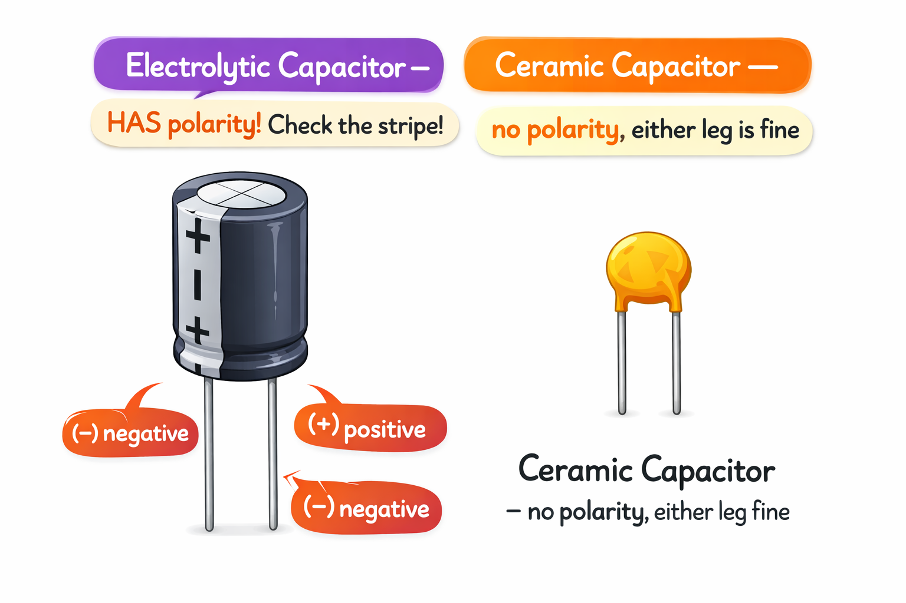

# Lesson 5: Capacitors -- The Tiny Energy Tanks

**Module:** 1 -- Electronic Components Basics
**Difficulty:** Star-1 Beginner
**Session Time:** 40--45 minutes
**Age:** 6--12 years
**XP Available:** 300 XP

---

## Your Mission Today

Circuit Explorer, today you are going to discover a component that can STORE electricity and then release it all at once -- like a water balloon that bursts! And you will use your Magic Measurement Wand to watch the stored electricity slowly drain away. This is going to be awesome!

---

## Learning Objectives

By the end of this lesson, you will be able to:
- Explain what a capacitor does (stores charge, then releases it)
- Know the difference between electrolytic (has a + and - side) and ceramic capacitors
- Charge a capacitor and use that stored energy to light an LED
- Use the Magic Measurement Wand to watch voltage change in real time
- Understand capacitance units: Farads, microfarads

---

## What You Need

| Item | Qty |
|------|-----|
| 1000-microfarad electrolytic capacitor | 1 |
| 100-microfarad electrolytic capacitor | 1 |
| 0.1-microfarad ceramic capacitor | 2 |
| 9V battery + clip | 1 |
| LED (red or yellow) | 1 |
| 330-ohm resistor | 1 |
| 10k-ohm resistor | 1 |
| Breadboard | 1 |
| Jumper wires | 4 |
| Multimeter (Magic Measurement Wand) | 1 |

---

## How to Teach This Lesson

### Step 1: Hook -- The Magic Flash (5 min)

**Before any explanation**, set up this demo in advance (while the kid is not watching):

1. Charge a 1000-microfarad capacitor from the 9V battery for 5 seconds
2. Disconnect the battery
3. Tell the kid: "I have a battery here. Except... it is not a battery."

Hand them the charged capacitor and a small LED (with resistor leads attached).

> "Touch these two legs to the LED."

The LED flashes briefly and goes out.

> "What just happened? That component was storing electricity! Even without the battery connected, it held onto the energy and gave it to the LED."

This is the "wow" moment. Let it sink in before explaining.

**Award: +10 XP for witnessing the magic flash!**

---

### Step 2: The Water Balloon Analogy (8 min)

Draw this on paper:

```
  Charging a capacitor:          Discharging a capacitor:

   Battery                        Capacitor
     |                              |
     | --fills-->  [  C  ]          | --releases--> LED lights up!
                  (water balloon)
```



> "A capacitor is like a water balloon. You fill it up (charge it), then it holds the water (charge) until you poke a hole in it -- then all the water squirts out (discharge) at once."

**Key ideas:**

| Concept | Explanation |
|---------|------------|
| **Charge** | Storing electrical energy |
| **Discharge** | Releasing that energy |
| **Capacitance** | How much energy it can hold |
| **Farads (F)** | The unit of capacitance |

Fun comparison:
> "1 Farad is HUGE. Most capacitors are measured in millionths of a Farad -- microfarads. Our 1000-microfarad cap is 0.001 Farad. That is tiny. Yet it lit up the LED for a moment!"

**Award: +10 XP for learning the water balloon analogy!**

---

### Step 3: Meet the Capacitors (5 min)

Show both types side by side:



**Electrolytic Capacitor (the big one):**
```
      +--+
      |  |  <-- aluminum can
      |  |
  (-) |  |
      |  |
  long leg = (+)
  short leg = (-)
  stripe with (-) marks the negative side
```

> "This type has a + and - side -- we call that POLARITY. If you put it in backwards, it can overheat and even pop! Always check the stripe -- that is the negative side."

**Ceramic Capacitor (the small yellow/orange disc):**
```
     +---+
     |   |  <-- flat disc, no polarity
     +---+
   any leg = any side
```

> "This type does not care which way it goes -- no polarity. But it holds much, much less charge than the big electrolytic one."

**Award: +10 XP for identifying which capacitor has polarity!**

---

### Step 4: Charge and Discharge Experiment (12 min)

**Experiment 1 -- Charge and Light an LED:**

```
  Step 1: Charge the capacitor

  9V (+) ---- Capacitor (+leg) ----+
                                   |
  9V (-) ---- Capacitor (-leg) ----+

  Wait 5 seconds. Disconnect battery.

  Step 2: Discharge through LED

  Capacitor (+) ---- [330-ohm] ---- LED (+) ---- LED (-) ---- Capacitor (-)
```

Observe: LED flashes briefly.

> "How long did it glow? Try with 100 microfarads -- does it glow longer or shorter?"

Fill in the results:
```
| Capacitor        | Glow time |
|------------------|-----------|
| 1000 microfarad  |           |
| 100 microfarad   |           |
```

**Award: +30 XP for completing both charge/discharge experiments!**

---

### Step 5: Wand Check -- Watch the Voltage Drain! (10 min)

> "This is one of the COOLEST things your Magic Measurement Wand can do. You are going to watch electricity slowly disappear from the capacitor -- in real time!"

**The Wand Drain Experiment:**

1. Set your Wand to **DC Volts** (the V with a straight line)
2. Charge the 1000-microfarad capacitor from the 9V battery for 5 seconds
3. Disconnect the battery
4. Immediately touch the Wand probes to the capacitor legs (red to +, black to -)
5. Read the voltage: it should be close to 9V!
6. Now connect a 10k-ohm resistor across the capacitor legs
7. Watch the Wand display... the number is going DOWN!

> "See how the voltage drops over time? That is the capacitor slowly releasing its stored charge through the resistor. It is like watching a bathtub drain!"

**Record the readings:**

```
| Time       | Voltage (Wand reads) |
|------------|---------------------|
| 0 seconds  |                     |
| 10 seconds |                     |
| 20 seconds |                     |
| 30 seconds |                     |
| 60 seconds |                     |
```

> "Notice how it drops fast at first, then slower and slower? That is because as there is less charge left, the 'push' gets weaker, so it drains more slowly. Scientists call this **exponential decay** -- but you can just call it the bathtub effect!"

**Bonus Wand Challenge:**
- Charge the capacitor again. This time, measure the voltage BEFORE disconnecting the battery. It should read about 9V.
- Now measure the battery BY ITSELF. Still about 9V.
- They are the SAME! The capacitor "copied" the battery's voltage!

**Award: +50 XP for completing the Wand Drain Experiment!**
**Award: +20 XP bonus for the voltage comparison challenge!**

---

### Step 6: Why Are Capacitors Useful? (5 min)

> "OK, a quick flash is fun. But why would engineers actually use capacitors?"

**Real-world uses to discuss:**

1. **Timing circuits** -- Charge/discharge speed depends on R and C values, which makes timers
   > "We will use this in Module 3 with the 555 timer chip!"

2. **Smoothing power** -- Computers need steady voltage. Capacitors "catch" any dips and fill them in.
   > "Think of it like a water tank next to a tap -- keeps pressure steady even if the tap flickers."

3. **Flash photography** -- Camera flashes charge a big capacitor, then dump ALL the energy in a millisecond -- bright flash!

4. **Touchscreens** -- Your phone screen has a grid of tiny capacitors. Your finger changes their charge slightly -- that is how it knows where you touched!

**Award: +10 XP for naming one real-world use of a capacitor!**

---

## Quick Quiz -- Earn Bonus XP!

**Question 1:** "A capacitor is like a ______."
- A) Flashlight
- B) Water balloon
- C) Battery that lasts forever

**(Correct: B -- +20 XP!)**

**Question 2:** "Why can you NOT put an electrolytic capacitor in backwards?"
- A) It does not fit
- B) It could overheat or pop (polarity matters!)
- C) It makes no difference

**(Correct: B -- +20 XP!)**

**Question 3:** "You charged a 1000-microfarad capacitor and watched the Wand. The voltage went from 9V to 3V in 30 seconds. What was happening?"
- A) The battery was dying
- B) The capacitor was slowly releasing its stored charge (discharging)
- C) The Wand was broken

**(Correct: B -- +20 XP!)**

---

## Lesson 4 Complete!

```
  =============================================

     ENERGY TANK EXPLORER BADGE UNLOCKED!

     Skills unlocked:
     [check] Charge and discharge a capacitor
     [check] Watch voltage drain with the Wand
     [check] Identify electrolytic vs ceramic capacitors
     [check] Understand polarity

  =============================================
```

**XP Breakdown:**
| Activity | XP |
|----------|-----|
| Magic flash demo | 10 |
| Water balloon analogy | 10 |
| Identify polarity | 10 |
| Charge/discharge experiments | 30 |
| Wand Drain Experiment | 50 |
| Voltage comparison bonus | 20 |
| Real-world use | 10 |
| Quiz (3 questions) | 60 |
| **TOTAL POSSIBLE** | **210** |

---

## Coming Up Next...

In **Lesson 6**, we explore **diodes and LEDs** -- components that only let electricity flow ONE direction. You will build a rainbow of lights and use your Magic Measurement Wand to discover that each color uses a different amount of voltage!

---

## Safety Note

> **Always check polarity** before connecting electrolytic capacitors. Reversed polarity can cause the capacitor to leak, overheat, or -- in extreme cases -- rupture. With 9V and small capacitors this is low risk, but build the habit early!

---

## Navigation

| | |
|:---|---:|
| [← Lesson 4: Ohm's Law](lesson-04-ohms-law.md) | [Lesson 6: Diodes and LEDs →](lesson-06-diodes-and-leds.md) |
