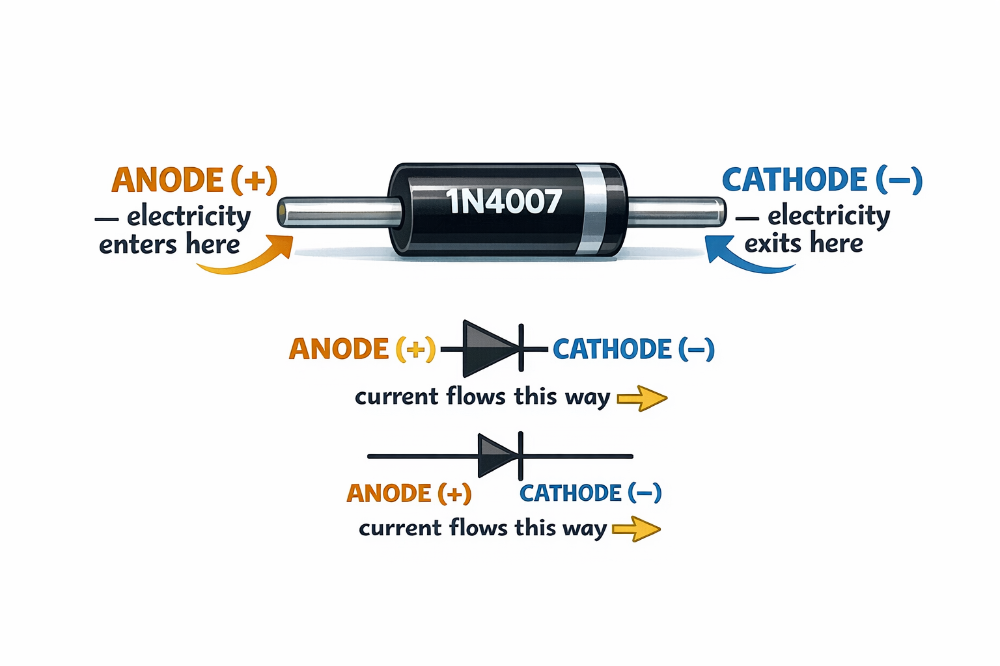
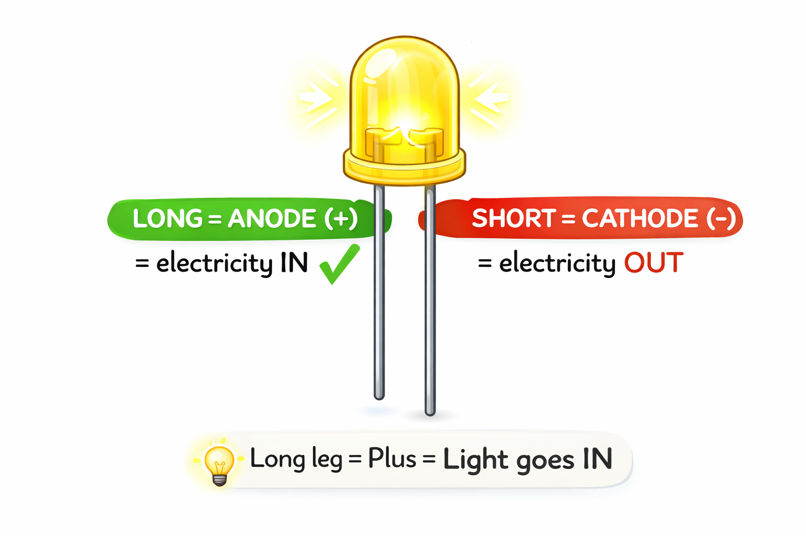
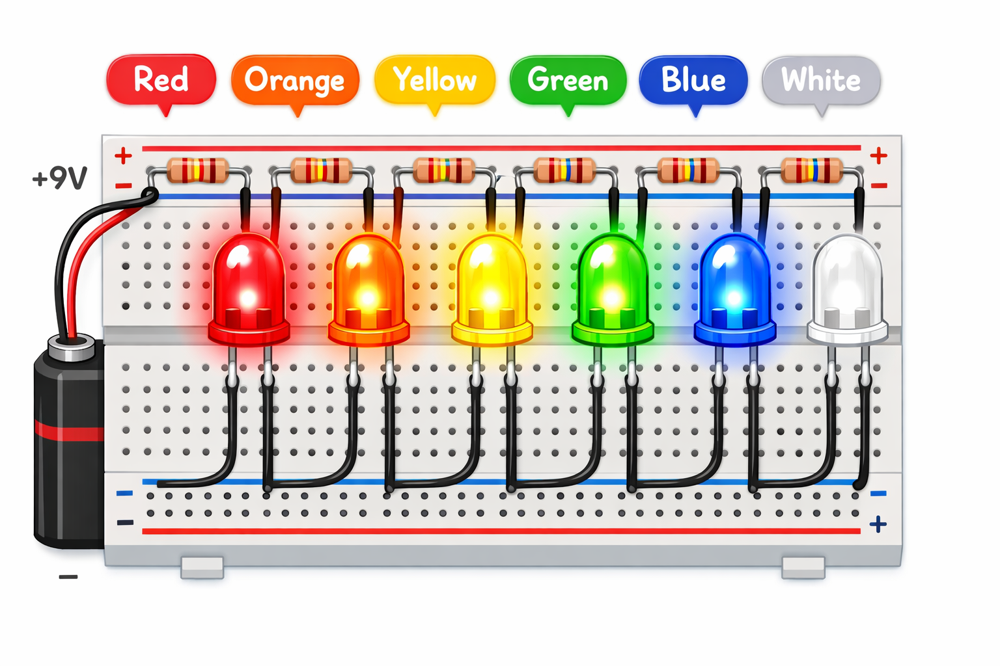

# Lesson 5: Diodes and LEDs -- One-Way Streets and Rainbow Lights

**Module:** 1 -- Electronic Components Basics
**Difficulty:** Star-1 Beginner
**Session Time:** 45 minutes
**Age:** 6--12 years
**XP Available:** 310 XP

---

## Your Mission Today

Circuit Explorer, today you are going to discover that some components are PICKY about which direction electricity flows. Diodes are one-way streets for electricity. And LEDs? They are one-way streets that GLOW! You will build a rainbow of lights and use your Magic Measurement Wand to uncover a hidden secret: each color uses a different amount of voltage.

---

## Learning Objectives

By the end of this lesson, you will be able to:
- Explain that diodes only allow current in one direction
- Know the difference between a regular diode and an LED
- Identify the anode (+) and cathode (-) legs
- Build a multi-color LED display
- Use the Magic Measurement Wand to measure LED voltage drops

---

## What You Need

| Item | Qty |
|------|-----|
| 1N4007 standard diode | 2 |
| LEDs: red, orange, yellow, green, blue, white | 2 each |
| 330-ohm resistors | 6 |
| 9V battery + clip | 1 |
| Breadboard | 1 |
| Jumper wires | 8 |
| Multimeter (Magic Measurement Wand) | 1 |

---

## How to Teach This Lesson

### Step 1: Hook -- The One-Way Door (5 min)

Ask the kid:

> "Have you ever been through a turnstile gate that only spins one way? Or a one-way door that you can push open but not pull?"

> "What if electricity had a door like that -- it could only go through in ONE direction? That is a **diode**."

**Physical demo:** Take a standard 1N4007 diode.
- Connect it one way in a circuit with an LED -- LED lights
- Flip the diode -- LED goes off

> "See? Electricity refused to go through backwards. The diode is a one-way valve."

**Award: +10 XP for predicting what would happen before flipping the diode!**

---

### Step 2: Understanding the Diode (8 min)

**The diode up close:**

```
   Anode (+)          Cathode (-)
       |                   |
      --|-->|--------------|--
           ^
     current flows this way only

  On the component:
  +-------------------+
  |  (no stripe)    |-- stripe --|
  +-------------------+
   Anode (+)        Cathode (-)
```



> "The stripe on the diode marks the CATHODE -- the exit door for electricity. The other side, with no stripe, is the ANODE -- the entrance."

**Real-world uses of diodes:**
- Protecting circuits from backwards battery installation
- Converting AC power to DC (inside phone chargers!)
- Radio receivers
- Any time you need "electricity only flows this way"

**Award: +10 XP for correctly pointing to the anode and cathode on a real diode!**

---

### Step 3: Meet the LED -- A Special Diode (5 min)

> "LED stands for **Light Emitting Diode**. It is a diode that releases energy as light instead of heat when current flows through it."

**Identifying LED legs:**

```
        Long leg = Anode (+)     (Remember: Long = Plus)
        Short leg = Cathode (-)  (Remember: Short = Minus)

        Also: look inside the LED
         +---------+
         |  /\     |
         | /  \    |
         |/    \   |
         |small    | <-- flat side = cathode (-)
         | plate   |
         +---------+
```



**LED colors and forward voltage:**

| Color | Forward Voltage | Fun Fact |
|-------|----------------|----------|
| Red | about 1.8--2.0V | First color of LED ever made (1962) |
| Orange | about 2.0--2.1V | Used in traffic lights |
| Yellow | about 2.1--2.2V | Used in indicator lights |
| Green | about 2.0--3.0V | Standard green = 2V, bright green = 3V |
| Blue | about 3.0--3.4V | Blue LEDs were invented in 1994 -- Nobel Prize! |
| White | about 3.0--3.4V | Actually a blue LED with yellow coating! |

> Fun story: "The inventors of the blue LED won the Nobel Prize in Physics in 2014. Before that, we could not make white LEDs -- so we could not have LED lightbulbs! Blue LEDs changed the world."

**Award: +10 XP for remembering which leg is positive (the LONG one)!**

---

### Step 4: Rainbow LED Experiment (15 min)

**Build a rainbow display -- all 6 colors at once:**

```
  9V (+) --+--[330-ohm]--[RED LED]------+
           +--[330-ohm]--[ORANGE LED]---+
           +--[330-ohm]--[YELLOW LED]---+  all (-) legs
           +--[330-ohm]--[GREEN LED]----+  connect to 9V (-)
           +--[330-ohm]--[BLUE LED]-----+
           +--[330-ohm]--[WHITE LED]----+
```



**Observation questions:**

1. "Look at the red and blue LEDs. Which one looks brighter to your eyes?"
2. "Cover the red LED. Put your hand in front of the blue. Notice the color on your palm?"
3. "Which LED is the hardest to look at directly?" (Blue/white -- more energetic light)

**Experiment -- Reverse polarity:**
Flip one LED backwards.
> "Which one went off? Why did the others stay on?" (They are in parallel -- each has its own path. One failing does not kill the others.)

**Award: +30 XP for building the rainbow display!**
**Award: +10 XP for correctly explaining why one reversed LED does not affect the others!**

---

### Step 5: Wand Check -- Measuring the Rainbow (8 min)

> "Here is a hidden secret of LEDs: each COLOR uses a different amount of voltage. Red uses less, blue uses more. Your Magic Measurement Wand can prove it!"

Set your Wand to **DC Volts** (the V with a straight line, 20V range).

**How to measure the voltage across an LED:**

```
  Measure here:

  --[330-ohm]--+--LED (+)--LED (--)--+--
               |                     |
             (+) probe            (-) probe
             (red)                (black)
```

Touch the red probe to the + side of the LED (where current enters) and the black probe to the - side (where current exits).

**Fill in the table:**

```
| LED Color | My Prediction | Wand Reads | Was I Close? |
|-----------|--------------|-----------|-------------|
| Red       |              |           |             |
| Orange    |              |           |             |
| Yellow    |              |           |             |
| Green     |              |           |             |
| Blue      |              |           |             |
| White     |              |           |             |
```

> "These are called **forward voltage drops**. The LED 'uses up' this much voltage just to turn on. Higher voltage = more energetic light = bluer/whiter color."

> For older kids: "This is related to physics -- blue light has more energy than red light. The LED converts electrical energy directly into light energy!"

**Award: +50 XP for measuring all 6 LED colors!**
**Award: +10 XP bonus if you noticed that blue and white are almost the same voltage!**

---

### Step 6: Wrap-Up (5 min)

**Quick quiz:**

**Question 1:** "In a diode, which way does current flow?"
- A) Cathode to anode
- B) Anode to cathode -- from + to -

**(Correct: B -- +20 XP!)**

**Question 2:** "Which leg of an LED is positive?"
- A) The shorter leg
- B) The longer leg

**(Correct: B -- +20 XP!)**

**Question 3:** "Your Wand shows 1.9V across a red LED and 3.2V across a blue LED. Why is the blue number bigger?"
- A) The blue LED is broken
- B) Blue light has more energy, so it needs more voltage

**(Correct: B -- +20 XP!)**

---

## Bonus Experiments

### Infrared LED Trick
If you have an IR LED (from an old remote control):
1. Connect it to 9V with a resistor -- nothing visible
2. Point your phone camera at it
3. On the camera screen, you will see it glowing purple/white!

> "Cameras can see infrared light even though our eyes cannot. That is how security cameras see in the dark!"

### Traffic Light Project (Ages 6--10 Favorite)
Wire up 1 red LED, 1 yellow LED, and 1 green LED. Take turns pressing wires to complete each circuit:
> "You are the traffic controller! Red means stop. Yellow means get ready. Green means go!"

---

## Lesson 5 Complete!

```
  =============================================

     RAINBOW BUILDER BADGE UNLOCKED!

     Skills unlocked:
     [check] Understand one-way current flow
     [check] Built a 6-color LED rainbow
     [check] Measured forward voltage with the Wand
     [check] Know anode from cathode

  =============================================
```

**XP Breakdown:**
| Activity | XP |
|----------|-----|
| Diode prediction | 10 |
| Identify anode/cathode | 10 |
| Remember LED legs | 10 |
| Rainbow display | 30 |
| Reverse polarity explanation | 10 |
| Wand Check (6 LEDs) | 50 |
| Blue/white voltage bonus | 10 |
| Quiz (3 questions) | 60 |
| **TOTAL POSSIBLE** | **190** |

---

## Coming Up Next...

In **Lesson 6**, we meet the **transistor** -- the most important electronic component ever invented. It is an electronic switch that can be controlled by electricity itself. Without transistors, computers, phones, and robots would not exist!
