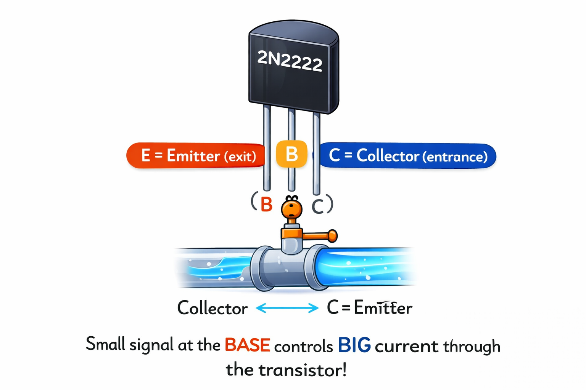

# Lesson 7: Transistors -- The Electronic Switch

**Module:** 1 -- Electronic Components Basics
**Difficulty:** Star-1-Star-2 Easy-Medium
**Session Time:** 45 minutes
**Age:** 6--12 years
**XP Available:** 280 XP

---

## Your Mission Today

Circuit Explorer, get ready to meet the MOST IMPORTANT electronic component ever invented. There are more transistors on Earth than grains of sand on every beach. Your phone has 10 BILLION of them. Today you are going to learn how just one works -- and use your Magic Measurement Wand to prove it is doing its job!

---

## Learning Objectives

By the end of this lesson, you will be able to:
- Explain what a transistor does (acts as an electronic switch)
- Name the three legs: Base, Collector, Emitter
- Build a circuit where a small signal controls a bigger load
- Use the Wand to measure voltage at different points in a transistor circuit

---

## What You Need

| Item | Qty |
|------|-----|
| 2N2222 NPN transistor | 3 |
| LEDs (any color) | 2 |
| 330-ohm resistors | 2 |
| 10k-ohm resistors | 2 |
| Push button | 1 |
| 9V battery + clip | 1 |
| Breadboard | 1 |
| Jumper wires | 8 |
| Multimeter (Magic Measurement Wand) | 1 |

---

## How to Teach This Lesson

### Step 1: Hook -- The World's Most Important Invention (5 min)

Start big:

> "If I asked you to name the most important invention of the last 100 years -- what would you say?"

(Let them answer -- probably phone, internet, car, computer...)

> "All of those things are built from ONE invention: the transistor. Your phone has about 10 to 15 BILLION transistors in it. Each one is smaller than a virus. They were invented in 1947. Before that, computers were the size of buildings. After? They fit in your pocket."

Show them the 2N2222 transistor. It is tiny -- hold it between your fingers.

> "This little three-legged thing changed the world. Let us find out how."

**Award: +10 XP for holding a transistor for the first time!**

---

### Step 2: What is a Transistor? (8 min)

**The Water Faucet Analogy:**

Draw this:

```
  Water flowing through a pipe:

  Tank --------------------------> Bucket
  (high water pressure)            (output)
           |
         Faucet handle
           |
        (tiny turn)
         controls
      (huge flow of water)


  In electronics:

  Battery (+) ---------------------> Load (LED, motor, etc.)
                    |
                  Base pin
                    |
               (tiny current)
                 controls
           (large current through transistor)
```

> "A tiny signal at the BASE controls a large current from COLLECTOR to EMITTER. It is like turning a small handle to open a big valve."

**The three legs of a 2N2222:**

```
  Looking at the FLAT side of the transistor:

   +-----------+
   |  2N2222   |  (flat side facing you)
   |   NPN     |
   +--+-+-+----+
      | | |
      E B C
   Emitter Base Collector

  E = Emitter  (electricity exits here -- connects to GND)
  B = Base     (control pin -- tiny signal goes here)
  C = Collector (electricity enters here -- connects to load/LED)
```



> "Always check the datasheet for leg order! Different transistors have different leg layouts."

**Award: +10 XP for correctly identifying E, B, and C on the transistor!**

---

### Step 3: Build the Transistor Switch Circuit (15 min)

**Circuit -- Manual switch:**

```
  Circuit diagram:

       9V
        |
       [330-ohm]
        |
       LED (+)
       LED (-)
        |
   Collector (C) of transistor
   Emitter (E) ---------------- GND
   Base (B) --[10k-ohm]---- button ---- 9V

  In plain English:
  - LED + resistor connected between 9V and transistor Collector
  - Emitter connected to GND
  - Pressing the button sends small current to Base
  - This turns on the transistor -- current flows C to E -- LED lights!
```

**Build it step by step on the breadboard:**

1. Place transistor in breadboard (legs in separate rows)
2. Connect Collector to 330-ohm resistor to LED (+)
3. Connect LED (-) to 9V (+) rail (through resistor path)
4. Connect Emitter to GND
5. Connect Base to 10k-ohm resistor to button to 9V

> "Notice we are using TWO resistors. The 330-ohm protects the LED. The 10k-ohm protects the transistor -- the base does not need much current, and too much would destroy it."

**Test it:**
- Without button: LED off
- Press button: LED on!

> "You just controlled electricity with electricity! The tiny current from the button (through 10k ohm) switched on a bigger current through the LED. That is transistor magic."

**Award: +40 XP for building the transistor switch circuit!**

---

### Step 4: Wand Check -- Seeing the Switch in Action (8 min)

> "Your Magic Measurement Wand can PROVE that the transistor is switching. Let us measure voltage at three different spots."

Set your Wand to **DC Volts** (20V range).

**Measurement 1 -- Across the LED (button NOT pressed):**
- Red probe on LED (+), black probe on LED (-)
- Expected: close to 0V (no current flowing, LED off)

**Measurement 2 -- Across the LED (button PRESSED):**
- Same probe positions
- Expected: about 2V (the LED's forward voltage -- it is ON!)

**Measurement 3 -- At the Base (button PRESSED):**
- Red probe on the Base pin, black probe on GND
- Expected: about 0.6--0.7V

> "That tiny 0.7V at the base is all it takes to switch on the transistor! That small signal controls the bigger current through the LED. This is what makes transistors so powerful."

**Fill in your readings:**

```
| Measurement Point      | Button OFF | Button ON |
|------------------------|-----------|----------|
| Across LED             |           |          |
| Base to GND            |           |          |
```

**Award: +40 XP for completing all Wand measurements!**

---

### Step 5: Experiment -- The Touch Switch (7 min)

**Build a touch-activated LED:**

Remove the push button. Replace it with two bare wire ends.

> "Now lightly touch BOTH wires at the same time with your finger."

The LED should flicker or glow dimly!

> "Your skin has resistance -- maybe 10k to 100k ohms. Remember measuring your finger in Lesson 2? A tiny current flows through your finger to the base of the transistor, and the transistor turns on slightly!"

**Make it more fun:**
- Wet your finger: LED brighter (lower skin resistance)
- Try through a damp cloth
- Try with a coin touching both wires

> "This is the basic principle behind touch sensors -- even the buttons on your phone use this idea!"

**Award: +20 XP for making the LED glow with your finger!**

---

### Step 6: Wrap-Up Quiz (5 min)

**Question 1:** "What are the three legs of a transistor called?"
- A) Red, Blue, Green
- B) Base, Collector, Emitter
- C) Plus, Minus, Ground

**(Correct: B -- +20 XP!)**

**Question 2:** "Which leg is the 'control' leg?"
- A) Emitter
- B) Collector
- C) Base

**(Correct: C -- +20 XP!)**

**Question 3:** "You measured 0V across the LED when the button was NOT pressed, and 2V when it WAS pressed. What does this prove?"
- A) The battery died
- B) The transistor switched from OFF to ON, allowing current to flow through the LED
- C) The Wand is guessing

**(Correct: B -- +20 XP!)**

---

## Fun Facts to Share

- The first transistor was built at Bell Labs on December 23, 1947. It was the size of your palm.
- The inventors won the Nobel Prize in Physics in 1956.
- The Intel 4004 chip (1971) had 2,300 transistors. Today's chips have 50+ billion.
- If cars improved at the same rate as transistors since 1971, a car would cost $0.00003 and do 2 million miles per hour.

---

## Lesson 6 Complete!

```
  =============================================

     TRANSISTOR TAMER BADGE UNLOCKED!

     Skills unlocked:
     [check] Built a transistor switch circuit
     [check] Measured voltage with the Wand to prove switching
     [check] Made a touch-activated LED
     [check] Know Base, Collector, Emitter

  =============================================
```

**XP Breakdown:**
| Activity | XP |
|----------|-----|
| Hold a transistor | 10 |
| Identify E, B, C | 10 |
| Build switch circuit | 40 |
| Wand Check (3 measurements) | 40 |
| Touch switch experiment | 20 |
| Quiz (3 questions) | 60 |
| **TOTAL POSSIBLE** | **180** |

---

## Coming Up Next...

In **Lesson 8**, we play with **switches and potentiometers** -- and build a light dimmer you can control with a knob! You will use your Magic Measurement Wand to watch the resistance change as you turn!

---

## Navigation

| | |
|:---|---:|
| [← Lesson 6: Diodes and LEDs](lesson-06-diodes-and-leds.md) | [Lesson 8: Switches and Potentiometers →](lesson-08-switches-and-potentiometers.md) |
