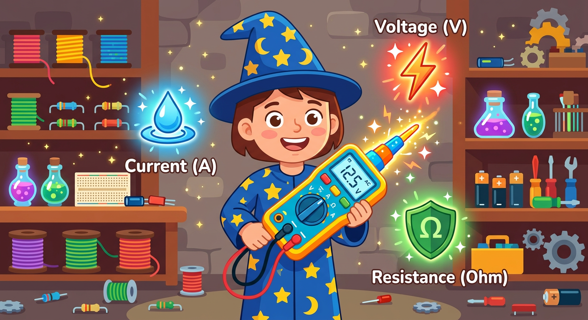
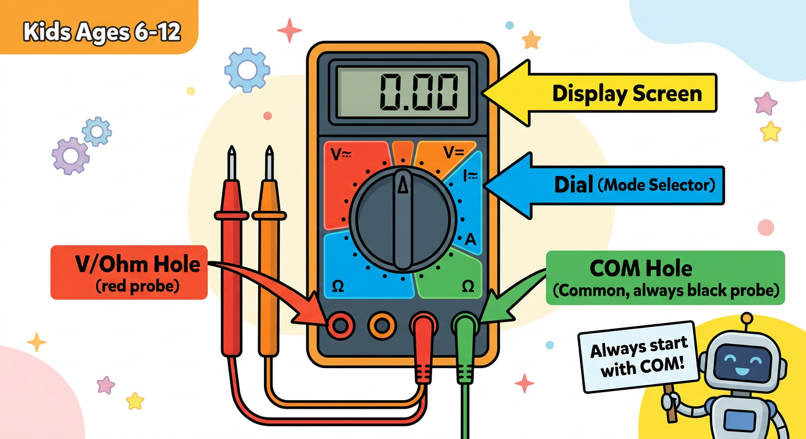
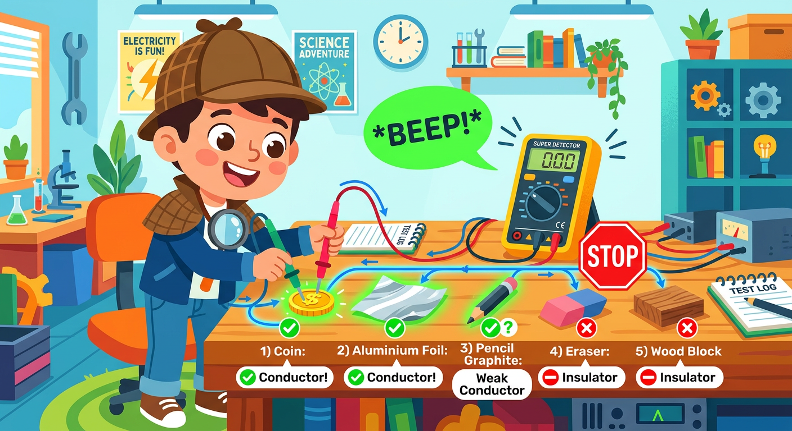

# Lesson 2: Meet the Multimeter (Magic Measurement Wand) -- Quick Reference

**Age:** 6--12 years | **Time:** 35--40 min | **XP:** 200

---

## The Three Superpowers

**Your multimeter can measure:**

| Superpower | Measures | Unit | Symbol |
|-----------|----------|------|--------|
| ⚡ **Voltage** | Electrical pressure | Volts | V |
| 💧 **Current** | Flow of electrons | Amps | A |
| 🛡️ **Resistance** | Opposition to flow | Ohms | Ω |

---

## Multimeter Parts

- **Display Screen** — Shows the reading
- **Dial/Selector** — Choose what to measure
- **COM Port** — Always use black probe here
- **V/Ω Port** — Use red probe for voltage/resistance
- **Red Probe** — Positive side
- **Black Probe** — Negative/Ground side

---

## Safety Rule #1

**ALWAYS plug COM (black probe) first!**

---

## Conductor Detective Game

**Test everyday objects for conductivity:**

| Object | Result | Type |
|--------|--------|------|
| Coin | ✅ BEEP | Conductor |
| Aluminum foil | ✅ BEEP | Conductor |
| Pencil graphite | ⚠️ Weak | Weak conductor |
| Eraser | ❌ Silent | Insulator |
| Wood | ❌ Silent | Insulator |

---

## How to Measure

1. Set multimeter dial to desired mode
2. Plug black probe into COM port
3. Plug red probe into V/Ω port
4. Touch red probe to positive side
5. Touch black probe to negative/ground side
6. Read the value on display

---

## Real-World Uses

- 🔋 **Check battery voltage** — Is it 1.5V, 9V, or dead?
- 🔌 **Test outlets** — Are they providing 120V?
- 🧪 **Verify components** — Is this resistor really 1000Ω?
- 🐛 **Debug circuits** — Find broken connections

---

## Quick Quiz

**Q1:** What does the COM port do?
**A:** It's the common (ground) reference — always use the black probe here.

**Q2:** How many superpowers does a multimeter have?
**A:** Three: voltage, current, and resistance.

**Q3:** What's the difference between a conductor and insulator?
**A:** Conductors let electricity flow (like metal), insulators block it (like rubber).

---

## Challenge

**Conductor detective:** Find 5 items around your house and test which are conductors. Record your results!

---

*Print this with the multimeter parts diagram for reference!*
