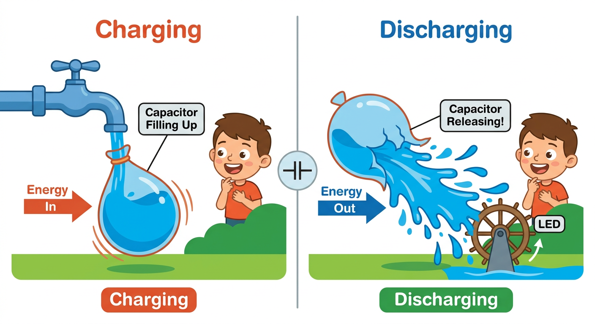
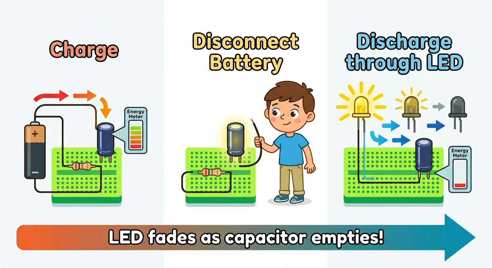

# Lesson 5: Capacitors -- Quick Reference

**Age:** 6--12 years | **Time:** 45--50 min | **XP:** 240

---

## What is a Capacitor?

**A capacitor is like an energy storage balloon:**

- **Charging** — Energy flows in, capacitor fills up
- **Holding** — Energy stores between the plates
- **Discharging** — Energy releases quickly when needed

---

## Capacitor Types

| Type | Shape | Polarity | Use |
|------|-------|----------|-----|
| **Electrolytic** | Tall cylinder | POLARIZED (⚠️) | High storage, power circuits |
| **Ceramic** | Tiny disc | Non-polarized ✅ | Filtering, coupling |

**⚠️ IMPORTANT:** Electrolytic capacitors have a positive and negative leg! Reverse it = EXPLOSION! 💥

---

## Identifying Legs

**Electrolytic:**
- Longer leg (+) = Positive
- Shorter leg (-) = Negative with stripe mark

**Ceramic:**
- No polarity — use either direction

---

## Charge and Discharge Cycle

**Three-step process:**

1. **Charge:** Battery fills capacitor with energy
2. **Disconnect:** Energy stays stored (briefly)
3. **Discharge:** Release energy through LED — LED glows then fades!

---

## Capacitance Values

| Value | Symbol | Use |
|-------|--------|-----|
| 100μF | 100 microfarads | Large storage |
| 10μF | 10 microfarads | Medium storage |
| 1μF | 1 microfarad | Small storage |
| 0.1μF | 100 nanofarads | Filtering |
| 0.01μF | 10 nanofarads | Coupling |

---

## Real-World Uses

- 📱 **Phone batteries** — Tiny capacitors for camera flash
- 💡 **Power supplies** — Smooth out voltage
- 🎧 **Audio circuits** — Couple audio signals
- 🔌 **House power** — Stabilize AC current
- ⚡ **Lightning protection** — Absorb electrical surges

---

## Quick Quiz

**Q1:** What does a capacitor do?
**A:** It stores electrical energy temporarily, like a rechargeable battery.

**Q2:** What's the danger with electrolytic capacitors?
**A:** They're polarized — connect them backward and they can explode!

**Q3:** What happens when you discharge a capacitor through an LED?
**A:** The LED glows brightly then gradually fades as energy runs out.

---

## Challenge

**Capacitor timing:** Charge a capacitor, then discharge it through an LED. Use a stopwatch to time how long the LED stays visibly lit!

---

*Print this with the balloon analogy diagram for reference!*
