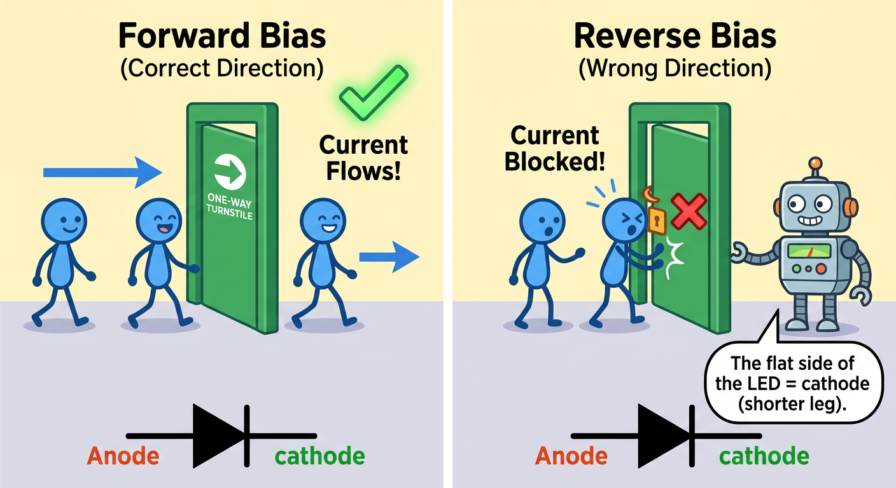
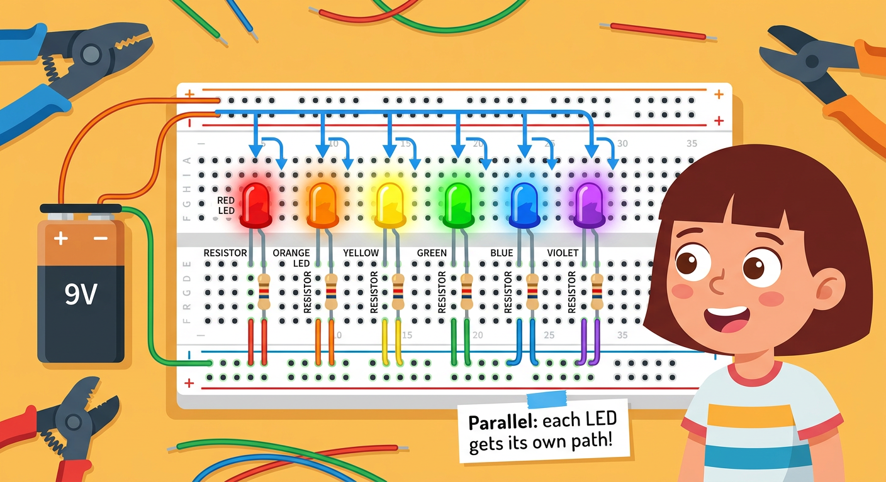
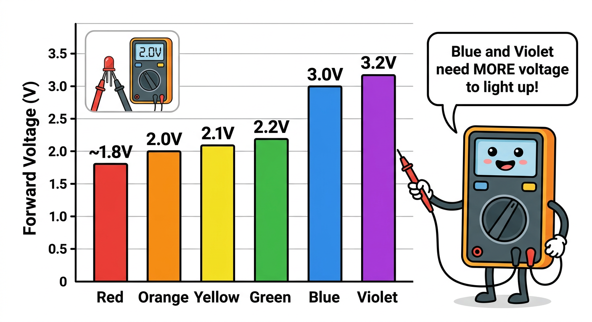

# Lesson 6: Diodes and LEDs -- Quick Reference

**Age:** 6--12 years | **Time:** 50--55 min | **XP:** 280

---

## The One-Way Door

**Diodes only let current flow ONE WAY:**

- ✅ **Forward bias** — Correct direction = Current flows!
- ❌ **Reverse bias** — Wrong direction = Current blocked!

---

## LED Basics

| Property | Value | Note |
|----------|-------|------|
| **Voltage drop** | 1.8–3.2V | Depends on color |
| **Typical current** | 10–20mA | Needs resistor to limit |
| **Lifetime** | 100,000+ hours | Much longer than bulbs |
| **Polarity** | YES (⚠️) | Longer leg = positive |

---

## Identifying LED Polarity

**Longer leg (+) = Positive (Anode)**
**Shorter leg (-) = Negative/Cathode (Flat side)**

**Rule:** Positive (long leg) to power, Negative (short leg) to ground

---

## Rainbow LED Circuit

**Different LED colors = Different forward voltages:**

- 🔴 Red: ~1.8V (lowest)
- 🟠 Orange: ~2.0V
- 🟡 Yellow: ~2.1V
- 🟢 Green: ~2.2V
- 🔵 Blue: ~3.0V
- 🟣 Violet: ~3.2V (highest)

**In parallel:** Each LED needs its own resistor!

---

## Forward Voltage Measurements

**Use multimeter to measure voltage drop across each LED:**

- Red LEDs need less voltage (~1.8V)
- Blue/Violet LEDs need more (~3.0V)
- For 9V supply: Choose resistor accordingly using Ohm's Law!

---

## Real-World Uses

- 💡 **Flashlights** — White LEDs
- 🚗 **Car lights** — Red brake, amber turn, white headlights
- 📱 **Status indicators** — Red/green/blue LEDs
- 🔌 **Power indicators** — Device "on" lights
- 🎮 **Game consoles** — LED displays and controllers

---

## Quick Quiz

**Q1:** Why is diode polarity important?
**A:** Diodes only work in one direction — reversed = no current flows.

**Q2:** Why do different color LEDs need different resistor values?
**A:** Different colors have different forward voltages (red ~1.8V, blue ~3.0V).

**Q3:** What happens if you connect an LED backward?
**A:** It won't light up, but it won't break (usually) — reverse it and it will work.

---

## Challenge

**Rainbow brightness:** Build a circuit with 3 different colored LEDs in parallel. Measure their brightness — do they match?

---

*Print this with the forward voltage chart for reference!*
