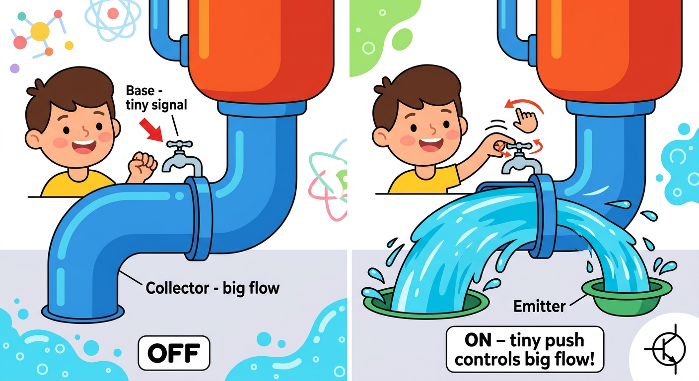
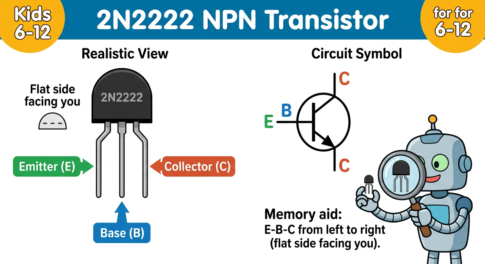
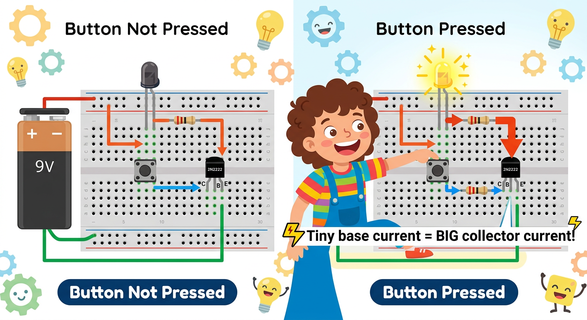

# Lesson 7: Transistors -- Quick Reference

**Age:** 6--12 years | **Time:** 60--65 min | **XP:** 300

---

## The Water Faucet Analogy

**A transistor is like a water faucet:**

- **Big pipe (Collector)** = Main flow
- **Tiny handle (Base)** = Control signal
- **Tiny push** = Controls HUGE flow!

**Magic:** A tiny signal controls a big current!

---

## NPN Transistor (2N2222)

| Pin | Name | Role | Color Code |
|-----|------|------|-----------|
| Left | **E** - Emitter | Output (ground side) | Green |
| Center | **B** - Base | Input signal (control) | Blue |
| Right | **C** - Collector | Input (power side) | Red/Orange |

**Memory aid:** E-B-C from left to right (flat side facing you)

---

## How a Transistor Works

1. Apply tiny signal to Base (blue wire)
2. Base current OPENS the gate
3. Collector current FLOWS from power supply
4. Output comes from Emitter
5. Remove Base signal → Gate closes → Current stops

---

## Button Controls LED Through Transistor

**Configuration:**
- Battery+ → Resistor → LED → Collector
- Button + Resistor → Base
- Emitter → Battery-/Ground

**Action:**
- Press button → Base gets signal → Collector opens → Current flows → LED lights
- Release button → Base signal stops → Collector closes → LED off

---

## Real-World Uses

- 🎮 **Game controllers** — Transistor switches for buttons
- 🎙️ **Microphones** — Amplify tiny voice signals
- 🎵 **Audio amplifiers** — Make speakers loud
- 💾 **Computer memory** — Transistors store 1s and 0s
- 🔌 **Power supplies** — Control voltage regulation

---

## Common Transistor Types

| Type | Use | Voltage |
|------|-----|---------|
| 2N2222 (NPN) | General switching/amplification | 5-30V |
| 2N3904 (NPN) | Small signal amplification | 5-40V |
| TIP120 (Darlington) | High current switching | 5-60V |
| 2N2907 (PNP) | Complementary to NPN | 5-40V |

---

## Quick Quiz

**Q1:** What do the three transistor pins do?
**A:** Base = control signal, Collector = power input, Emitter = output.

**Q2:** Why is a transistor called "electronic switch"?
**A:** A tiny signal at the Base can turn a huge current on/off.

**Q3:** How is a transistor like a faucet?
**A:** Turning the handle (base) controls the water flow (collector current).

---

## Challenge

**Amplifier:** Use a transistor to control a bright LED from a weak signal source (like a photodiode detecting dim light).

---

*Print this with the EBC diagram for reference!*
