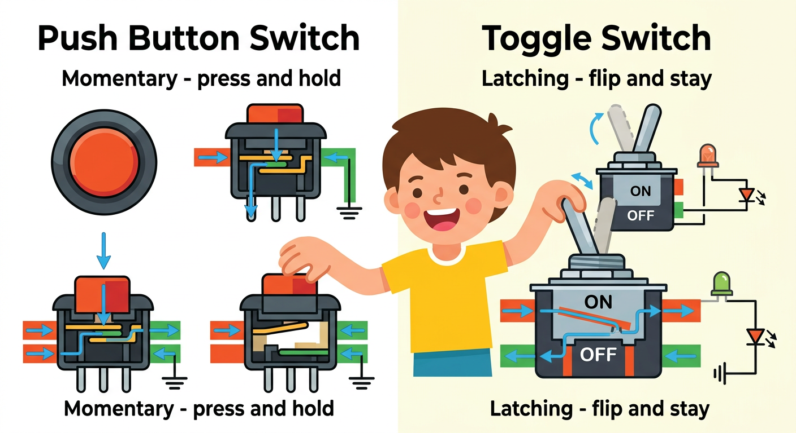
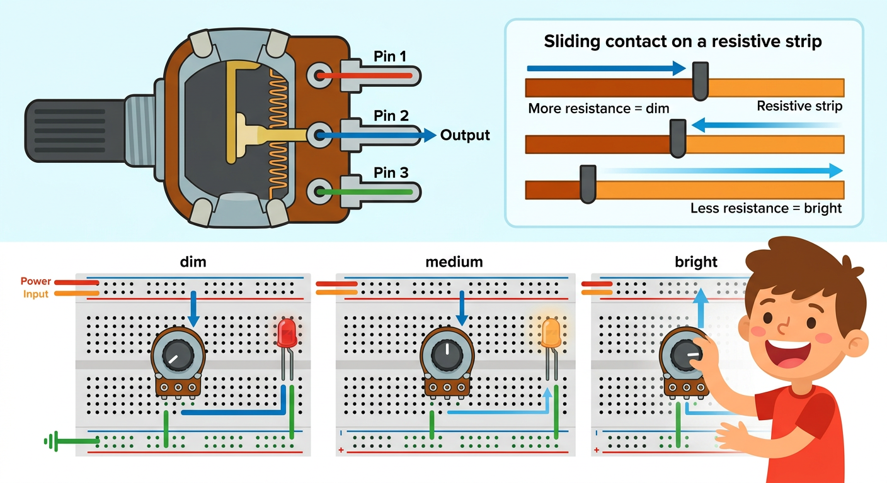

# Lesson 8: Switches and Potentiometers -- Quick Reference

**Age:** 6--12 years | **Time:** 50--55 min | **XP:** 260

---

## Two Types of Switches

| Switch | Action | Use |
|--------|--------|-----|
| **Push Button** | Press to activate | Doorbells, computer buttons, toys |
| **Toggle** | Flip to lock ON/OFF | Light switches, power switches |

| Type | Behavior | Symbol |
|------|----------|--------|
| **Momentary** | Only ON while pressed | Circuit closes while held |
| **Latching** | Stays in position | Circuit stays closed/open until toggled |

---

## How Switches Work

**Internally:** Metal contacts touch (closed = current flows) or separate (open = no current)

**In circuits:**
- Closed switch = Complete path = Current flows = LED on
- Open switch = Broken path = No current = LED off

---

## Introduction to Potentiometers

**A potentiometer is a variable resistor:**

| Feature | Description |
|---------|-------------|
| **Three pins** | Input, output (wiper), ground |
| **Sliding contact** | Wiper moves on resistive strip |
| **Variable resistance** | Changes as you turn the knob |
| **Output voltage** | Varies based on wiper position |

---

## Using a Potentiometer as Dimmer

**Setup:**
- Connect 5V to one end of resistive strip
- Connect ground to the other end
- Read voltage from the wiper (middle pin)
- Output voltage = 0V (full resistance) to 5V (no resistance)

**Effect on LED:**
- Knob all left → Maximum resistance → Dim
- Knob middle → Medium resistance → Medium
- Knob all right → Minimum resistance → Bright

---

## LED Brightness Control

| Knob Position | Resistance | Output Voltage | LED Brightness |
|--------------|-----------|----------------|-----------------|
| Fully left | High | 0V | OFF |
| Middle | Medium | 2.5V | MEDIUM |
| Fully right | Low | 5V | BRIGHT |

---

## Real-World Uses

- 🎚️ **Volume control** — Audio systems use potentiometers
- 🌡️ **Temperature sensors** — Thermistor is variable resistor
- 🎮 **Joysticks** — Potentiometers measure position
- 💡 **Dimmer switches** — Home lighting
- 🎛️ **Mixing boards** — Audio/music production

---

## Quick Quiz

**Q1:** What's the difference between momentary and latching switches?
**A:** Momentary = only ON while pressed, Latching = stays ON until toggled off.

**Q2:** How does a potentiometer work?
**A:** A sliding contact moves on a resistive strip, changing the resistance as you turn the knob.

**Q3:** Why does turning a potentiometer knob affect LED brightness?
**A:** Changing resistance changes current through LED, affecting brightness.

---

## Challenge

**Build an LED dimmer:** Use a potentiometer to control the brightness of an LED from OFF to maximum brightness smoothly.

---

*Print this with the switch types and potentiometer diagrams for reference!*
