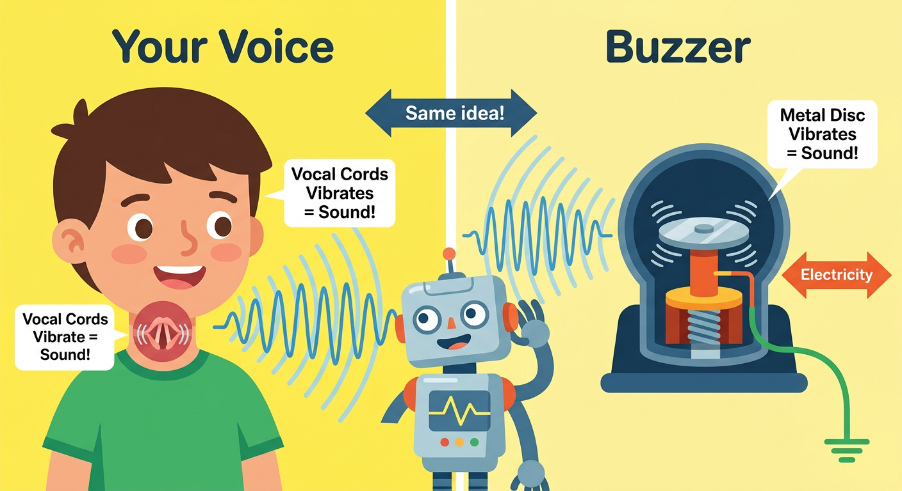
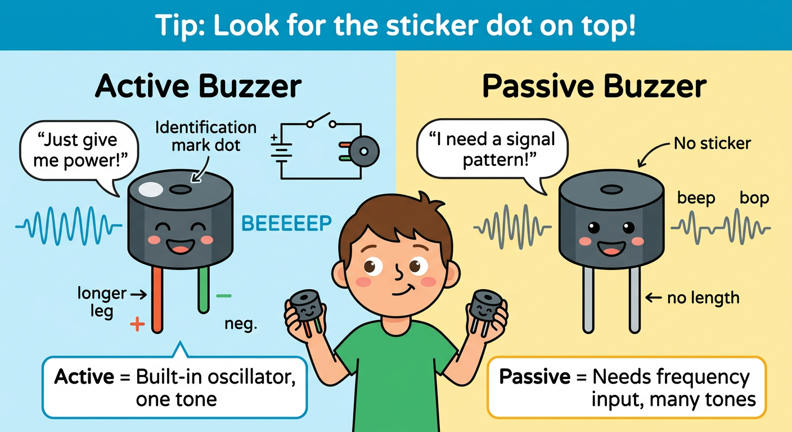
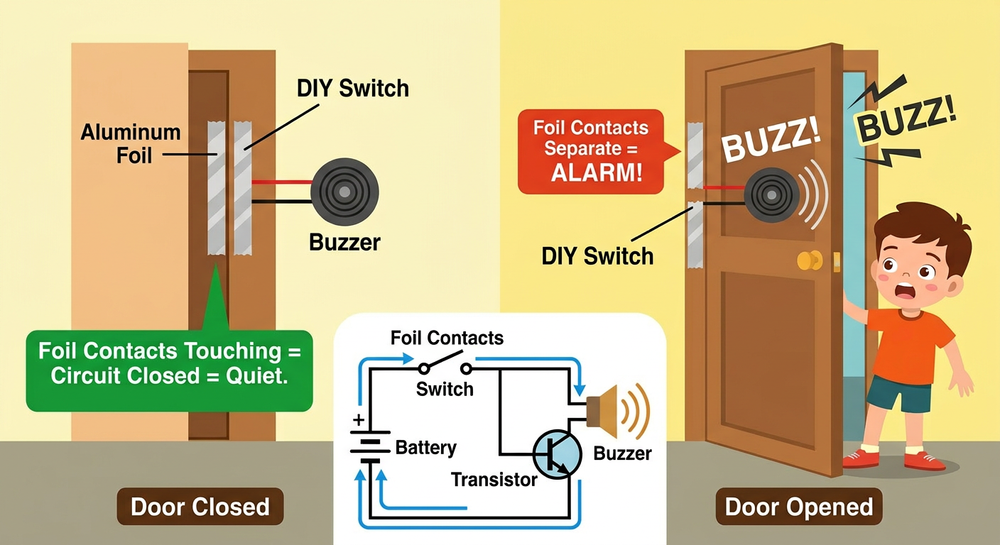

# Lesson 9: Buzzers and Sound -- Quick Reference

**Age:** 6--12 years | **Time:** 45--50 min | **XP:** 240

---

## How Sound Happens



**Your voice = Vocal cords vibrate = Air vibrates = Sound!**
**Buzzer = Metal disc vibrates = Air vibrates = Sound!**

Same principle!

---

## Active vs Passive Buzzers



| Feature | Active | Passive |
|---------|--------|---------|
| **Simplicity** | Just apply power! | Needs frequency signal |
| **Sound** | One tone (BEEEP) | Many tones (beep-boop) |
| **Frequency control** | NO | YES |
| **Circuit** | Simple | Needs Arduino/function generator |
| **Use** | Alarms, notifications | Music, melodies |
| **Identification** | Black dot on top | No dot |

---

## Identifying Active Buzzers

✅ **Has a black dot/sticker** on the top
✅ **Two pins** (positive, negative)
✅ **Just apply 5V** — it beeps automatically!

---

## Active Buzzer Circuit

**Simple:**
- Battery+ → Buzzer
- Buzzer → Ground
- Result: BEEEP! 🔊

---

## Passive Buzzer Code (Arduino)

```cpp
tone(buzzerPin, 1000);  // 1000 Hz tone
delay(500);             // Hold for 0.5 seconds
noTone(buzzerPin);      // Stop
```

**Common frequencies (Hz):**
- 262 = Middle C
- 440 = Concert A
- 1000 = High beep
- 100 = Low beep

---

## Door Alarm Project



**Simple alarm using foil contacts:**

1. Tape foil on door and frame
2. When closed: Foil touches = circuit complete = quiet
3. When opened: Foil separates = circuit breaks = **ALARM!**

**Circuit:** Battery → Foil contacts → Buzzer → Ground

---

## Real-World Uses

- 🚗 **Car alarms** — Motion sensor triggers buzzer
- ⏰ **Alarms clocks** — Passive buzzer plays tone at set time
- 🏥 **Medical alerts** — Beep when patient needs help
- 🎮 **Video game feedback** — Buzzer sounds for actions
- 🚨 **Smoke detectors** — Loud buzzer for warning

---

## Quick Quiz

**Q1:** What's the difference between active and passive buzzers?
**A:** Active has one tone, passive can play different tones/frequencies.

**Q2:** How do you identify an active buzzer?
**A:** Look for the black dot on top, and it doesn't need a frequency signal.

**Q3:** How does the door alarm work?
**A:** Foil contacts touching = circuit closed = quiet, separated = circuit open = alarm triggers.

---

## Challenge

**Alarm design:** Build a door alarm using foil contacts. Then add an LED that lights up when the alarm sounds!

---

*Print this with the buzzer comparison and alarm circuit diagrams for reference!*
