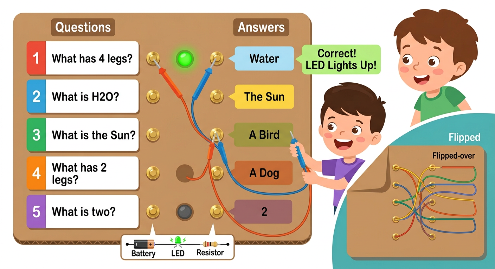

# Lesson 10: Project — Quiz Board Game -- Quick Reference

**Age:** 6--12 years | **Time:** 60--75 min | **XP:** 300

---

## The Quiz Board Concept



**An educational game combining circuits + knowledge:**

- ❓ **Questions** — 5 questions on the left
- ✅ **Answers** — 5 answers on the right (scrambled order)
- ⚡ **Circuit test** — Touch question + answer with probes
- 💡 **Feedback** — LED lights if correct, stays dark if wrong

---

## How It Works

### The Setup
1. Large cardboard board divided into two columns
2. Left column: 5 numbered question cards
3. Right column: 5 answer options (randomized)
4. Brass fasteners at each question and answer
5. Probes (wires) for testing connections

### The Game
1. Pick a question
2. Touch the question fastener with one probe
3. Touch your guess answer with the other probe
4. If correct: LED lights up! ✅
5. If wrong: LED stays dark ❌

---

## Circuit Behind the Scenes

**Visible (front):**
- Question and answer contacts
- Probes touching them
- LED that lights up

**Hidden (back):**
- Wiring connections from each question to its correct answer
- When probes touch correct pair: complete circuit = LED lights
- When probes touch wrong pair: circuit broken = LED stays off

---

## Building the Quiz Board

### Step 1: Design
- [ ] Decide on topic (math, science, history, etc.)
- [ ] Write 5 questions
- [ ] Write 5 answers (randomize order)
- [ ] Draw board layout on cardboard

### Step 2: Assemble
- [ ] Glue question and answer cards to board
- [ ] Insert brass fasteners at each card
- [ ] Build circuit: Battery + LED + Resistor
- [ ] On back: Connect fasteners with wires

### Step 3: Test
- [ ] Test each correct pair — LED lights
- [ ] Test each wrong pair — LED stays off
- [ ] Verify all connections work

---

## Circuit Diagram

```
Front:
┌─────────┬─────────┐
│Questions│Answers  │
│  ⊙     │  ⊙     │ ← Brass fasteners
│  ⊙     │  ⊙     │
│  ⊙     │  ⊙     │
└─────────┴─────────┘

Back (Hidden Wiring):
⊙ - - - - ⊙  (Connected pairs)
⊙ - - - - ⊙
⊙ - - - - ⊙
Plus: Battery - LED - Resistor - completing circuit
```

---

## Design Ideas

| Topic | Questions | Answers |
|-------|-----------|---------|
| **Animals** | "Has 4 legs" | "Dog" |
| | "Swims in water" | "Fish" |
| **Math** | "2 + 2 =" | "4" |
| | "5 - 3 =" | "2" |
| **Science** | "H2O is" | "Water" |
| | "Planet closest to sun" | "Mercury" |

---

## Real-World Applications

- 🎓 **Educational games** — Learn while playing
- 🎮 **Interactive displays** — Museums, science centers
- 📚 **Classroom teaching** — Make learning fun
- 🏥 **Medical devices** — Some use circuit logic
- 🧪 **Science projects** — Demonstrate circuit logic

---

## Quick Quiz

**Q1:** How does the quiz board determine if you're correct?
**A:** If probes touch a connected pair, the circuit completes and LED lights up.

**Q2:** Where is the wiring that connects questions to answers?
**A:** Hidden on the back of the board with colored wires.

**Q3:** What happens if you touch two unconnected fasteners?
**A:** The circuit stays broken and the LED doesn't light — indicating a wrong answer.

---

## Challenge Extension

**Upgrade:** Add multiple LED colors (green = correct, red = wrong) or a buzzer that sounds on correct answers!

---

*Print this with the circuit diagram for reference!*
