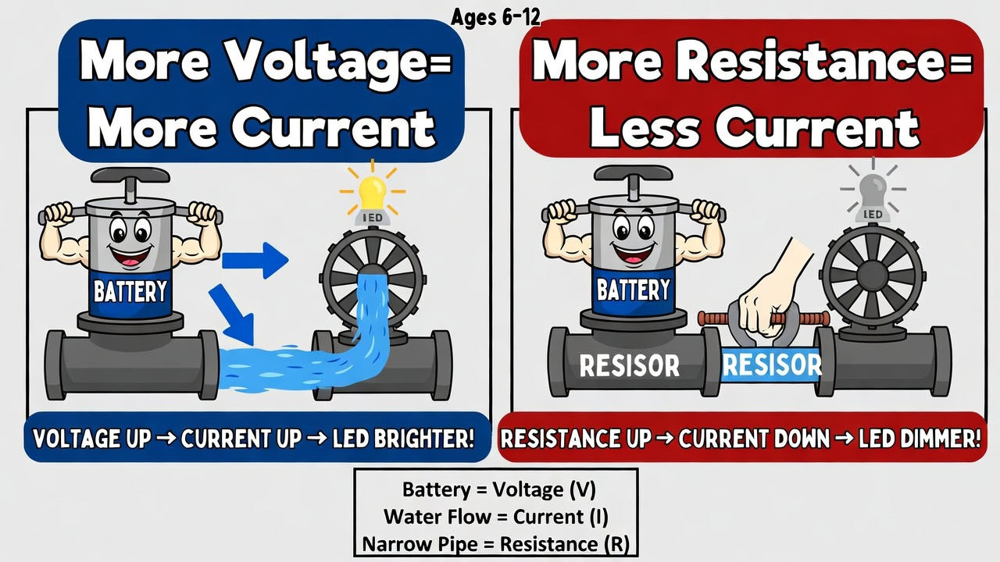
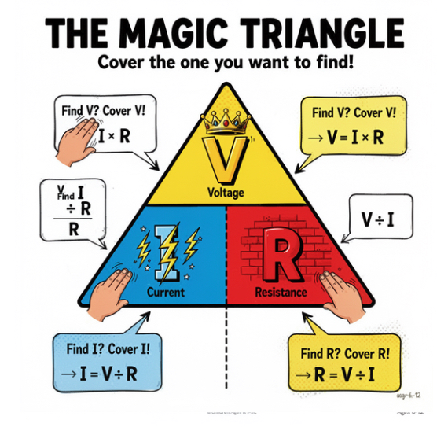
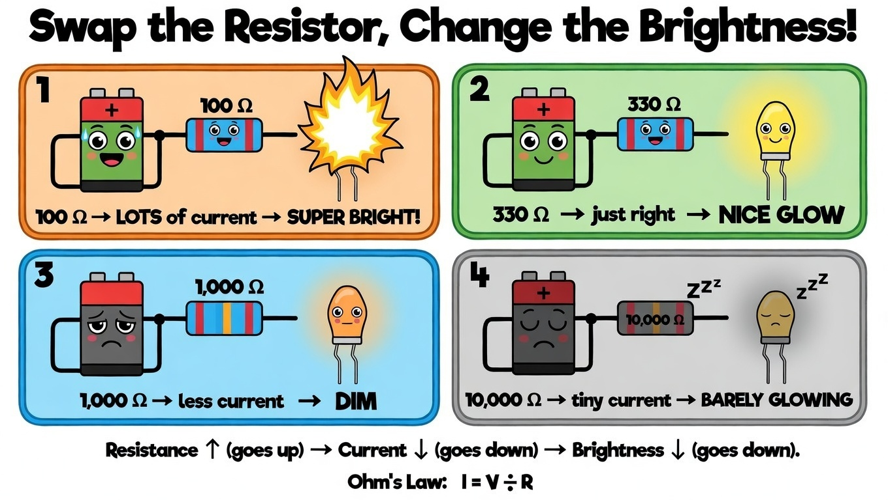

# Lesson 10: Ohm's Law -- The Superpower Formula

**Module:** 2 -- Building Simple Circuits
**Difficulty:** Star-2 Easy-Medium
**Session Time:** 45--50 minutes
**Age:** 6--12 years
**XP Available:** 240 XP

---

## Your Mission Today

Circuit Explorer, today you are going to learn THE most important formula in all of electronics. It is called **Ohm's Law**, and once you know it, you can PREDICT what your Magic Measurement Wand will read before you even touch the probes. Imagine that -- seeing the future! Let us discover how.

---

## Learning Objectives

By the end of this lesson, you will be able to:
- State Ohm's Law: V = I x R (Voltage = Current x Resistance)
- Use the formula to calculate voltage, current, or resistance
- Build a circuit and PREDICT what the Wand will measure
- Verify your predictions by measuring actual voltage and resistance
- Understand why Ohm's Law matters for every circuit you build

---

## What You Need

| Item | Qty |
|------|-----|
| 9V battery + clip | 1 |
| Breadboard | 1 |
| Resistors: 220-ohm, 330-ohm, 470-ohm, 1k-ohm, 10k-ohm | 2 each |
| LEDs (red) | 3 |
| Jumper wires | 6 |
| Multimeter (Magic Measurement Wand) | 1 |
| Paper + pencil (for calculations) | 1 set |
| Calculator (optional, for younger kids) | 1 |

---

## How to Teach This Lesson

### Step 1: Hook -- The Prediction Challenge (5 min)

Build this simple circuit (without the kid seeing your setup):

```
  9V battery ---- [1k-ohm resistor] ---- LED ---- back to battery
```

> "I am going to tell you EXACTLY what the Wand will read when I measure this circuit -- WITHOUT touching it. Ready?"

> "The Wand will read about 7 volts across the resistor and about 2 volts across the LED."

Now measure. Show the kid the readings.

> "How did I know? Am I psychic? Nope. I used a formula. And today, YOU are going to learn it."

**Award: +10 XP for being amazed by the prediction!**

---

### Step 2: The Water Park Analogy (10 min)

Draw this picture together:

```
  WATER PARK CIRCUIT
  ==================

  Water pump at the top of a hill
        |
        | (water pressure = VOLTAGE)
        |
        v
  [ Wide waterslide ]  -- low resistance, fast flow
        |
        v
  [ Narrow waterslide ] -- high resistance, slow flow
        |
        v
  Pool at the bottom (water returns to pump)


  The formula:

  Water pressure = Water flow x Slide narrowness

  In electricity:

  Voltage (V) = Current (I) x Resistance (R)

  V = I x R
```



**Break it down simply:**

> "V is **Voltage** -- how hard the battery pushes. We measure it in Volts."
>
> "I is **Current** -- how much electricity actually flows. We measure it in Amps."
>
> "R is **Resistance** -- how much the path blocks the flow. We measure it in Ohms."

**The three rearrangements (for ages 9--12):**

```
  V = I x R    (find voltage if you know current and resistance)
  I = V / R    (find current if you know voltage and resistance)
  R = V / I    (find resistance if you know voltage and current)
```

**The VIR Triangle trick:**

```
      +-------+
     /    V    \
    /  -------  \
   /   I  x  R   \
  +----------------+

  Cover what you want to find:
  - Cover V: you see I x R  --> V = I x R
  - Cover I: you see V / R  --> I = V / R
  - Cover R: you see V / I  --> R = V / I
```



> "Draw this triangle on a sticky note and keep it next to your breadboard. It is your cheat code!"

**Award: +20 XP for drawing the VIR triangle!**

---

### Step 3: Your First Calculation (8 min)

**Problem 1 -- Finding Current:**

> "You have a 9V battery and a 1,000-ohm resistor (1k ohm). How much current flows?"

```
  I = V / R
  I = 9V / 1000 ohms
  I = 0.009 Amps
  I = 9 milliamps (mA)
```

> "9 milliamps! That is 9 thousandths of an Amp. Tiny! But enough to light an LED."

**Problem 2 -- Finding Voltage:**

> "A circuit has 0.02 Amps (20 mA) flowing through a 330-ohm resistor. How much voltage does the resistor use?"

```
  V = I x R
  V = 0.02 x 330
  V = 6.6 Volts
```

**Problem 3 -- Finding Resistance:**

> "You want 0.01 Amps (10 mA) to flow from a 9V battery. What resistor do you need?"

```
  R = V / I
  R = 9V / 0.01
  R = 900 ohms (closest standard value: 1k ohm)
```

**For ages 6--8:** Do Problem 1 only. Use a calculator. Focus on the concept: "bigger resistor = less current."

**For ages 9--12:** Do all three. Have them write the formula, plug in numbers, and solve.

**Award: +30 XP for solving at least 2 problems correctly!**

---

### Step 4: Predict, Then Prove -- The Ohm's Law Lab (12 min)

> "Now here is the exciting part. You are going to PREDICT what your Wand will read, and then CHECK if you were right. This is real science -- making predictions and testing them!"

**Build this circuit on the breadboard:**

```
  9V (+) ---- [resistor] ---- LED (+) ---- LED (-) ---- 9V (-)
```

**Round 1 -- 330-ohm resistor:**

Step 1: Calculate the expected voltage across the resistor.
> "The LED uses about 2V. The battery is 9V. So the resistor gets... 9 - 2 = 7V!"

Step 2: Calculate the expected current.
> "I = V / R = 7V / 330 ohms = 0.021 Amps = 21 mA."

Step 3: MEASURE with the Wand!

**Round 2 -- 1k-ohm resistor:**

Swap the resistor. Repeat the prediction and measurement.
> "Resistor voltage: still about 7V. Current: I = 7V / 1000 = 7 mA. LED should be dimmer!"

**Round 3 -- 10k-ohm resistor:**

Swap again.
> "Current: I = 7V / 10000 = 0.7 mA. Very dim! Maybe barely visible."

**Fill in this results table:**

```
| Resistor | Predicted V_resistor | Wand Reads V | Predicted I | LED Brightness |
|----------|---------------------|-------------|------------|---------------|
| 330 ohm  |                     |             |            | Bright / Dim  |
| 1k ohm   |                     |             |            | Bright / Dim  |
| 10k ohm  |                     |             |            | Bright / Dim  |
```



> "Did your predictions match the Wand? They should be close! If they are a little off, that is because real components are not perfect -- remember tolerance from the resistor lesson?"

**Award: +40 XP for completing all three rounds of predict-and-prove!**

---

### Step 5: Wand Check -- Verify Ohm's Law with Real Measurements (8 min)

> "Let us put Ohm's Law on trial. We will measure BOTH voltage and resistance, then calculate current -- and see if the formula holds."

**Verification Experiment:**

Build the circuit with a **470-ohm resistor** and a red LED.

**Measurement 1 -- Measure the actual resistance:**

1. REMOVE the resistor from the circuit (very important -- no power!)
2. Set Wand to ohms mode
3. Measure the resistor
4. Write down the ACTUAL resistance (it might be 465 ohms or 478 ohms -- tolerance!)

**Measurement 2 -- Measure the voltage across the resistor:**

1. Put the resistor back in the circuit
2. Connect the battery
3. Set Wand to DC Volts
4. Touch probes across the resistor
5. Write down the voltage

**Measurement 3 -- Measure the voltage across the LED:**

1. Touch probes across the LED
2. Write down the voltage

**Now calculate:**

```
  Measured resistance: _____ ohms
  Measured V_resistor: _____ V
  Measured V_LED: _____ V

  Check 1: V_resistor + V_LED = _____ V (should be close to 9V!)
  Check 2: I = V_resistor / R_actual = _____ A = _____ mA
```

> "If V_resistor + V_LED is close to 9V, Ohm's Law passed the test! The battery's push is PERFECTLY divided between the resistor and the LED. Nothing is wasted, nothing is created -- it all adds up."

**Award: +40 XP for completing the full Ohm's Law verification!**

---

### Step 6: Why Does This Matter? (3 min)

> "So why should you care about Ohm's Law?"

**Real-world reason 1 -- Protecting LEDs:**
> "An LED can handle about 20 mA. Too much current and it burns out. Ohm's Law tells you EXACTLY which resistor to use: R = V / I. That is how we chose 330 ohms for our 9V circuits!"

**Real-world reason 2 -- Designing circuits:**
> "Engineers use Ohm's Law hundreds of times a day. Every circuit in your phone, your computer, your game console -- they all follow this law."

**Real-world reason 3 -- Troubleshooting:**
> "If the Wand reads a different voltage than you predicted, something is wrong. Ohm's Law helps you figure out WHAT."

**Award: +10 XP for explaining one reason Ohm's Law matters!**

---

## Quick Quiz -- Earn Bonus XP!

**Question 1:** What does Ohm's Law say?
- A) V = I + R (Voltage equals current plus resistance)
- B) V = I x R (Voltage equals current times resistance)
- C) V = I - R (Voltage equals current minus resistance)

**(Correct: B -- +20 XP!)**

**Question 2:** A 9V battery pushes current through a 1,000-ohm resistor. How much current flows?
- A) 9,000 Amps
- B) 9 milliamps (0.009 A)
- C) 0.9 Amps

**(Correct: B -- +20 XP!)**

**Question 3:** You measure 7V across a 330-ohm resistor with your Wand. About how much current is flowing?
- A) About 2 mA
- B) About 21 mA
- C) About 330 mA

**(Correct: B -- 7 / 330 = 0.021 A = 21 mA -- +20 XP!)**

**Bonus question for older kids (10+):**
> "You want exactly 15 mA through an LED with a forward voltage of 2V, using a 9V battery. What resistor should you use?"
>
> R = (9V - 2V) / 0.015A = 7V / 0.015 = 467 ohms. Closest standard value: 470 ohms!

**(Correct: +30 XP bonus!)**

---

## Lesson 10 Complete!

```
  =============================================

     OHM'S LAW APPRENTICE BADGE UNLOCKED!

     Skills unlocked:
     [check] Know V = I x R and the VIR triangle
     [check] Calculate voltage, current, and resistance
     [check] Predict Wand readings using math
     [check] Verified Ohm's Law with real measurements
     [check] Chose the right resistor for an LED

  =============================================
```

**XP Breakdown:**
| Activity | XP |
|----------|-----|
| Hook -- prediction amazement | 10 |
| VIR triangle | 20 |
| Solve 2+ calculation problems | 30 |
| Predict-and-prove lab (3 rounds) | 40 |
| Full Ohm's Law verification | 40 |
| Why it matters | 10 |
| Quiz (3 questions) | 60 |
| Bonus question | 30 |
| **TOTAL POSSIBLE** | **240** |

---

## Coming Up Next...

In **Lesson 11**, we explore **series circuits** -- where components line up one after the other like train cars. You will discover that voltage gets SPLIT between them, and you will use your Magic Measurement Wand to go on a voltage treasure hunt across every component!

---

## Troubleshooting

| Problem | Likely Cause | Fix |
|---------|-------------|-----|
| Wand reads 0V across resistor | Battery not connected or dead | Check battery; measure battery voltage first |
| Predictions are way off | Using wrong resistor value | Measure resistor with Wand in ohms mode before calculating |
| LED does not light up | LED reversed or wrong row | Check polarity and breadboard connections |
| Voltages do not add up to 9V | Probe placement error | Make sure red probe is on the + side, black on - side |
| Current calculation gives huge number | Divided wrong way | Double-check: I = V / R, not R / V |

---

## Parent/Instructor Notes

- **Ages 6--8:** Focus on the BIG IDEA: bigger resistor = less current = dimmer LED. Skip the math calculations. Let the Wand do the measuring and just compare brightness. The "water park" analogy is enough.
- **Ages 9--12:** This is the lesson where math becomes a superpower. Encourage them to do all calculations on paper first, THEN measure. The thrill of a prediction matching reality is extremely motivating.
- The VIR triangle is a powerful memory tool. Encourage them to draw it on a sticky note and keep it at their workspace.
- Common mistake: kids forget that the LED also "uses" voltage. When they calculate current, they need to subtract the LED's forward voltage (about 2V) from the battery voltage first: I = (V_battery - V_LED) / R.
- The bonus question introduces the concept of choosing a resistor for a specific current -- this is the core design skill for LED circuits.
- Keep the Wand Journal going! Every measurement should be recorded with the prediction next to it.

---

## Navigation

| | |
|:---|---:|
| [← Lesson 9: The Breadboard -- Your Circuit Building Playground](lesson-09-the-breadboard.md) | [Lesson 11: Series Circuits -- The Single-Track Train →](lesson-11-series-circuits.md) |
