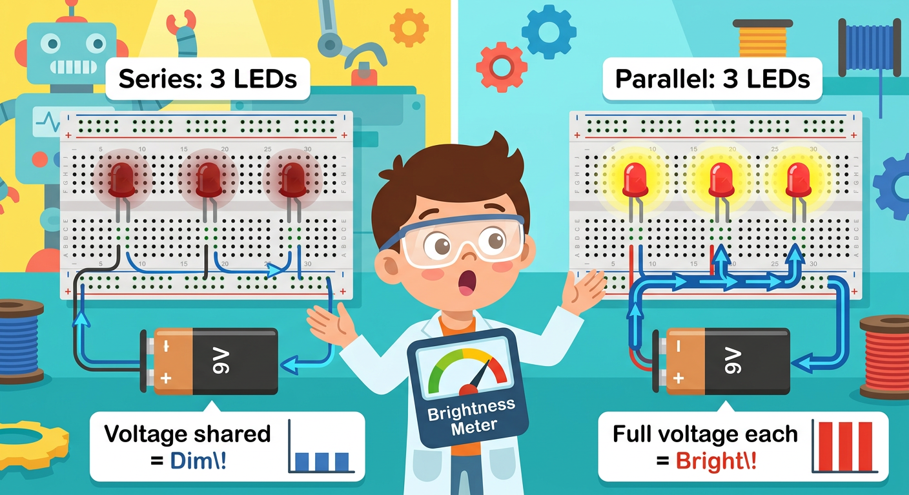
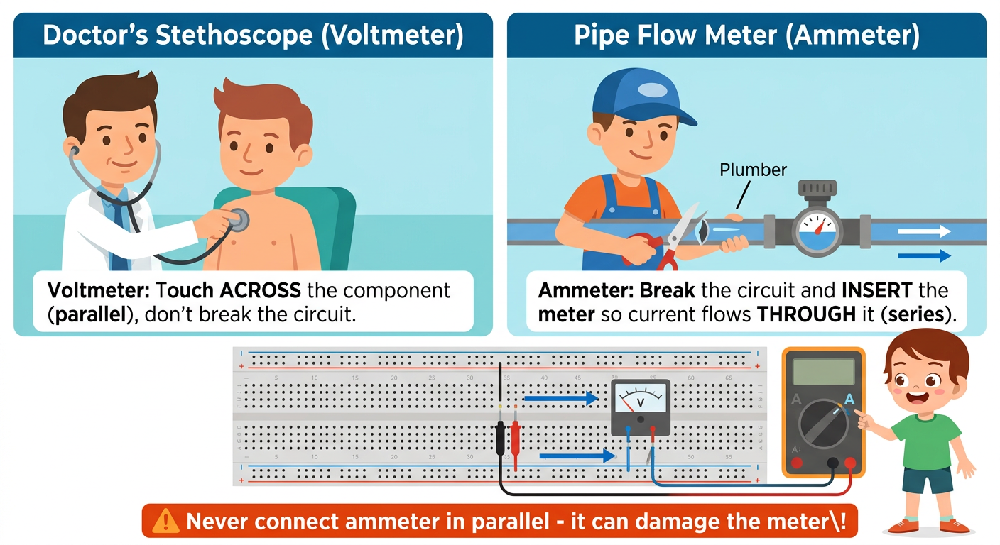

# Lesson 12: Parallel Circuits -- Quick Reference

**Age:** 6--12 years | **Time:** 45--50 min | **XP:** 230

---

## What You'll Learn

✓ Build circuits with MULTIPLE independent paths for electricity
✓ Understand that voltage is THE SAME across all paths
✓ Measure current using the Wand in a new "ammeter" mode
✓ Prove: Branch currents ADD UP to total current (Kirchhoff's Current Law)
✓ Know: Remove ONE branch = others KEEP WORKING ✓

---

## The Big Idea: The Highway with Multiple Lanes


**Parallel = MULTIPLE independent paths**

| Feature | Series | Parallel |
|---------|--------|----------|
| **Paths** | ONE | MANY |
| **Current** | Same everywhere | Splits between branches |
| **Voltage** | Splits | SAME across all branches |
| **Remove one?** | Everything stops | Others keep working ✓ |

---

## Build It: Three LEDs in Parallel

```
                +--[330Ω]--[RED LED]---+
                |                       |
9V (+) ----+----+--[330Ω]--[GREEN LED]-+----+---- 9V (−)
                |                       |
                +--[330Ω]--[YELLOW LED]-+
```

**On the breadboard:**
- Each LED has its OWN path from +rail to −rail
- Each branch: +rail → Resistor → LED → −rail
- All branches share the same battery voltage!

✓ **Three independent roads. Each works alone.**

---

## Measure It: Voltage & Current

### Voltage is the SAME everywhere



Set your Multimeter to **DC Volts**:

| Measurement | Expected |
|-------------|----------|
| Across battery | ~9V |
| Across each LED | ~2V each |
| Across each resistor | ~7V each |

✓ **Every branch sees the same 9V voltage!**

---

### Current SPLITS between branches (NEW skill!)



**NEW Wand Power: Measuring Current (Amps/mA)**

**SAFETY RULES:**
1. Move RED probe to **mA** jack (not V/Ω!)
2. Wand must be IN the circuit (break one wire, insert meter)
3. Never connect ammeter directly across battery!
4. Start on highest range (200mA)

**Measure current in each branch:**

| Branch | Current |
|--------|---------|
| Red LED | _____ mA |
| Green LED | _____ mA |
| Yellow LED | _____ mA |
| **TOTAL** | _____ mA |

Expected: ~20mA per branch, ~60mA total

**Kirchhoff's Current Law:** I_total = I_red + I_green + I_yellow ✓

---

## The Independence Test

Remove the GREEN LED. What happens?
- Red LED: ✓ Still ON
- Yellow LED: ✓ Still ON

**That's parallel!** Each branch is independent.
Remove one = others keep working.

---

## Compare: Series vs. Parallel

| Aspect | Series | Parallel |
|--------|--------|----------|
| **Brightness** | Dim (voltage shared) | Bright (each gets full voltage) |
| **Reliability** | Fragile (one breaks = all stop) | Reliable (one breaks = others work) |
| **Best for** | Simple projects | Real-world devices (homes, cars) |
| **Current path** | One track | Multiple lanes |
| **Voltage split** | Yes (shared) | No (same everywhere) |

---

## Key Takeaways

1. **Parallel = Multiple lanes** → Electricity has many paths
2. **Voltage is the SAME** → Each branch gets full battery voltage
3. **Current splits** → Total current = sum of all branch currents
4. **Reliable** → Remove one branch, others keep working ✓
5. **Brighter** → Each component gets full voltage (vs. series dimming)

---

## Quick Quiz (Test Yourself!)

**Q1:** In a parallel circuit, what stays the SAME across every branch?
- A) Current
- B) Voltage
- C) Resistance
✓ **Answer: B (Voltage)**

**Q2:** Three branches with currents: 10mA + 15mA + 25mA. Total current from battery?
✓ **Answer: 50mA** (10 + 15 + 25)

**Q3:** Remove one LED from a parallel circuit with 3 LEDs. What happens?
✓ **Answer: Other two stay ON (each has its own path)**

---

## Real-World Examples

- **Your house wiring:** Outlets are in parallel (unplug one device, others work)
- **Holiday lights (modern):** Parallel (one burns out, rest stay on)
- **Car headlights:** Parallel (one breaks, other works)
- **Phone chargers:** Multiple devices in parallel (charge phone AND tablet!)

---

## Next Steps

**Challenge:** Build a mixed circuit with BOTH series and parallel elements!
Example: Two branches in parallel, each branch has resistors in series.

---

*Print this page. Your key to understanding how real circuits work!*
