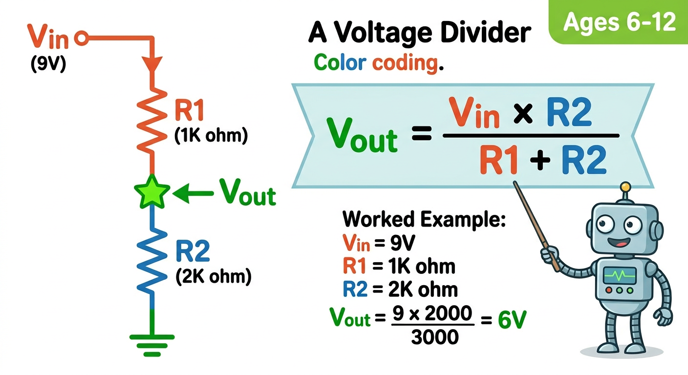
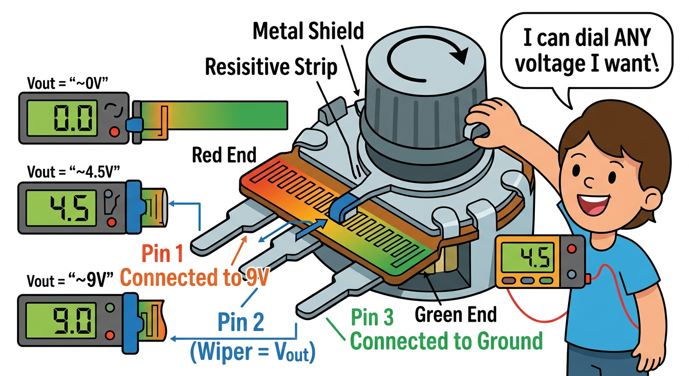

# Lesson 13: Voltage Dividers -- Quick Reference

**Age:** 6--12 years | **Time:** 45--50 min | **XP:** 230

---

## What You'll Learn

✓ Use TWO resistors to "divide" voltage into any size you want
✓ Use the voltage divider formula to PREDICT output voltage
✓ Verify predictions with your Wand (formula vs. reality!)
✓ Build a variable voltage divider with a potentiometer (adjustable voltage)

---

## The Big Idea: The Pizza Sharing Problem


**Two resistors = voltage splitter**

Think of it like sharing a pizza:
- Bigger resistor = bigger appetite = gets MORE voltage
- Smaller resistor = smaller appetite = gets LESS voltage
- The voltage at the middle point (Vout) is what's LEFT

---

## The Magic Formula



```
                   R2
Vout = Vin × ─────────────
             (R1 + R2)
```

**In plain English:** Output voltage = input voltage × (bottom resistor / total resistance)

---

## Try the Formula: Three Examples

### Round 1: Equal Resistors (1k + 1k)
```
Vout = 9 × 1000 / (1000 + 1000)
Vout = 9 × 0.5 = 4.5V
```
✓ Equal resistors = HALF the voltage

### Round 2: Unequal Resistors (1k + 2.2k)
```
Vout = 9 × 2200 / (1000 + 2200)
Vout = 9 × 0.6875 = 6.19V
```
✓ Bigger R2 = MORE voltage to Vout

### Round 3: Extreme (10k + 1k)
```
Vout = 9 × 1000 / (10000 + 1000)
Vout = 9 × 0.0909 = 0.82V
```
✓ Huge R1 = tiny output voltage

---

## Build & Test It

**Circuit: 1k + 1k voltage divider (predict 4.5V)**

```
9V (+) ---- [1kΩ R1] ----+---- [1kΩ R2] ---- GND
                          |
                        Vout
```

**On breadboard:**
1. R1 (1k): +rail to middle junction
2. R2 (1k): middle junction to −rail
3. Vout is at the middle junction

**Measure with Wand (DC Volts):**
- Predicted Vout: 4.5V
- Wand reads: _____ V
- Match? ✓

Tolerance: ±0.2V is excellent (real resistors have tolerances!)

---

## The Variable Voltage Divider: Potentiometer



**A potentiometer IS a voltage divider with an adjustable split point**

**Connections:**
- Pin 1 → 9V (+)
- Pin 3 → GND (−)
- Pin 2 → Vout (the wiper that moves)

**Turn the knob:**

| Position | Vout |
|----------|------|
| Fully left | ~0V |
| 1/4 turn | ~2.3V |
| Halfway | ~4.5V |
| 3/4 turn | ~6.7V |
| Fully right | ~9V |

✓ **You can dial ANY voltage you want!**

**Bonus:** Add an LED + resistor from Vout to GND = dimmer switch!

---

## Why Voltage Dividers Matter

1. **Sensors** - Light/temperature sensors are voltage dividers
2. **Volume controls** - Potentiometer is a voltage divider
3. **Signal scaling** - Lower 5V signal to 3.3V for microcontroller
4. **Battery monitoring** - Robots use this to check battery level

---

## Key Takeaways

1. **Two resistors split voltage** → Use the formula to predict output
2. **The formula works!** → R2 gets more voltage than R1 (in circuit)
3. **Potentiometer = adjustable divider** → Turn knob, voltage changes
4. **Real-world everywhere** → Sensors, controls, level shifters

---

## Quick Quiz (Test Yourself!)

**Q1:** Equal resistors (1k + 1k), Vin=10V. What's Vout?
✓ **Answer: 5V** (equal split)

**Q2:** R1=1k, R2=1k, Vin=10V. You increase R2 to 2k. Does Vout go up or down?
✓ **Answer: UP** (bigger R2 = bigger share of voltage)

**Q3:** Potentiometer at halfway. Vin=9V. What's Vout?
✓ **Answer: 4.5V** (halfway = half voltage)

---

## Challenge

**Design a voltage divider to get exactly 3V from a 9V battery using only 1kΩ resistors.**
Hint: Use multiple resistors or... think about series/parallel combinations!

---

*Print this page. Master the voltage divider and you've got sensor circuits covered!*
