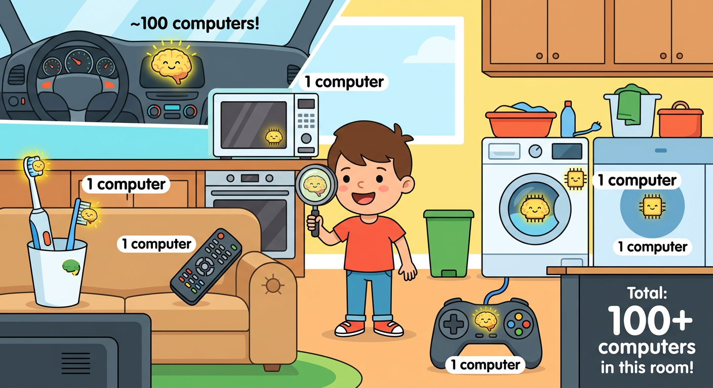
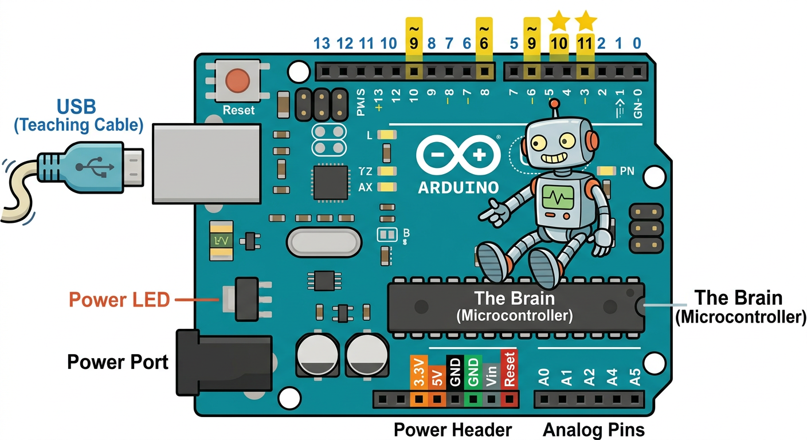
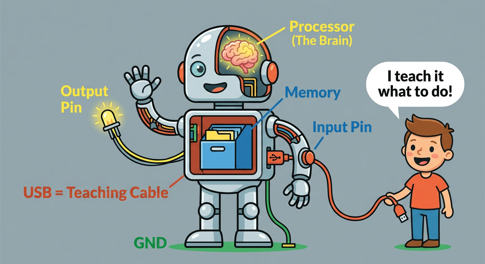

# Lesson 25: What is a Microcontroller? -- Quick Reference

**Age:** 6--12 years | **Time:** 40--45 min | **XP:** 250

---

## The Big Idea

**Microcontroller = Tiny computer on ONE chip**

- Has a brain (processor) that THINKS
- Has memory to REMEMBER
- Has pins that CONTROL the real world
- Runs ONE program over and over forever

---

## Hidden Computers

They're EVERYWHERE:
- Cars (100+ computers!)
- Microwaves (1 computer)
- Washing machines (1 computer)
- Game controllers (1 computer)
- Your toothbrush (1 computer)

---

## The Arduino Uno

### Key Parts

| Part | What It Does |
|------|-------------|
| **USB Port** | Teaches the Arduino + provides power |
| **ATmega328 Chip** | The actual microcontroller -- the BRAIN |
| **Digital Pins (0-13)** | Can turn ON (5V) or OFF (0V) |
| **Analog Pins (A0-A5)** | Can read smooth values (0-1023) |
| **Power Pins** | 5V, 3.3V, GND (ground) |
| **Reset Button** | Restarts your program |
| **Pin 13 LED** | Built-in LED for testing |

---

## The Robot Brain Analogy

**Your Arduino is like a robot:**
- **USB Cable** = Teaching cord (you teach it what to do)
- **Processor** = Robot's brain (it THINKS)
- **Memory** = Robot's filing cabinet (it REMEMBERS)
- **Output Pins** = Robot's arms (they CONTROL things)
- **Input Pins** = Robot's sensors (they SENSE things)
- **GND (Ground)** = Robot's feet (grounded and safe)

---

## Real-World Uses

- 🚗 **Cars:** Engine control, safety systems, infotainment
- 🏥 **Medical:** Insulin pumps, heart monitors, ventilators
- 🤖 **Robots:** Movement, sensing, decision-making
- 🎮 **Games:** Controllers, sound, motion
- 🏠 **Home:** Smart lights, thermostats, doorbells

---

## Quick Quiz

**Q1:** What does a microcontroller have inside it?
**A:** A processor (brain), memory, and pins to control things.

**Q2:** How many pins does the Arduino Uno have?
**A:** 14 digital pins + 6 analog pins = 20 total pins.

**Q3:** Why is the USB cable important?
**A:** It teaches the Arduino what to do AND provides power!

---

## Challenge

**Find a microcontroller:** Look around your house and find 5 devices that might contain microcontrollers. List them!

---

*Print this with the Arduino diagram and robot brain analogy for reference!*
