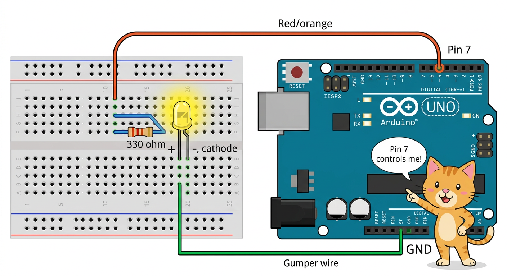
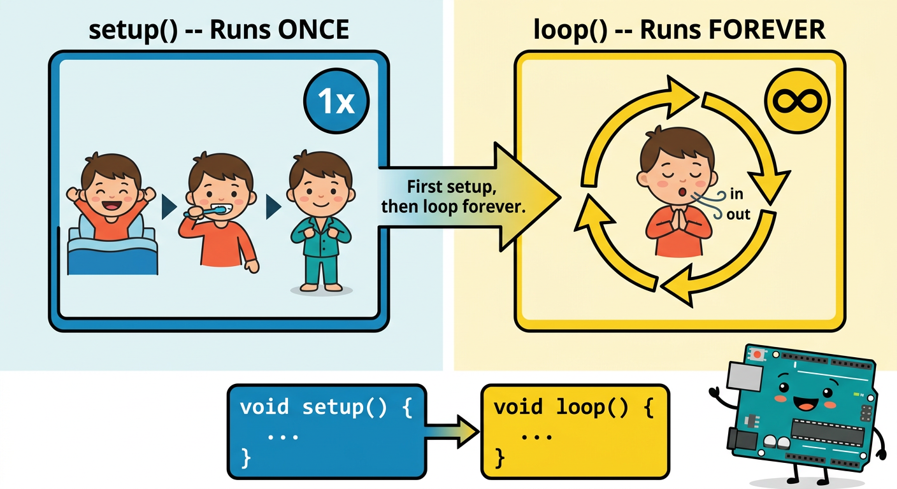

# Lesson 26: First Sketch -- Blink External LED -- Quick Reference

**Age:** 6--12 years | **Time:** 45--50 min | **XP:** 270

---

## Your Mission

**Write a program that blinks an external LED on and off!**

This teaches:
- How to write Arduino code (a "sketch")
- How to control pins from code
- How `setup()` and `loop()` work

---

## The Wiring



**Connect:**
1. Arduino Pin 7 → 330Ω resistor → LED (long leg)
2. LED short leg → back to Arduino GND

**Why the resistor?** Protects the LED from too much current!

---

## Code Structure: setup() and loop()



```cpp
void setup() {
  // Runs ONCE at the start
  // Initialize pins, Serial, etc.
  pinMode(7, OUTPUT);
}

void loop() {
  // Runs FOREVER (continuously)
  // Main program goes here
  digitalWrite(7, HIGH);    // LED ON
  delay(1000);              // Wait 1 second
  digitalWrite(7, LOW);     // LED OFF
  delay(1000);              // Wait 1 second
}
```

---

## Key Functions

| Function | What It Does |
|----------|-------------|
| `pinMode(pin, OUTPUT)` | Tell Arduino: "This pin is an OUTPUT" |
| `digitalWrite(pin, HIGH)` | Turn pin ON (5V) |
| `digitalWrite(pin, LOW)` | Turn pin OFF (0V) |
| `delay(ms)` | Wait for X milliseconds |

---

## The Blink Pattern

```
Loop 1: ON → wait 1s → OFF → wait 1s
Loop 2: ON → wait 1s → OFF → wait 1s
Loop 3: ON → wait 1s → OFF → wait 1s
... (repeats forever!)
```

---

## Real-World Blinking

- 🚨 **Traffic lights** -- blink for visibility
- 🔌 **Device indicators** -- power LED, charging LED, error LED
- 🚁 **Drones** -- navigation lights
- 📡 **Satellites** -- status indicators
- 🎁 **Decorations** -- LED strands, holiday lights

---

## Quick Quiz

**Q1:** What does `pinMode(7, OUTPUT)` do?
**A:** Tells Arduino that Pin 7 is sending OUT a signal (not reading IN).

**Q2:** How long does this code wait between blinks?
**A:** 1000 milliseconds = 1 second.

**Q3:** Where does the main blinking code go?
**A:** Inside the `loop()` function (runs forever).

---

## Challenge

**Speed Challenge:** Change the delay to 250 milliseconds. How fast does the LED blink now?

---

*Print this with the wiring diagram for circuit reference!*
