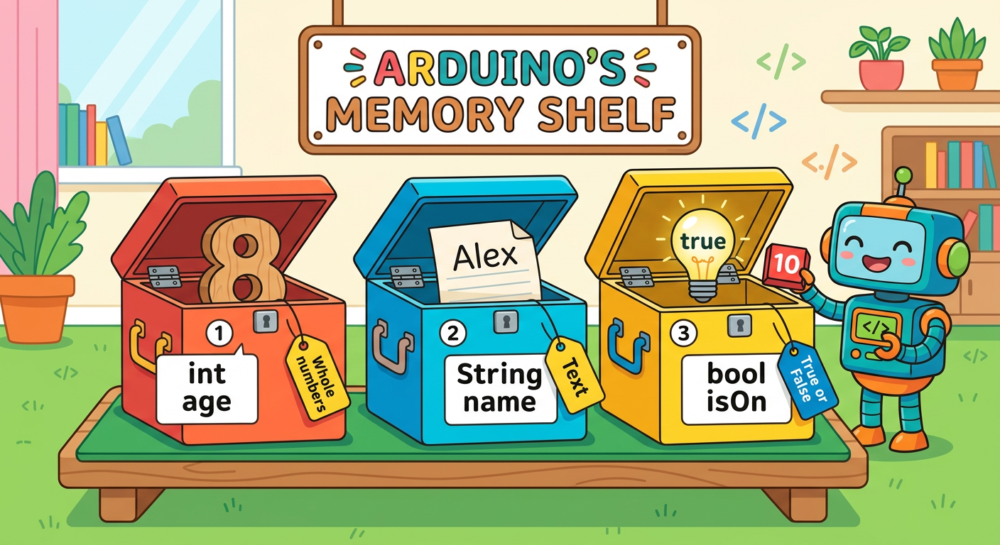
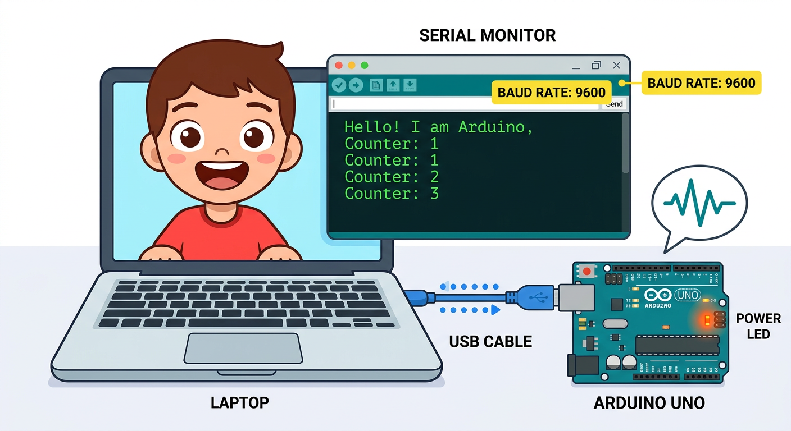
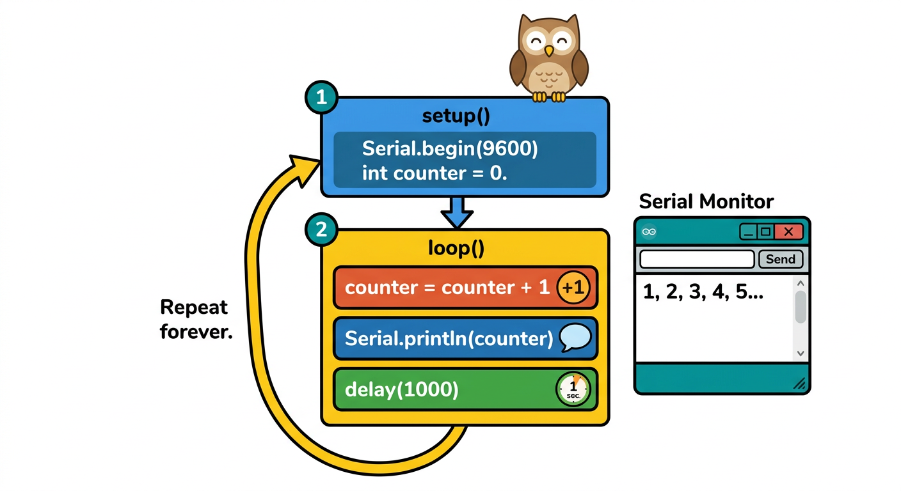

# Lesson 27: Variables and Serial Monitor -- Quick Reference

**Age:** 6--12 years | **Time:** 45--50 min | **XP:** 230

---

## What Are Variables?

**Variable = A labeled box where Arduino stores numbers or text**



### Three Main Types

| Type | Example | What It Holds |
|------|---------|---------------|
| **int** | `int age = 8;` | Whole numbers (0, 1, 2, ..., 1000) |
| **String** | `String name = "Alex";` | Text ("Hello", "Arduino", etc.) |
| **bool** | `bool isOn = true;` | True or False only |

---

## The Serial Monitor



**Serial Monitor = A window to see what your Arduino is thinking**

```cpp
void setup() {
  Serial.begin(9600);  // Start talking to Serial Monitor
}

void loop() {
  Serial.println("Hello!");  // Send text to monitor
}
```

**Baud Rate:** 9600 (how fast data flows over USB)

---

## Build a Counter



```cpp
int counter = 0;  // Create counter variable

void setup() {
  Serial.begin(9600);
}

void loop() {
  counter = counter + 1;      // Increase by 1
  Serial.println(counter);    // Show new value
  delay(1000);                // Wait 1 second
}
```

**Serial Monitor output:**
```
1
2
3
4
5
...
```

---

## Serial Functions

| Function | What It Does |
|----------|-------------|
| `Serial.begin(9600)` | Start communication with computer |
| `Serial.println("text")` | Send text + new line |
| `Serial.print("text")` | Send text (no new line) |
| `Serial.println(variable)` | Send a number value |

---

## Real-World Uses

- 🌡️ **Temperature display** -- show sensor readings
- 📊 **Data logging** -- record measurements over time
- 🐛 **Debugging** -- figure out what code is doing
- 📱 **Phone apps** -- Arduino talks to your phone via Bluetooth
- 🎮 **Game input** -- controller sends button presses to computer

---

## Quick Quiz

**Q1:** What does `int counter = 0;` do?
**A:** Creates a variable box named "counter" and puts 0 inside.

**Q2:** What is the Serial Monitor used for?
**A:** Seeing messages and numbers that your Arduino sends.

**Q3:** What does `Serial.println()` do?
**A:** Sends text or numbers to the Serial Monitor with a new line.

---

## Challenge

**Count Down:** Modify the counter sketch to count DOWN from 10 to 1 instead of UP.

---

*Print this with the Serial Monitor screenshot for reference!*
