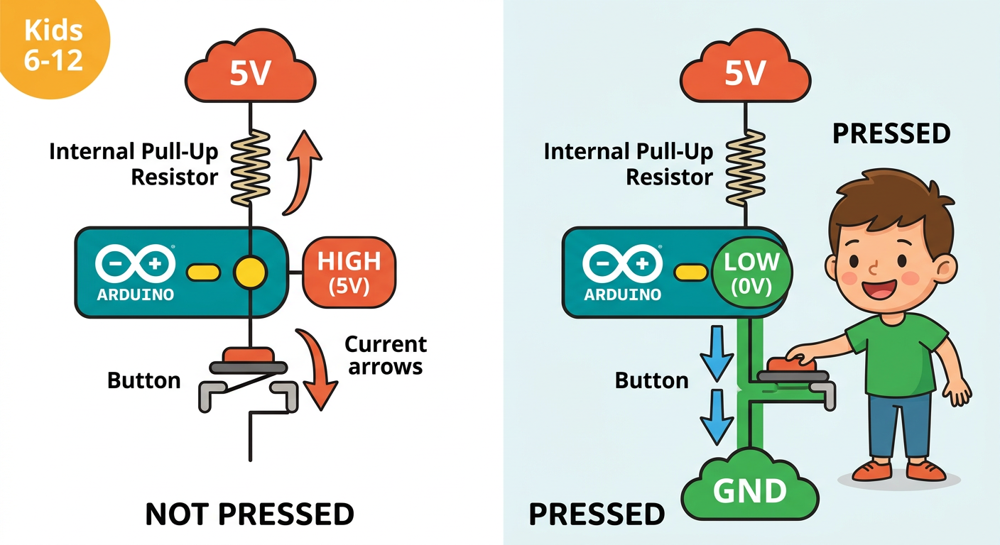
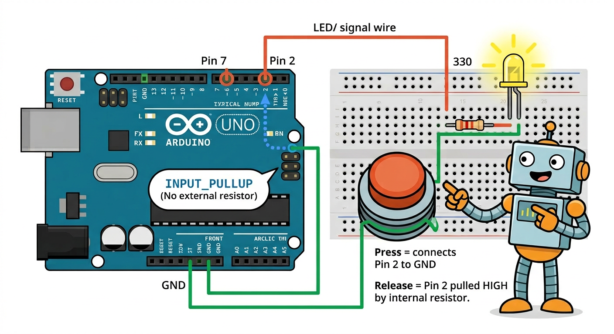
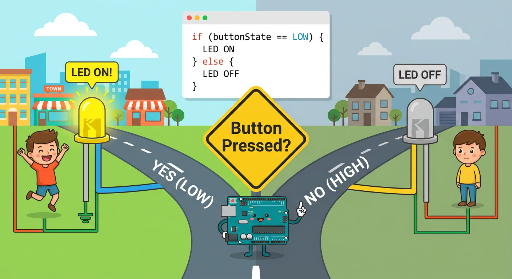

# Lesson 28: Reading Digital Inputs (Buttons) -- Quick Reference

**Age:** 6--12 years | **Time:** 50--60 min | **XP:** 280

---

## How Buttons Work with Arduino



**INPUT_PULLUP = Arduino pulls pin UP to 5V by default**

- **Button NOT pressed:** Pin reads HIGH (5V)
- **Button pressed:** Pin connects to GND, reads LOW (0V)

---

## Button Wiring



**Connect:**
1. Arduino Pin 2 → one side of button
2. Button other side → Arduino GND
3. (No external resistor needed! Arduino does it internally with INPUT_PULLUP)

---

## The Code

```cpp
int buttonPin = 2;
int ledPin = 7;

void setup() {
  pinMode(buttonPin, INPUT_PULLUP);  // Button is input
  pinMode(ledPin, OUTPUT);            // LED is output
}

void loop() {
  int buttonState = digitalRead(buttonPin);

  if (buttonState == LOW) {      // Button PRESSED
    digitalWrite(ledPin, HIGH);  // LED ON
  } else {                       // Button NOT pressed
    digitalWrite(ledPin, LOW);   // LED OFF
  }
}
```

---

## The Decision Fork



**if/else = Make a decision:**

```cpp
if (condition) {
  // Code runs if condition is TRUE
} else {
  // Code runs if condition is FALSE
}
```

---

## Key Functions

| Function | What It Does |
|----------|-------------|
| `digitalRead(pin)` | Read pin: returns HIGH or LOW |
| `if (condition) { }` | Execute code if TRUE |
| `else { }` | Execute code if FALSE |
| `INPUT_PULLUP` | Internal pull-up resistor (no external resistor!) |

---

## Real-World Button Uses

- 🎮 **Game controllers** -- detect button presses
- 🔘 **Doorbells** -- trigger a sound
- 🚨 **Alarm systems** -- detect motion or window open
- 🎛️ **Volume control** -- increase/decrease levels
- ⏰ **Timers** -- start/stop countdown

---

## Quick Quiz

**Q1:** What does `INPUT_PULLUP` do?
**A:** It pulls the pin up to 5V internally, so pressing the button brings it LOW to 0V.

**Q2:** When the button is pressed, what value does `digitalRead()` return?
**A:** LOW (0V).

**Q3:** What is the if/else statement used for?
**A:** Making decisions: "If something is true, do this; otherwise, do that."

---

## Challenge

**Toggle:** Make the button TOGGLE the LED (press once to turn on, press again to turn off).

---

*Print this with the button wiring and logic diagrams for reference!*
