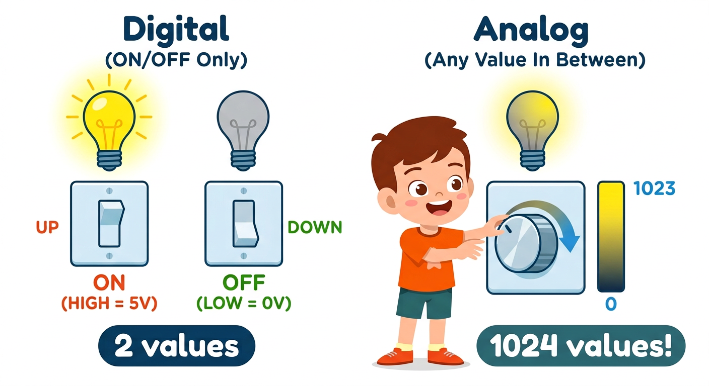
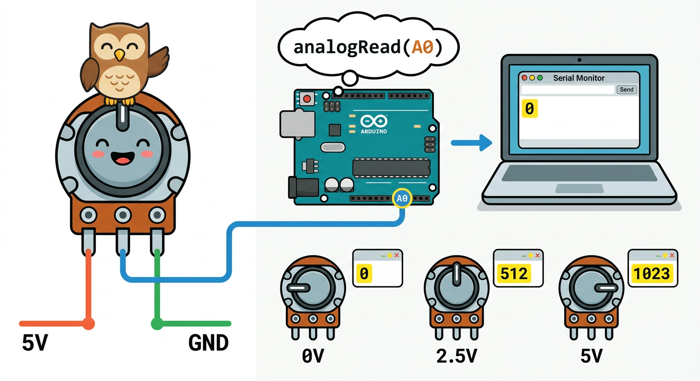

# Lesson 29: Analog Inputs -- Quick Reference

**Age:** 6--12 years | **Time:** 45--50 min | **XP:** 240

---

## Digital vs Analog



| Digital | Analog |
|---------|--------|
| ON / OFF only | ANY value in between |
| 2 values (0 or 1) | 1024 values (0-1023) |
| Light switch | Dimmer knob |
| Button | Potentiometer |

---

## The Potentiometer (3-Pin Knob)

**Potentiometer = A resistor you can twist**

```
5V  ─── [Potentiometer] ─── GND
         │
      Output to Arduino A0
```

- **Rotate left:** Output reads 0V
- **Rotate middle:** Output reads 2.5V
- **Rotate right:** Output reads 5V

---

## Reading Potentiometer Values



```cpp
int potPin = A0;  // Analog pin A0

void setup() {
  Serial.begin(9600);
}

void loop() {
  int value = analogRead(potPin);  // Read 0-1023
  Serial.println(value);           // Print value
  delay(100);
}
```

**Serial Monitor output:**
```
0       (knob at left)
512     (knob at middle)
1023    (knob at right)
```

---

## Analog Pin Map

| Arduino Pin | Connects To |
|-------------|------------|
| A0 | Analog 0 |
| A1 | Analog 1 |
| A2 | Analog 2 |
| A3 | Analog 3 |
| A4 | Analog 4 |
| A5 | Analog 5 |

---

## Real-World Analog Sensors

- 🌡️ **Temperature sensor** -- smooth temperature reading
- 📢 **Sound sensor** -- measure loudness
- ☀️ **Light sensor** -- measure brightness
- 🎚️ **Joystick** -- smooth X and Y movement
- 🌊 **Soil moisture** -- smooth water level reading

---

## Using Analog Values

```cpp
int sensorValue = analogRead(A0);

// Map 0-1023 to 0-255 for LED brightness
int brightness = map(sensorValue, 0, 1023, 0, 255);
analogWrite(9, brightness);
```

---

## Quick Quiz

**Q1:** What is the difference between digital and analog?
**A:** Digital is ON/OFF (2 values). Analog is any smooth value (1024 values).

**Q2:** What does `analogRead(A0)` return?
**A:** A number from 0 to 1023 representing the voltage.

**Q3:** How many analog pins does the Arduino Uno have?
**A:** 6 analog pins (A0 through A5).

---

## Challenge

**Display on Serial:** Connect a potentiometer to A0 and read its value. Twist it and watch the Serial Monitor!

---

*Print this with the digital vs analog and potentiometer diagrams for reference!*
