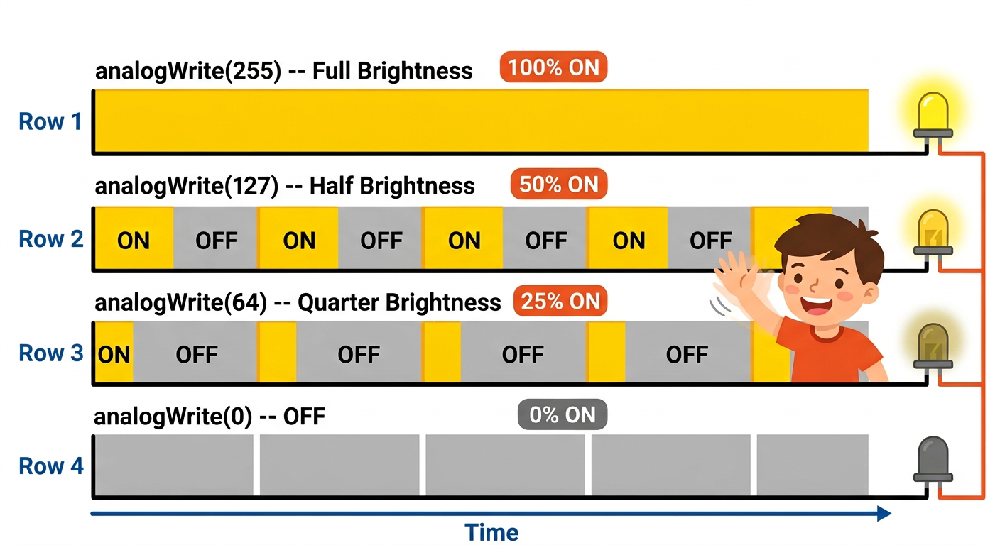
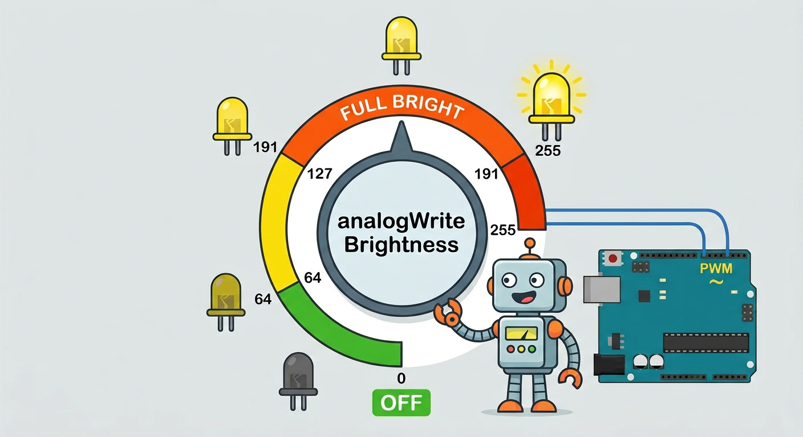
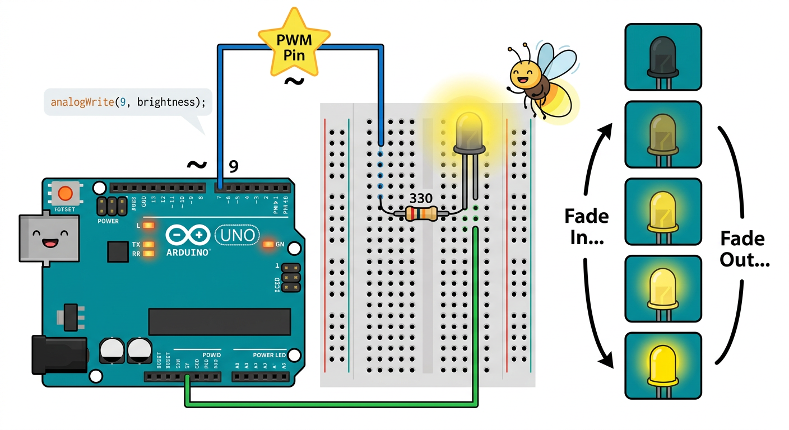

# Lesson 30: PWM Dimming LEDs -- Quick Reference

**Age:** 6--12 years | **Time:** 50--60 min | **XP:** 270

---

## What is PWM?

**PWM (Pulse Width Modulation) = Super-fast ON/OFF to fake smooth brightness**



```
analogWrite(255) = 100% ON  = Full brightness
analogWrite(127) = 50% ON   = Half brightness
analogWrite(64)  = 25% ON   = Quarter brightness
analogWrite(0)   = 0% ON    = OFF
```

The eye can't see the flickering, so it looks like smooth dimming!

---

## Brightness Dial



**analogWrite(pin, value)** where value is 0-255:

| Value | Brightness |
|-------|-----------|
| 0 | OFF |
| 64 | Very dim |
| 127 | Half bright |
| 191 | Very bright |
| 255 | Full bright |

---

## PWM Pins

**Only certain pins support PWM (marked with ~):**

| Arduino Uno | PWM Pins |
|------------|---------|
| Digital | 3, 5, 6, 9, 10, 11 |

Use these pins for dimming LEDs!

---

## The Fade Circuit



**Connect:**
1. Arduino Pin 9 (PWM) → 330Ω resistor → LED (long leg)
2. LED short leg → Arduino GND

---

## Fade Code

```cpp
int ledPin = 9;  // Must be a PWM pin (~)

void setup() {
  pinMode(ledPin, OUTPUT);
}

void loop() {
  // Fade in (0 to 255)
  for (int i = 0; i <= 255; i++) {
    analogWrite(ledPin, i);
    delay(10);
  }

  // Fade out (255 to 0)
  for (int i = 255; i >= 0; i--) {
    analogWrite(ledPin, i);
    delay(10);
  }
}
```

---

## Real-World PWM Uses

- 💡 **Smart bulbs** -- smooth dimming
- 🎮 **Rumble motors** -- intensity control
- 🎛️ **Audio amplifiers** -- volume control
- 🚘 **Motor speed** -- slow or fast
- ⌚ **LCD backlight** -- brightness control

---

## Quick Quiz

**Q1:** What does PWM stand for?
**A:** Pulse Width Modulation.

**Q2:** Why is Pin 9 better than Pin 7 for dimming an LED?
**A:** Pin 9 supports PWM (~), while Pin 7 does not.

**Q3:** What value would you use for 75% brightness?
**A:** Around 191 (75% of 255).

---

## Challenge

**Control with Potentiometer:** Connect a potentiometer to A0, then use its value to control LED brightness!

---

*Print this with the fade circuit diagram and PWM pattern chart for reference!*
