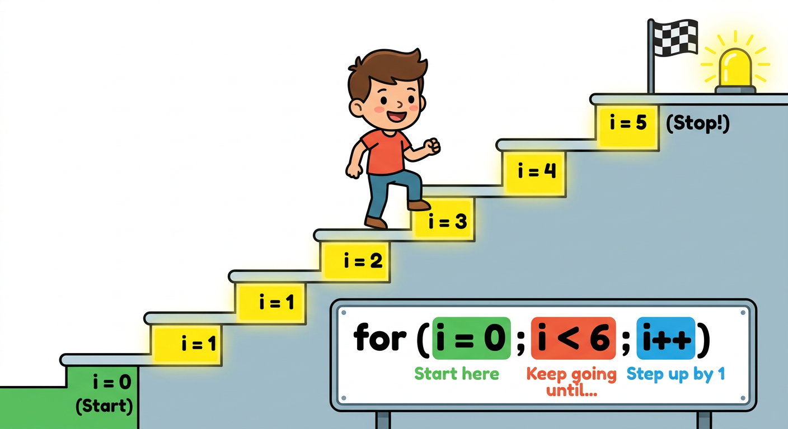
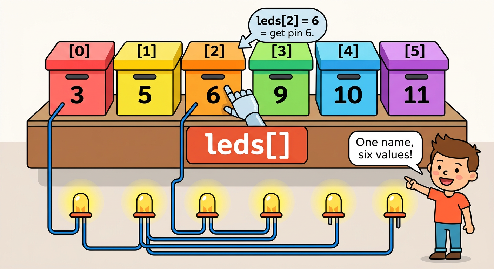
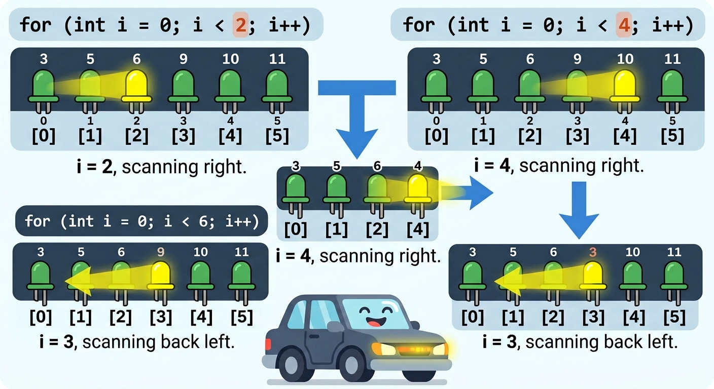

# Lesson 31: For Loops and Arrays -- Quick Reference

**Age:** 6--12 years | **Time:** 50--60 min | **XP:** 280

---

## What Is a For Loop?

**For Loop = Repeat code a specific number of times**



```cpp
for (int i = 0; i < 6; i++) {
  // This code runs 6 times (i = 0, 1, 2, 3, 4, 5)
}
```

- **i = 0** = Start at 0
- **i < 6** = Stop before 6 (0, 1, 2, 3, 4, 5 = 6 times!)
- **i++** = Increase i by 1 each loop

---

## What Is an Array?

**Array = A line of boxes with the same variable name**



```cpp
int leds[] = {3, 5, 6, 9, 10, 11};
// leds[0] = 3
// leds[1] = 5
// leds[2] = 6
// leds[3] = 9
// leds[4] = 10
// leds[5] = 11
```

Get values with: `leds[index]`

---

## Loops + Arrays = Power!

```cpp
int leds[] = {3, 5, 6, 9, 10, 11};

void setup() {
  for (int i = 0; i < 6; i++) {
    pinMode(leds[i], OUTPUT);  // Set all 6 as OUTPUT
  }
}

void loop() {
  for (int i = 0; i < 6; i++) {
    digitalWrite(leds[i], HIGH);
    delay(200);
    digitalWrite(leds[i], LOW);
  }
}
```

---

## Knight Rider Scanner



```cpp
int leds[] = {3, 5, 6, 9, 10, 11};

void loop() {
  // Light up left to right
  for (int i = 0; i < 6; i++) {
    digitalWrite(leds[i], HIGH);
    delay(100);
    digitalWrite(leds[i], LOW);
  }

  // Light up right to left
  for (int i = 5; i >= 0; i--) {
    digitalWrite(leds[i], HIGH);
    delay(100);
    digitalWrite(leds[i], LOW);
  }
}
```

---

## Real-World Loop Uses

- 🚨 **Light shows** -- control many LEDs at once
- 🎛️ **Button arrays** -- scan all buttons with one loop
- 📊 **Sensor reading** -- collect data from multiple sensors
- 🎮 **Animation** -- move objects frame by frame
- 🔊 **Sound generation** -- create musical tones

---

## Loop Common Mistakes

| Mistake | Correct |
|---------|---------|
| `for (i = 0; i < 6; i++)` | `for (int i = 0; i < 6; i++)` |
| `for (int i = 1; i < 6; i++)` | `for (int i = 0; i < 6; i++)` |
| `digitalWrite(leds[6], HIGH)` | `digitalWrite(leds[5], HIGH)` |
| (No curly braces) | `{ code }` |

---

## Quick Quiz

**Q1:** What does `i++` do?
**A:** Increases i by 1 each loop iteration.

**Q2:** How many times does this loop run: `for (int i = 0; i < 10; i++)`?
**A:** 10 times (i = 0 through 9).

**Q3:** What is `leds[2]`?
**A:** The third value in the array (index 2 = third item).

---

## Challenge

**Make your own:** Create an array of 5 different pin numbers and make them light up in sequence!

---

*Print this with the loop staircase and array diagrams for reference!*
