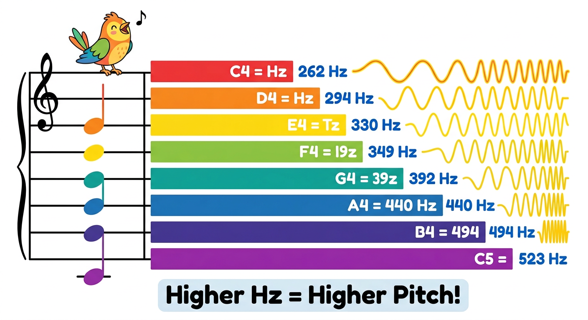
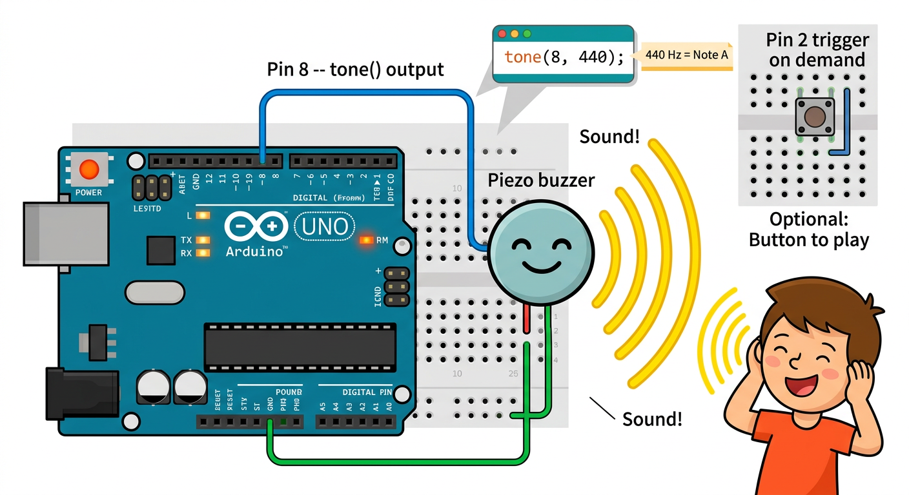

# Lesson 32: Piezo Buzzer and Tones -- Quick Reference

**Age:** 6--12 years | **Time:** 45--50 min | **XP:** 220

---

## Musical Notes and Frequencies



**Higher Hz = Higher Pitch (squeakier)**

| Note | Frequency (Hz) | Use |
|------|-------|------|
| C4 | 262 | Low note |
| D4 | 294 | |
| E4 | 330 | |
| F4 | 349 | |
| G4 | 392 | |
| A4 | 440 | Standard note |
| B4 | 494 | |
| C5 | 523 | High note |

---

## Buzzer Wiring



**Connect:**
1. Arduino Pin 8 → Piezo buzzer (+ leg)
2. Piezo buzzer (- leg) → Arduino GND

**No resistor needed!**

---

## Playing Tones

```cpp
int buzzerPin = 8;

void setup() {
  pinMode(buzzerPin, OUTPUT);
}

void loop() {
  // Play A4 (440 Hz) for 1 second
  tone(buzzerPin, 440);
  delay(1000);

  // Stop playing
  noTone(buzzerPin);
  delay(500);
}
```

---

## Tone Functions

| Function | What It Does |
|----------|-------------|
| `tone(pin, frequency)` | Play a tone forever |
| `tone(pin, frequency, duration)` | Play tone for X ms then stop |
| `noTone(pin)` | Stop playing any tone |

---

## Play a Melody

```cpp
int notes[] = {262, 294, 330, 349, 392};  // C D E F G

void loop() {
  for (int i = 0; i < 5; i++) {
    tone(8, notes[i]);  // Play note
    delay(500);         // Wait 500ms
    noTone(8);          // Stop
    delay(100);         // Gap between notes
  }
}
```

---

## Real-World Buzzer Uses

- 🔔 **Doorbells** -- alert tones
- ⏰ **Alarms** -- beeping sounds
- 🎮 **Games** -- sound effects and music
- 🚨 **Warnings** -- piezo sirens
- 🎵 **Music box** -- simple melodies

---

## Quick Quiz

**Q1:** What does `tone(8, 440)` do?
**A:** Plays a 440 Hz (note A) tone continuously on Pin 8.

**Q2:** How do you stop a tone?
**A:** Use `noTone(buzzerPin)`.

**Q3:** What frequency is the highest pitch?
**A:** C5 at 523 Hz.

---

## Challenge

**Play Mary Had a Little Lamb:** Look up the note frequencies and create an array to play the melody!

---

*Print this with the frequency chart and buzzer wiring diagram for reference!*
