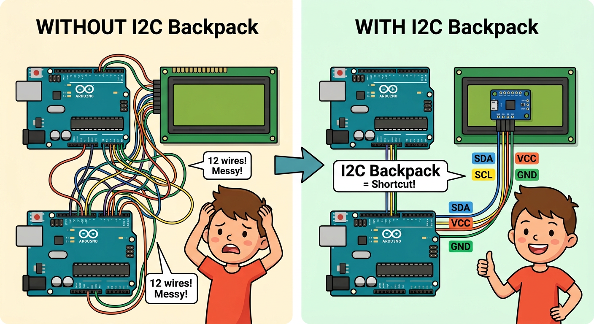
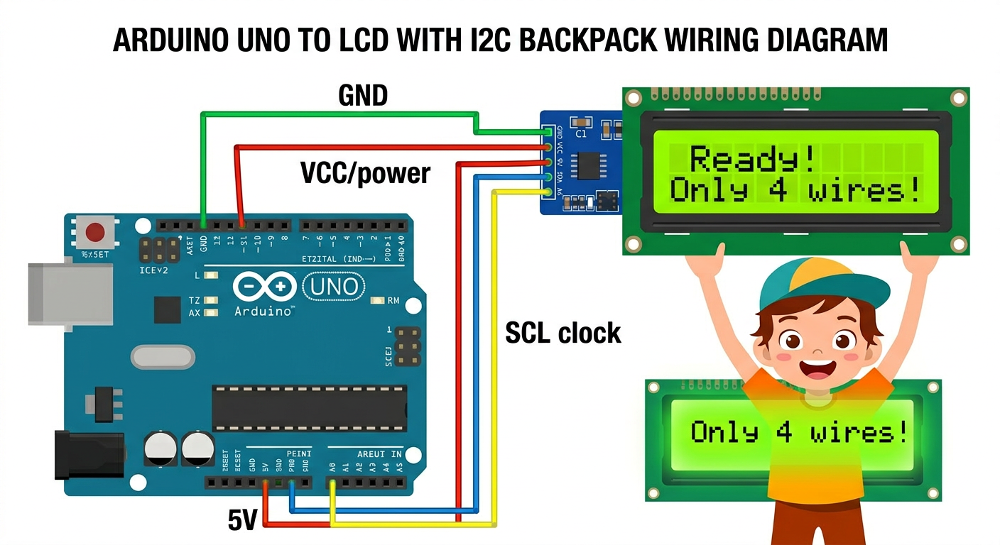
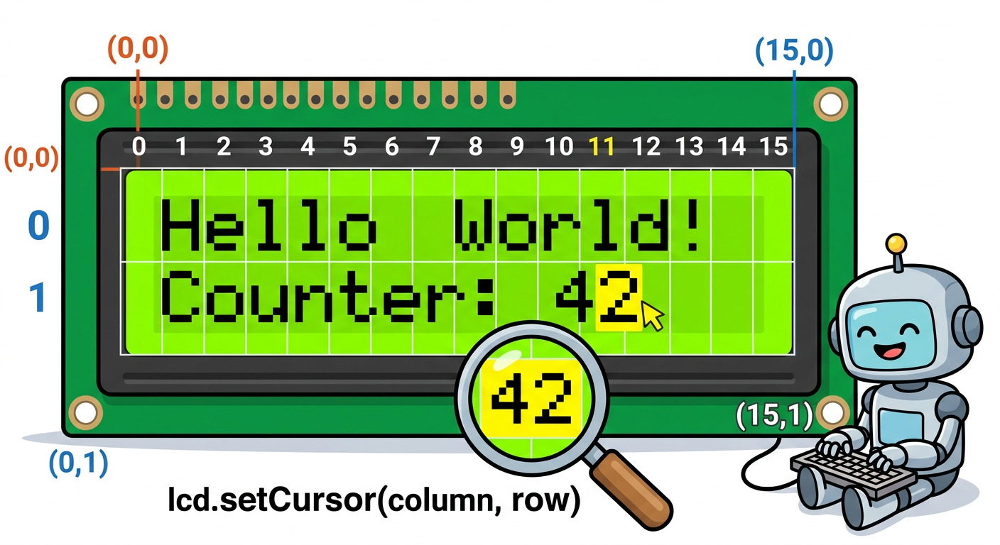

# Lesson 33: LCD Display (16x2 with I2C) -- Quick Reference

**Age:** 6--12 years | **Time:** 50--60 min | **XP:** 270

---

## The I2C Shortcut



**WITHOUT I2C:** 12 messy wires = Confusing!

**WITH I2C Backpack:** 4 clean wires = Easy!

---

## What is I2C?

**I2C (I-squared-C) = Smart communication over just 2 wires**

- Uses only **SDA** (data line) and **SCL** (clock line)
- The I2C backpack handles all the complexity
- Multiple devices can share the same 2 wires!

---

## Wiring the LCD



**Connect 4 wires only:**

| LCD Pin | Arduino Pin | Wire Color |
|---------|------------|-----------|
| GND | GND | Green |
| VCC | 5V | Red/Orange |
| SDA | A4 | Blue |
| SCL | A5 | Yellow |

---

## LCD Positions (16x2)



**Row 0:** 16 characters (positions 0-15)
**Row 1:** 16 characters (positions 0-15)

```cpp
lcd.setCursor(column, row);  // Move cursor to position
lcd.print("text");           // Print text
```

---

## LCD Code Example

```cpp
#include <LiquidCrystal_I2C.h>

// Create LCD object (address 0x27, 16 cols, 2 rows)
LiquidCrystal_I2C lcd(0x27, 16, 2);

void setup() {
  lcd.init();           // Start LCD
  lcd.backlight();      // Turn on backlight
  lcd.print("Hello!");  // Print on row 0
}

void loop() {
  lcd.setCursor(0, 1);       // Move to row 1
  lcd.print("Count: 5");     // Print on row 1
}
```

---

## LCD Commands

| Command | What It Does |
|---------|-------------|
| `lcd.init()` | Start the LCD |
| `lcd.backlight()` | Turn on backlight |
| `lcd.noBacklight()` | Turn off backlight |
| `lcd.setCursor(col, row)` | Move cursor to position |
| `lcd.print("text")` | Display text |
| `lcd.clear()` | Erase all text |

---

## Real-World LCD Uses

- 🌡️ **Thermometer** -- display temperature
- ⏰ **Digital clock** -- show time
- 📊 **Scoreboard** -- display scores
- 🎛️ **Control panel** -- buttons + LCD display menu
- 🚗 **Car dashboards** -- speed, fuel, distance

---

## Quick Quiz

**Q1:** What is the address 0x27?
**A:** The I2C address of this specific LCD backpack.

**Q2:** How many wires does the I2C version use?
**A:** 4 wires (GND, VCC, SDA, SCL).

**Q3:** What does `lcd.setCursor(0, 1)` do?
**A:** Moves the cursor to column 0, row 1 (bottom-left).

---

## Challenge

**Make a Clock:** Use Serial data or a real-time clock module to display hours and minutes on the LCD!

---

*Print this with the I2C wiring and LCD position diagrams for reference!*
