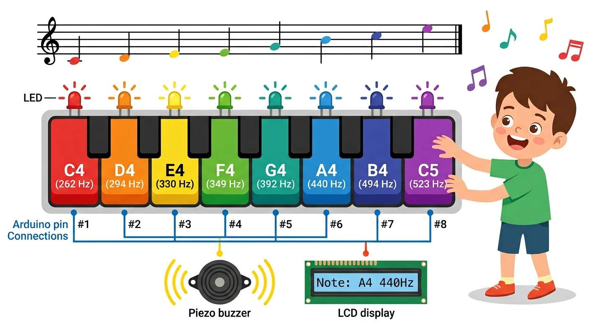
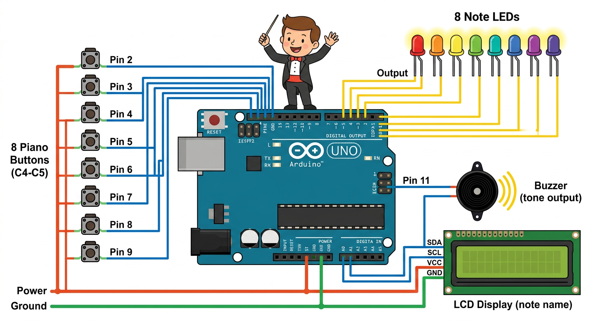

# Lesson 34: Project -- Digital Piano -- Quick Reference

**Age:** 6--12 years | **Time:** 90--120 min | **XP:** 360

---

## Building a Digital Piano

**Play music with 8 buttons controlling 8 notes!**

Combines EVERYTHING from Module 4:
- 8 buttons (digital inputs)
- 8 LEDs (digital outputs)
- Piezo buzzer (tone output)
- 16x2 LCD display (I2C)
- Arrays and loops
- Decision making (if/else)

---

## Piano Layout



**8 Buttons = 8 Notes:**

| Button | Pin | Note | Frequency | LED Color |
|--------|-----|------|-----------|----------|
| 1 | 2 | C4 | 262 Hz | Red |
| 2 | 3 | D4 | 294 Hz | Orange |
| 3 | 4 | E4 | 330 Hz | Yellow |
| 4 | 5 | F4 | 349 Hz | Green |
| 5 | 6 | G4 | 392 Hz | Teal |
| 6 | 7 | A4 | 440 Hz | Blue |
| 7 | 8 | B4 | 494 Hz | Indigo |
| 8 | 9 | C5 | 523 Hz | Violet |

---

## System Overview



**Architecture:**
```
8 Buttons (Pins 2-9)
      ↓
  Arduino (makes decisions)
      ↓
Piezo (plays tone) + 8 LEDs (light up) + LCD (shows note name)
```

---

## The Piano Code

```cpp
#include <LiquidCrystal_I2C.h>

int buttonPins[] = {2, 3, 4, 5, 6, 7, 8, 9};
int ledPins[] = {10, 11, 12, 13, A0, A1, A2, A3};
int tones[] = {262, 294, 330, 349, 392, 440, 494, 523};
String noteNames[] = {"C4", "D4", "E4", "F4", "G4", "A4", "B4", "C5"};

LiquidCrystal_I2C lcd(0x27, 16, 2);
int buzzerPin = 11;

void setup() {
  for (int i = 0; i < 8; i++) {
    pinMode(buttonPins[i], INPUT_PULLUP);
    pinMode(ledPins[i], OUTPUT);
  }
  lcd.init();
  lcd.backlight();
  lcd.print("Piano Ready!");
}

void loop() {
  for (int i = 0; i < 8; i++) {
    if (digitalRead(buttonPins[i]) == LOW) {
      // Button pressed!
      digitalWrite(ledPins[i], HIGH);          // Light LED
      tone(buzzerPin, tones[i]);               // Play tone
      lcd.setCursor(0, 1);
      lcd.print(noteNames[i]);                 // Show note
      delay(500);
      digitalWrite(ledPins[i], LOW);           // Turn off LED
      noTone(buzzerPin);                       // Stop tone
    }
  }
}
```

---

## Real-World Music Tech

- 🎹 **Synthesizers** -- electronic instruments
- 🎮 **Video games** -- interactive sound
- 📱 **Smartphone apps** -- touch piano
- 🎵 **Music production** -- MIDI controllers
- 🔊 **Audio equipment** -- buttons control functions

---

## Challenges

**Challenge 1:** Add a second button that changes the octave (plays lower/higher notes)

**Challenge 2:** Record a sequence of 8 button presses and play them back

**Challenge 3:** Add a "song mode" that plays a pre-recorded melody automatically

**Challenge 4:** Connect a potentiometer to control volume

---

## Quick Quiz

**Q1:** How many buttons does the piano have?
**A:** 8 buttons for 8 musical notes.

**Q2:** What happens when you press button 5?
**A:** LED lights up, buzzer plays G4 (392 Hz), and the LCD shows "G4".

**Q3:** Why use an array for the notes and buttons?
**A:** So we can use a for loop to check all buttons at once instead of writing 8 separate if statements.

---

## Debugging Tips

| Problem | Solution |
|---------|----------|
| Button doesn't work | Check INPUT_PULLUP and pin connections |
| No sound | Check buzzer wiring and pin number |
| LCD blank | Check I2C address (usually 0x27) and SDA/SCL wires |
| LED always on | Check digitalWrite and pin setup |

---

*Print this with the piano layout and system diagrams for reference!*
