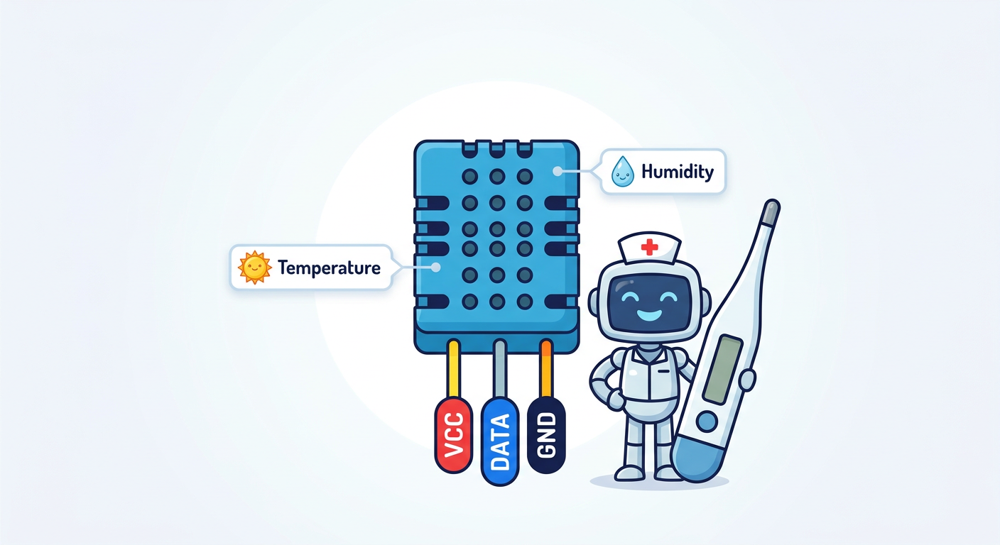
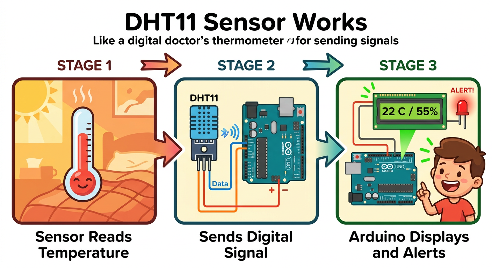
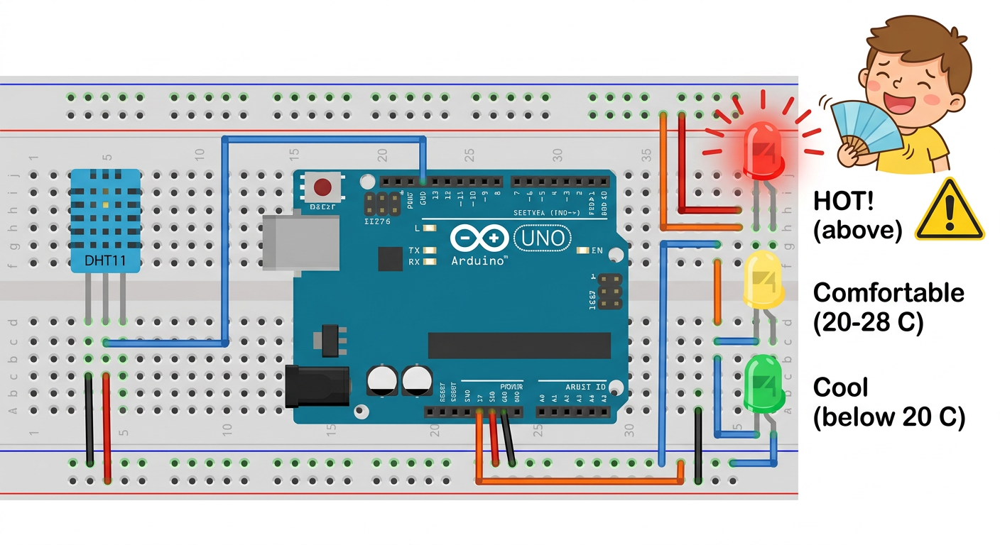

# Lesson 35: Temperature Sensor -- Your Arduino's Thermometer (DHT11/DHT22)

**Module:** 5 -- Sensors and Actuators
**Difficulty:** Star-4 Advanced
**Session Time:** 40--45 minutes
**Age:** 6--12 years
**XP Available:** 275 XP

---

## Your Mission Today

Welcome back, Circuit Explorer! Your Arduino has learned to blink, beep, and display messages. But right now it is **blind** to the world around it. It cannot feel if a room is hot or cold, bright or dark, or if anything is moving nearby. Time to change that! Today you are giving your Arduino its very first **sense** -- the ability to feel temperature and humidity, just like your skin can feel a hot summer day or a chilly winter morning.

---

## Learning Objectives

By the end of this lesson, you will be able to:
- Explain what a temperature sensor does and how the DHT11 works
- Wire a DHT11 sensor to your Arduino
- Write a sketch that reads temperature and humidity
- Display sensor readings on the Serial Monitor and an LCD
- Use your Magic Measurement Wand to verify the sensor's power supply

---

## What You Need

| Item | Qty |
|------|-----|
| Arduino Uno + USB cable | 1 |
| DHT11 temperature and humidity sensor | 1 |
| 10k-ohm resistor (pull-up) | 1 |
| 16x2 LCD with I2C backpack | 1 |
| Breadboard | 1 |
| Jumper wires | 8 |
| Multimeter (your Magic Measurement Wand!) | 1 |
| LED (any color) | 1 |
| 330-ohm resistor | 1 |

---

## How to Teach This Lesson

### Step 1: Hook -- The Weather Station Dream (5 min)

Start with a question:

> "Have you ever wondered how a weather app on your phone knows the temperature outside? Someone did not just guess -- there is a tiny sensor measuring it! Today, you are going to build your OWN weather station that reads the real temperature of this room."

Show them the DHT11 sensor -- it is a small blue box with holes in it and 3 or 4 pins.

> "This little blue box can feel the temperature AND how humid (sticky/muggy) the air is. It is like giving your Arduino a nose and skin at the same time!"

**Fun fact:**
> "The DHT11 takes a measurement every 2 seconds. That is slower than your skin, which feels temperature changes almost instantly. But hey, it never complains about the cold!"

**Award: +10 XP for learning about the DHT11!**

---



### Step 2: What Is a Temperature Sensor? (8 min)

**The Thermometer Analogy:**

> "You know how a thermometer at the doctor's office tells your body temperature? The DHT11 does the same thing, but instead of showing numbers on a glass tube, it sends digital signals to your Arduino."

**Key vocabulary:**

- **Sensor:** A device that detects something in the real world (heat, light, movement) and converts it into an electrical signal your Arduino can read
- **DHT11:** A digital temperature and humidity sensor. Measures 0 to 50 degrees Celsius and 20 to 90 percent humidity
- **DHT22:** The big sibling -- more accurate, wider range (-40 to 80 degrees Celsius), but costs a bit more
- **Humidity:** How much water vapor (invisible water) is in the air. 100% = super muggy, like a rainforest. 20% = very dry, like a desert.

**DHT11 vs DHT22:**

| Feature | DHT11 | DHT22 |
|---------|-------|-------|
| Temperature range | 0 to 50 degrees C | -40 to 80 degrees C |
| Accuracy | +/- 2 degrees C | +/- 0.5 degrees C |
| Humidity range | 20 to 90% | 0 to 100% |
| Speed | 1 reading per second | 1 reading every 2 seconds |
| Cost | Very cheap | A bit more |

> "For our projects, the DHT11 works great. It is like the 'starter wand' of temperature sensors!"

**Award: +10 XP for understanding sensors!**

---



### Step 3: Wiring the DHT11 (8 min)

**DHT11 Pinout (3-pin module version):**

```
  DHT11 Module (front view)
  +---+---+---+
  | S | V | G |
  | I | C | N |
  | G | C | D |
  +---+---+---+
    |   |   |
    |   |   +---- GND (ground)
    |   +-------- VCC (power, 3.3V or 5V)
    +------------ Signal (data out)
```

**Wiring diagram:**

```
  Arduino 5V  ---------> DHT11 VCC (middle pin)
  Arduino GND ---------> DHT11 GND (right pin)
  Arduino Pin 2 -------> DHT11 Signal (left pin)
                  |
             [10k-ohm]
                  |
              Arduino 5V

  (The 10k-ohm pull-up resistor goes between Signal and VCC)
```

> "The 10k-ohm resistor is a 'pull-up' resistor. It keeps the signal wire at a steady HIGH voltage when the sensor is not talking. Without it, the signal wire floats around like a balloon in the wind, and Arduino gets confused."

**Note:** Many DHT11 modules already have this resistor built in. If yours is a 3-pin module on a small PCB, you likely do NOT need the extra resistor. If it is the raw 4-pin component, you do.

**Award: +20 XP for wiring the sensor correctly!**

---

### Step 4: Installing the DHT Library (3 min)

Before writing code, you need to install the DHT library:

1. Open Arduino IDE
2. Go to Sketch > Include Library > Manage Libraries
3. Search for "DHT sensor library" by Adafruit
4. Click Install
5. It may ask to install "Adafruit Unified Sensor" too -- click "Install All"

> "Libraries are like cheat codes for Arduino. Someone already figured out how to talk to the DHT11, and they shared their code so we do not have to start from scratch!"

**Award: +10 XP for installing the library!**

---



### Step 5: Your First Temperature Reading (10 min)

**The Code:**

```cpp
#include <DHT.h>

#define DHTPIN 2       // Data pin connected to pin 2
#define DHTTYPE DHT11  // We are using DHT11

DHT dht(DHTPIN, DHTTYPE);

void setup() {
  Serial.begin(9600);
  dht.begin();
  Serial.println("Temperature Sensor Ready!");
}

void loop() {
  // Wait 2 seconds between readings
  delay(2000);

  float temperature = dht.readTemperature();  // Celsius
  float humidity = dht.readHumidity();

  // Check if reading failed
  if (isnan(temperature) || isnan(humidity)) {
    Serial.println("ERROR: Could not read from DHT sensor!");
    return;
  }

  Serial.print("Temperature: ");
  Serial.print(temperature);
  Serial.print(" C   Humidity: ");
  Serial.print(humidity);
  Serial.println(" %");
}
```

**What each line does:**

- `#include <DHT.h>` -- Loads the DHT library (the cheat code!)
- `#define DHTPIN 2` -- Tells Arduino which pin the sensor is on
- `dht.begin()` -- Wakes up the sensor
- `dht.readTemperature()` -- Asks the sensor "How hot is it?"
- `dht.readHumidity()` -- Asks "How sticky is the air?"
- `isnan()` -- Checks if the reading is "Not A Number" (meaning something went wrong)

**Upload and test:**
1. Upload the sketch
2. Open Serial Monitor (9600 baud)
3. Watch the temperature and humidity update every 2 seconds!

**Try this:**
- Breathe on the sensor -- watch humidity jump up!
- Hold the sensor gently in your hand -- watch temperature rise from your body heat
- Put it near a window -- is it cooler there?

**Award: +30 XP for your first temperature reading!**

---

### Step 6: Display on LCD (5 min)

**Upgrade your code to show readings on the LCD:**

```cpp
#include <DHT.h>
#include <LiquidCrystal_I2C.h>

#define DHTPIN 2
#define DHTTYPE DHT11

DHT dht(DHTPIN, DHTTYPE);
LiquidCrystal_I2C lcd(0x27, 16, 2);

void setup() {
  Serial.begin(9600);
  dht.begin();
  lcd.init();
  lcd.backlight();
  lcd.setCursor(0, 0);
  lcd.print("Weather Station");
  delay(2000);
}

void loop() {
  delay(2000);

  float temp = dht.readTemperature();
  float humid = dht.readHumidity();

  if (isnan(temp) || isnan(humid)) {
    lcd.clear();
    lcd.print("Sensor Error!");
    return;
  }

  lcd.clear();
  lcd.setCursor(0, 0);
  lcd.print("Temp: ");
  lcd.print(temp, 1);
  lcd.print(" C");

  lcd.setCursor(0, 1);
  lcd.print("Humid: ");
  lcd.print(humid, 1);
  lcd.print(" %");
}
```

> "Now you have a real weather station sitting on your desk! You could put this in your room and check the temperature any time."

**Award: +20 XP for displaying on the LCD!**

---

### Step 7: Bonus Challenge -- Temperature Alert (5 min)

Add an LED that turns on when the temperature goes above a threshold:

```cpp
int ledPin = 13;

void setup() {
  // ... (same as before)
  pinMode(ledPin, OUTPUT);
}

void loop() {
  // ... (read temp as before)

  if (temp > 28.0) {
    digitalWrite(ledPin, HIGH);  // Too hot! LED warning!
    lcd.setCursor(15, 0);
    lcd.print("!");
  } else {
    digitalWrite(ledPin, LOW);
  }
}
```

> "Now your Arduino is not just reading the temperature -- it is REACTING to it. This is the beginning of a smart system!"

**Award: +20 XP for building the temperature alert!**

---

### Step 8: Wand Check -- Verify the Power Supply (5 min)

> "Your sensor needs exactly the right amount of power to work properly. Let us use your Magic Measurement Wand to make sure it is getting what it needs!"

**Wand Test 1 -- VCC Pin Voltage:**

1. Set your Wand to DC Volts (20V range)
2. Touch the black probe to Arduino GND
3. Touch the red probe to the DHT11 VCC pin (where the 5V wire connects)
4. You should see approximately 5.0V

```
| Measurement | Expected | Your Reading | Match? |
|-------------|----------|-------------|--------|
| DHT11 VCC   | ~5.0V    |             |        |
```

**Wand Test 2 -- Signal Pin Idle Voltage:**

1. Keep Wand on DC Volts
2. Touch red probe to the Signal/Data pin
3. With the pull-up resistor, it should read close to 5V when idle (between readings)

```
| Measurement | Expected | Your Reading | Match? |
|-------------|----------|-------------|--------|
| Signal pin (idle) | ~4.5-5.0V |       |        |
```

> "If the VCC reads less than 4.5V, your sensor might give bad readings. Check your wires! A happy sensor is a well-powered sensor."

**Award: +30 XP for verifying the power supply with your Wand!**

---

## Quick Quiz -- Earn Bonus XP!

**Question 1:** What two things does the DHT11 sensor measure?
- A) Voltage and current
- B) Temperature and humidity
- C) Distance and speed

**(Correct: B -- +15 XP!)**

**Question 2:** Why do we use a pull-up resistor with the DHT11?
- A) To make the sensor hotter
- B) To keep the signal line steady at HIGH when the sensor is not sending data
- C) To limit current to the LED

**(Correct: B -- +15 XP!)**

**Question 3:** What does `isnan()` check for in our code?
- A) If the sensor is a banana
- B) If the reading failed and returned "Not A Number"
- C) If the Arduino is sleeping

**(Correct: B -- +15 XP!)**

**Question 4:** If you breathe on the DHT11, which reading should go UP?
- A) Temperature only
- B) Humidity only
- C) Both temperature and humidity

**(Correct: C -- +15 XP! Your breath is warm AND moist.)**

---

## Lesson 35 Complete!

```
  =============================================

     WEATHER WIZARD BADGE UNLOCKED!

     Skills unlocked:
     [check] Wire and read a DHT11 temperature sensor
     [check] Display temperature and humidity on LCD
     [check] Build a temperature alert system
     [check] Verified sensor power with the Wand

  =============================================
```

**XP Breakdown:**
| Activity | XP |
|----------|-----|
| Hook -- learning about DHT11 | 10 |
| Understanding sensors | 10 |
| Wiring the sensor | 20 |
| Installing the library | 10 |
| First temperature reading | 30 |
| LCD display | 20 |
| Temperature alert bonus | 20 |
| Wand Check (2 measurements) | 30 |
| Quiz (4 questions) | 60 |
| **TOTAL POSSIBLE** | **210** |

---

## Coming Up Next...

In **Lesson 36**, you will meet the **Light Dependent Resistor (LDR)** -- a component that changes its resistance based on how bright or dark it is. You will build an automatic night light that turns on by itself when the lights go out. Your Magic Measurement Wand will show you the resistance changing in real time as you cover and uncover the LDR!

---

## Troubleshooting

| Problem | Fix |
|---------|-----|
| Serial Monitor shows "ERROR: Could not read" | Check wiring -- is the data pin on pin 2? Is the pull-up resistor in place? |
| Temperature reads 0 or NaN | Make sure you installed both DHT and Adafruit Unified Sensor libraries |
| LCD shows nothing | Check I2C address -- try 0x3F instead of 0x27 in the code |
| Temperature seems wrong | DHT11 is +/- 2 degrees C accuracy -- it is an estimate, not lab precision |
| Wand reads 0V on VCC | Wire is disconnected -- trace the 5V path from Arduino to sensor |
| Readings update very slowly | DHT11 can only read once per second -- the 2-second delay is fine |

---

## Navigation

| | |
|:---|---:|
| [← Module Overview](README.md) | [Lesson 36: Light Sensor -- The Eye of Your Arduino (LDR) →](lesson-36-light-sensor.md) |
