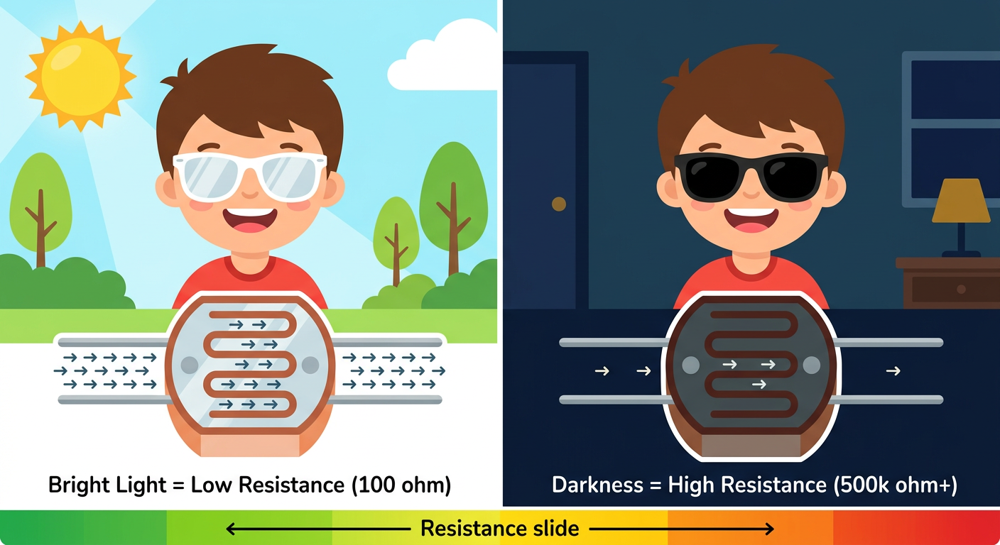
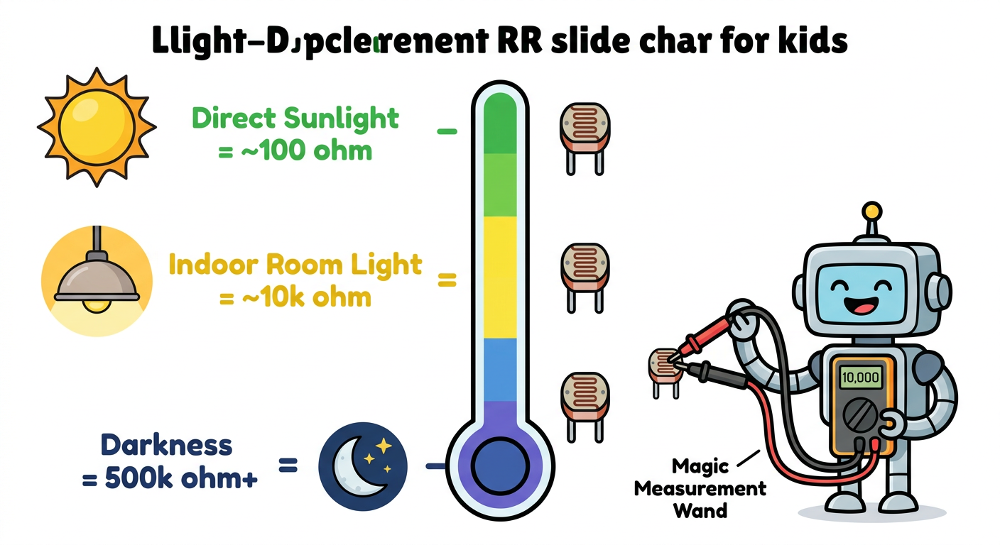
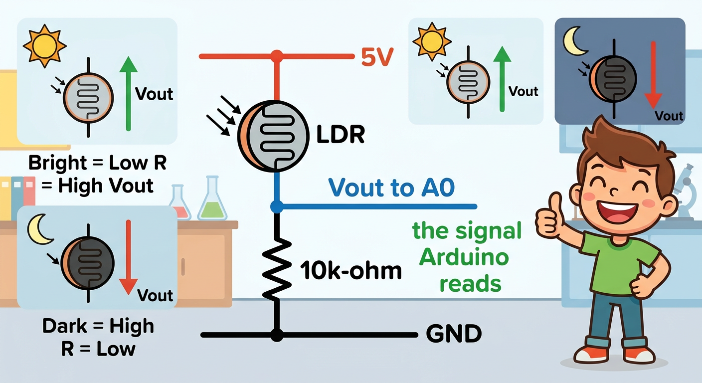

# Lesson 36: Light Sensor (LDR) -- Quick Reference

**Age:** 6--12 years | **Time:** 50--60 min | **XP:** 240

---

## What is an LDR?

**LDR (Light-Dependent Resistor) = Resistance changes with light**

**Magic Sunglasses Analogy:**
- 😎 Clear sunglasses (bright) = Low resistance (easy flow)
- 🕶️ Dark sunglasses (dark) = High resistance (hard flow)

---

## The Magic Sunglasses



| Light Level | Resistance | Like... |
|------------|-----------|---------|
| Direct sunlight | ~100 Ω | Clear glasses, full light |
| Indoor room light | ~10k Ω | Tinted glasses |
| Darkness | 500k+ Ω | Dark sunglasses, no light |

---

## Resistance Chart



**Use multimeter to measure:**
- Point at sun: reads ~100 ohms
- Point at lamp: reads ~10,000 ohms
- Cover completely: reads 500,000+ ohms

---

## Voltage Divider Circuit



**Setup:**
- LDR on top (resistor changes with light)
- Fixed 10k resistor on bottom (stays constant)
- Arduino reads midpoint voltage

**Result:**
- Bright = high voltage (reads close to 1023)
- Dark = low voltage (reads close to 0)

---

## Arduino Code

```cpp
int ldrPin = A0;  // Analog pin

void setup() {
  Serial.begin(9600);
}

void loop() {
  int brightness = analogRead(ldrPin);
  Serial.println(brightness);

  // Brightness > 800 = Turn on night light
  if (brightness < 400) {
    digitalWrite(13, HIGH);  // Night light ON
  } else {
    digitalWrite(13, LOW);   // Night light OFF
  }

  delay(500);
}
```

---

## Real-World Uses

- 💡 **Auto night lights** -- turn on when room gets dark
- 📸 **Camera flash** -- detect low light for flash trigger
- 🌙 **Streetlights** -- automatic on/off based on dusk/dawn
- 🎮 **Game controllers** -- brightness adjustment
- 📱 **Phone screens** -- auto brightness adjustment

---

## Quick Quiz

**Q1:** What does resistance do in bright light?
**A:** Resistance DECREASES (becomes lower).

**Q2:** What is the maximum resistance in darkness?
**A:** 500,000+ ohms (500k).

**Q3:** Why do we need a fixed resistor below the LDR?
**A:** To create a voltage divider so Arduino gets changing voltages.

---

## Challenge

**Auto Night Light:** Build a system that turns on a red LED when the room gets dark (LDR reading < 400)!

---

*Print this with the LDR sunglasses and resistance diagrams for reference!*
