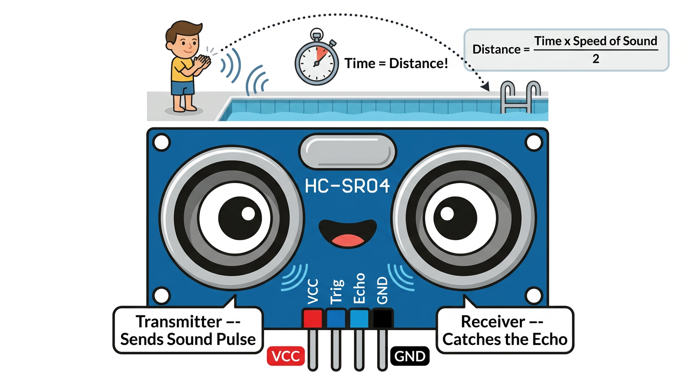
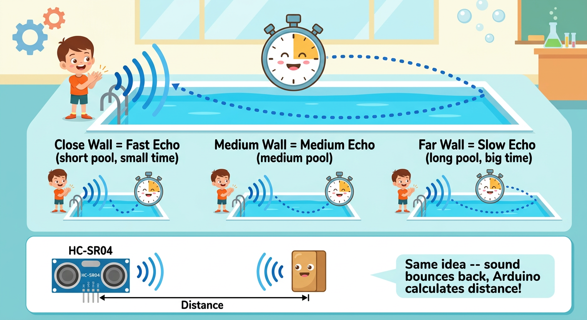
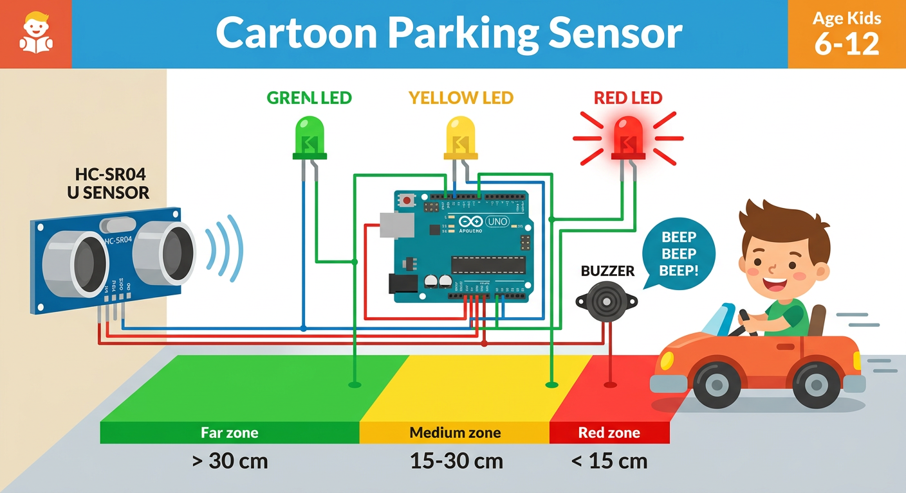

# Lesson 37: Ultrasonic Distance Sensor (HC-SR04) -- Quick Reference

**Age:** 6--12 years | **Time:** 50--60 min | **XP:** 240

---

## What is HC-SR04?

**Ultrasonic Distance Sensor = Measures distance using sound**

**Like a bat's sonar or pool echo:**
- Send sound pulse
- Wait for echo
- Measure time
- Calculate distance!

---

## The Sensor



**Two "eyes" on the sensor:**
- 👁️ **Transmitter:** Sends ultrasonic pulse
- 👁️ **Receiver:** Catches the echo
- 4 pins: VCC, Trig, Echo, GND

---

## How It Works



```
1. Send sound pulse from transmitter
2. Sound bounces off object
3. Receiver catches the echo
4. Measure time delay
5. Calculate: Distance = Time × Speed of Sound / 2
```

---

## Quick Wiring

| HC-SR04 Pin | Arduino Pin |
|------------|------------|
| VCC | 5V |
| Trig | Digital 7 |
| Echo | Digital 8 |
| GND | GND |

---

## Arduino Code

```cpp
int trigPin = 7;
int echoPin = 8;

void setup() {
  Serial.begin(9600);
  pinMode(trigPin, OUTPUT);
  pinMode(echoPin, INPUT);
}

void loop() {
  // Send pulse
  digitalWrite(trigPin, LOW);
  delayMicroseconds(2);
  digitalWrite(trigPin, HIGH);
  delayMicroseconds(10);
  digitalWrite(trigPin, LOW);

  // Measure echo time
  long duration = pulseIn(echoPin, HIGH);

  // Calculate distance (speed of sound = 343 m/s = 0.0343 cm/µs)
  int distance = duration * 0.0343 / 2;

  Serial.print("Distance: ");
  Serial.println(distance);
  delay(500);
}
```

---

## Parking Sensor Build



**Three zones with LEDs and buzzer:**
- 🟢 **Green:** Far (> 30 cm)
- 🟡 **Yellow:** Medium (15-30 cm)
- 🔴 **Red:** Close (< 15 cm) -- BEEP BEEP!

---

## Real-World Uses

- 🚗 **Parking sensors** -- car distance from obstacles
- 🤖 **Robot obstacle avoidance** -- navigate around objects
- 🚜 **Harvester equipment** -- measure crop height
- 🏭 **Industrial automation** -- measure distances
- 🚁 **Drones** -- altitude measurement

---

## Quick Quiz

**Q1:** What does HC-SR04 measure?
**A:** Distance using ultrasonic sound pulses.

**Q2:** How does the sensor measure distance?
**A:** Sends sound, waits for echo, calculates from time delay.

**Q3:** What is the formula to calculate distance?
**A:** Distance = Time × Speed of Sound / 2.

---

## Challenge

**Build a Parking Sensor:** Use an HC-SR04 to trigger different LEDs based on distance zones (green > 30cm, yellow 15-30cm, red < 15cm)!

---

*Print this with the HC-SR04 and pool echo diagrams for reference!*
