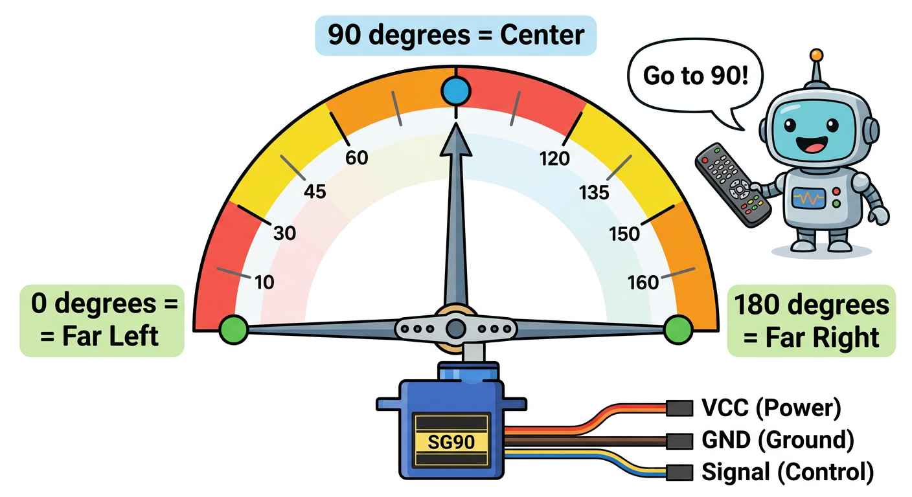
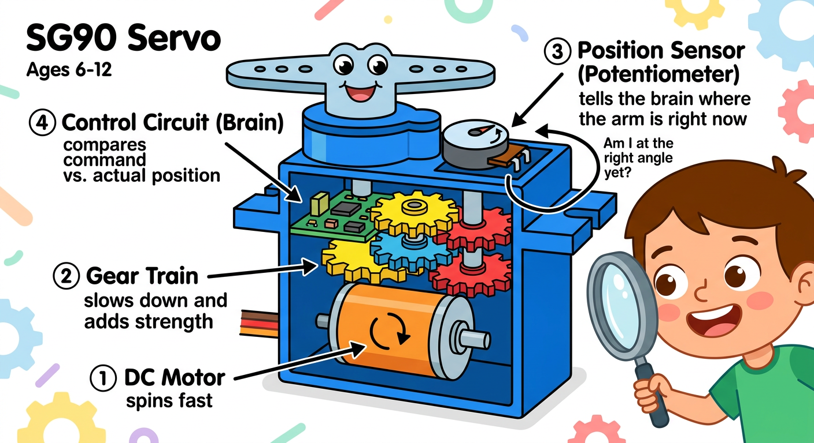
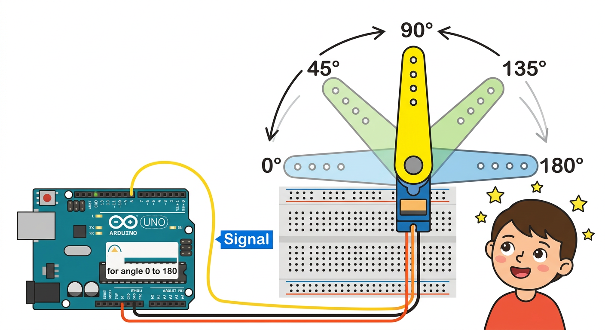

# Lesson 38: Servo Motors -- Quick Reference

**Age:** 6--12 years | **Time:** 50--60 min | **XP:** 240

---

## What is a Servo?

**Servo Motor = A motor that positions itself at exact angles**

Not like regular DC motors (spin forever). Servos:
- Position at specific angles
- Stop and hold position
- Have feedback (know where they are)
- Perfect for robotic control

---

## The Clock Hand Analogy



**Servo ranges 0° to 180°:**
- 0° = Far left
- 90° = Center
- 180° = Far right

Commands tell servo: "Go to angle 90!" and it does!

---

## How Servo Works



**Inside the servo:**
1. **DC Motor** -- spins the gears
2. **Gear Train** -- slows down motor, adds strength
3. **Position Sensor** -- tells brain where horn is RIGHT NOW
4. **Control Circuit** -- compares command vs. actual position
5. **Feedback Loop** -- adjusts until at exact angle

---

## Quick Wiring

| Servo Wire | Arduino Pin |
|-----------|------------|
| Red (VCC) | 5V |
| Brown (GND) | GND |
| Yellow (Signal) | PWM Pin 9 |

---

## Sweep Code

```cpp
#include <Servo.h>

Servo myServo;

void setup() {
  myServo.attach(9);  // Signal on Pin 9
}

void loop() {
  // Sweep from 0 to 180
  for (int angle = 0; angle <= 180; angle += 1) {
    myServo.write(angle);
    delay(15);
  }

  // Sweep back from 180 to 0
  for (int angle = 180; angle >= 0; angle -= 1) {
    myServo.write(angle);
    delay(15);
  }
}
```

---

## Servo Sweep Animation



The servo smoothly moves:
- 0° → 45° → 90° → 135° → 180° → back to 0°
- Repeats forever

---

## Real-World Uses

- 🤖 **Robot arms** -- move joint to position
- 🚁 **Drones** -- control surfaces
- 📸 **Camera pan/tilt** -- point camera anywhere
- 🎮 **Game controllers** -- haptic feedback
- 🏠 **Smart doors** -- automated locks

---

## Quick Quiz

**Q1:** What angle range can a typical servo move?
**A:** 0° to 180° (180 degrees total).

**Q2:** What is different between a servo and a DC motor?
**A:** Servo positions at exact angles and stops. DC motor just spins.

**Q3:** Why does a servo need a position sensor inside?
**A:** To know where it currently is and adjust if needed.

---

## Challenge

**Robot Head:** Use a servo to make a robot's head "look" left, center, and right repeatedly!

---

*Print this with the servo internals and sweep animation diagrams for reference!*
