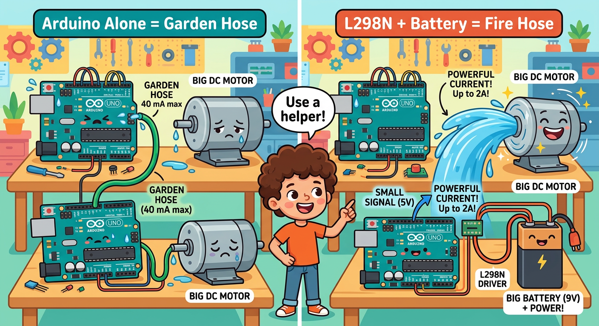
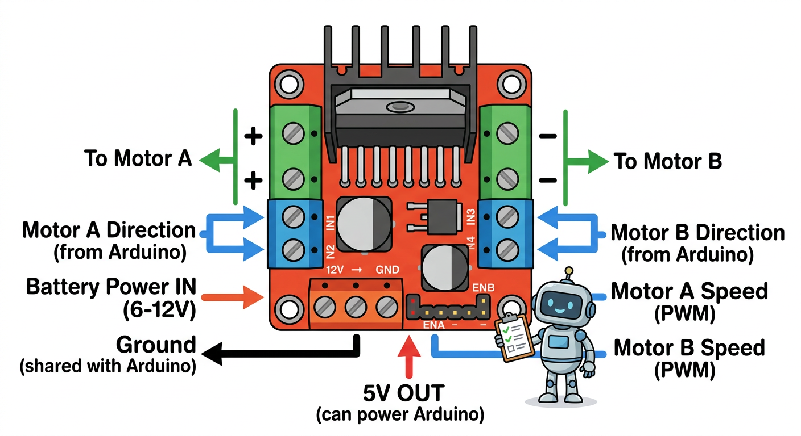
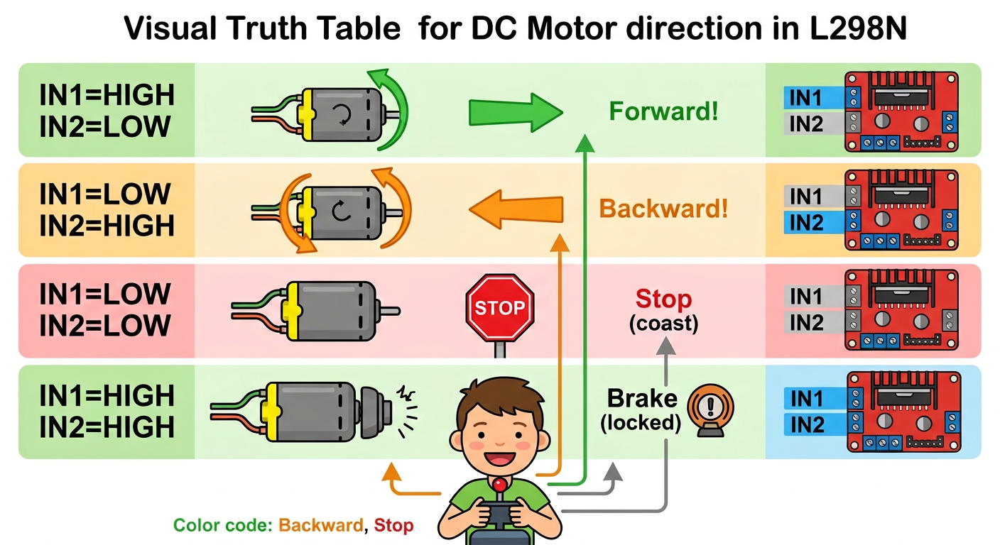

# Lesson 39: DC Motors and L298N Driver -- Quick Reference

**Age:** 6--12 years | **Time:** 50--60 min | **XP:** 240

---

## The Problem

**Arduino alone can only provide 40 mA of current**

Most DC motors need 100+ mA!

**Solution:** Use a Motor Driver (L298N)

---

## Arduino vs Motor Driver



- 🚰 **Arduino = Garden hose** (40 mA max, weak)
- 🔥 **L298N = Fire hose** (up to 2A, powerful!)

L298N is the "helper" that gives motor the power it needs!

---

## The L298N Module



**Key connections:**
- Motor A / Motor B outputs (green terminals)
- 12V power input (for motors)
- GND (shared with Arduino)
- IN1-IN4 pins (direction control from Arduino)
- ENA/ENB pins (speed control with PWM)

---

## Motor Direction Truth Table



| IN1 | IN2 | Motor |
|-----|-----|--------|
| HIGH | LOW | Forward (clockwise) |
| LOW | HIGH | Backward (counterclockwise) |
| LOW | LOW | Stop (coast) |
| HIGH | HIGH | Brake (locked) |

---

## Quick Code

```cpp
int in1 = 5, in2 = 6;  // Direction pins
int ena = 3;           // Speed control (PWM pin)

void setup() {
  pinMode(in1, OUTPUT);
  pinMode(in2, OUTPUT);
  pinMode(ena, OUTPUT);
}

void loop() {
  // Forward at full speed
  digitalWrite(in1, HIGH);
  digitalWrite(in2, LOW);
  analogWrite(ena, 255);
  delay(2000);

  // Backward at half speed
  digitalWrite(in1, LOW);
  digitalWrite(in2, HIGH);
  analogWrite(ena, 127);
  delay(2000);

  // Stop
  digitalWrite(in1, LOW);
  digitalWrite(in2, LOW);
  delay(1000);
}
```

---

## Real-World Uses

- 🤖 **Robot movement** -- drive wheels
- 🏭 **Conveyor belts** -- industrial automation
- 🎛️ **Fan controllers** -- vary fan speed
- 🚜 **Agricultural equipment** -- motor control
- 🏗️ **Construction equipment** -- movement control

---

## Quick Quiz

**Q1:** Why can't Arduino directly power a motor?
**A:** Arduino can only provide 40 mA, but motors need 100+ mA.

**Q2:** What does L298N do?
**A:** Acts as a helper that provides high current to motors while Arduino controls it.

**Q3:** How do you change motor direction?
**A:** By changing which of IN1/IN2 pins are HIGH or LOW.

---

## Challenge

**Motor Speed Ramp:** Make motor smoothly speed up from 0 to full speed, then slow back down!

---

*Print this with the L298N pinout and motor direction diagrams for reference!*
