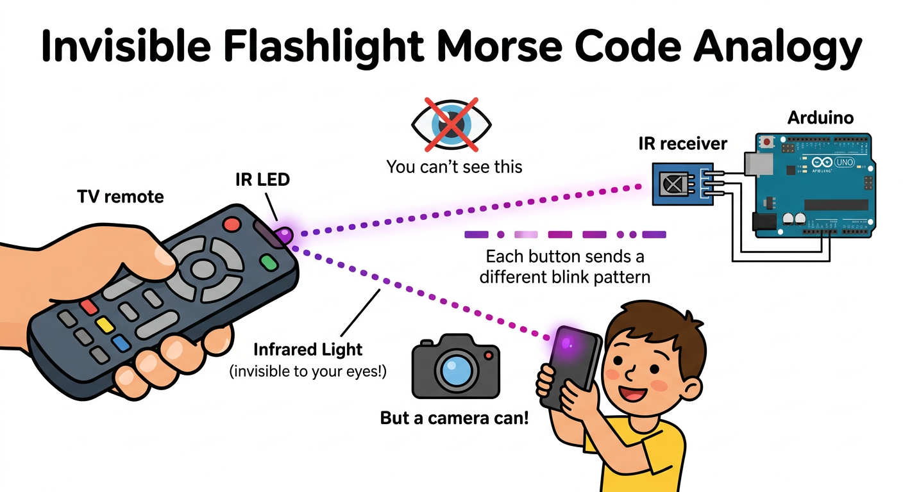
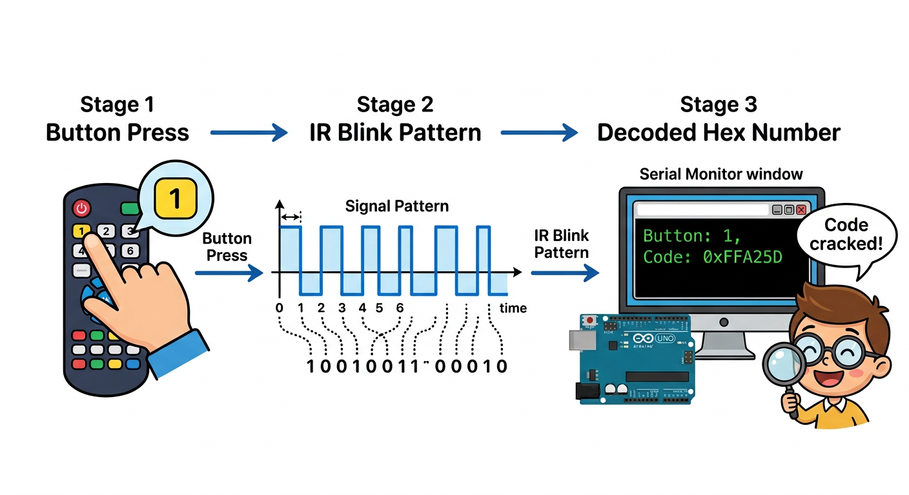

# Lesson 40: IR Sensor and Remote Control -- Quick Reference

**Age:** 6--12 years | **Time:** 45--50 min | **XP:** 220

---

## What is IR (Infrared)?

**IR = Invisible light that carries signals**

**Like Morse code with light:**
- 🔦 TV remote sends invisible light pulses
- 📱 Special receiver "hears" the pulses
- 🎛️ Each button has unique pulse pattern
- 📺 TV decodes and does the action

---

## The Invisible Flashlight



**Your eyes:** Can't see the IR light (invisible)
**Phone camera:** CAN see it (try it!)
**IR receiver:** "Hears" the pattern

---

## How Decoding Works



```
Button pressed on remote
        ↓
Remote emits IR pulse pattern
        ↓
IR receiver captures pattern
        ↓
Arduino decodes pattern
        ↓
Arduino gets hex code (like 0xFFA25D)
```

---

## Quick Wiring

| IR Receiver Pin | Arduino Pin |
|----------------|------------|
| VCC | 5V |
| GND | GND |
| Signal | Digital 11 |

---

## Arduino Code

```cpp
#include <IRremote.h>

int receiverPin = 11;
IRrecv irrecv(receiverPin);
decode_results results;

void setup() {
  Serial.begin(9600);
  irrecv.enableIRIn();  // Start IR receiver
}

void loop() {
  if (irrecv.decode(&results)) {
    Serial.print("Button Code: ");
    Serial.println(results.value, HEX);  // Print hex code
    irrecv.resume();
  }
}
```

---

## IR Codes (Common Remote)

| Button | Code |
|--------|------|
| 0 | 0xFFA25D |
| 1 | 0xFF629D |
| 2 | 0xFFE21D |
| Power | 0xFF02FD |
| Volume Up | 0xFF9867 |

---

## Real-World Uses

- 📺 **TV remotes** -- control television
- 🎮 **Game controllers** -- wireless input
- 🏠 **Smart home** -- remote lighting control
- 🎛️ **Audio equipment** -- remote control volume
- 🛰️ **Cable boxes** -- channel selection

---

## Quick Quiz

**Q1:** What does IR stand for?
**A:** Infrared.

**Q2:** Why can't you see IR light?
**A:** Infrared wavelength is outside the visible spectrum.

**Q3:** How do you see IR light from a remote?
**A:** Use a phone camera (it captures IR light).

---

## Challenge

**IR-Controlled LED:** Use an IR remote to turn an LED on/off with button presses!

---

*Print this with the IR light diagram and button decoding flowchart for reference!*
