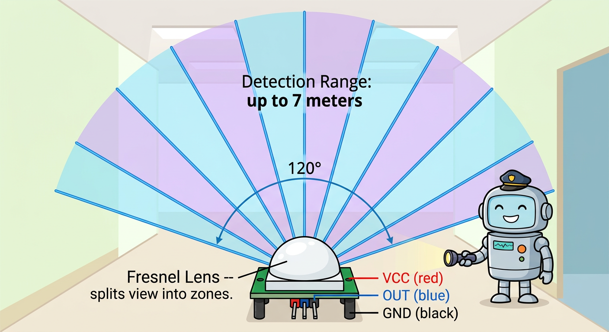
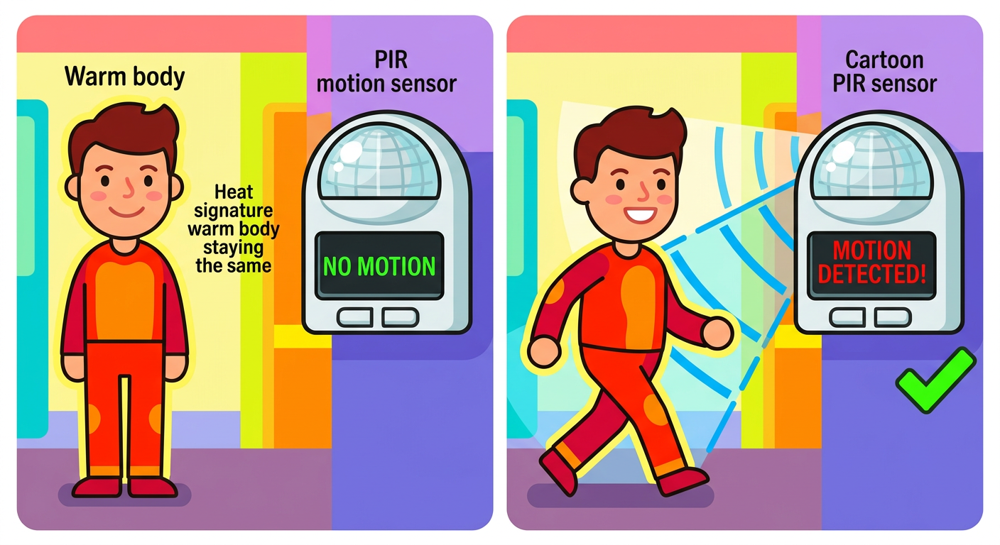

# Lesson 41: PIR Motion Sensor -- Quick Reference

**Age:** 6--12 years | **Time:** 45--50 min | **XP:** 220

---

## What is PIR?

**PIR (Passive InfraRed) = Detects heat movement**

- 🔥 All warm bodies emit infrared heat
- 👀 PIR "sees" this heat
- ➡️ Detects MOTION (heat crossing zones)
- 📍 Still objects don't trigger (heat stays same)

---

## The Spy Movie Laser Grid



**Fresnel lens splits view into zones** (like a spy movie laser grid):
- 120° wide detection fan
- Up to 7 meters range
- Multiple zones inside
- Any zone triggered = motion!

---

## When It Triggers



**Stays still:** No trigger (heat signature stays same)
**Walks across:** TRIGGERED! (heat pattern changes across zones)

---

## Quick Wiring

| PIR Sensor Pin | Arduino Pin |
|---------------|------------|
| VCC | 5V |
| OUT | Digital 4 |
| GND | GND |

---

## Arduino Code

```cpp
int pirPin = 4;
int ledPin = 13;

void setup() {
  Serial.begin(9600);
  pinMode(pirPin, INPUT);
  pinMode(ledPin, OUTPUT);
}

void loop() {
  int motionDetected = digitalRead(pirPin);

  if (motionDetected == HIGH) {
    Serial.println("MOTION!");
    digitalWrite(ledPin, HIGH);
  } else {
    digitalWrite(ledPin, LOW);
  }

  delay(100);
}
```

---

## Real-World Uses

- 🏠 **Security systems** -- detect intruders
- 💡 **Motion-activated lights** -- bathroom, hallways
- 🚪 **Door chimes** -- alert when motion at door
- 🎮 **Game consoles** -- motion-based games
- 📸 **Automatic cameras** -- trigger on movement

---

## Important Notes

**Warm-up time:** PIR needs 30-60 seconds to stabilize
**False triggers:** Can happen from heat sources (sunlight, heaters)
**Sensitivity adjustable:** Most modules have trim pots to adjust

---

## Quick Quiz

**Q1:** What does PIR detect?
**A:** Infrared heat radiation from warm bodies.

**Q2:** Why do still objects not trigger the PIR?
**A:** Heat signature stays the same. PIR detects CHANGE.

**Q3:** How far away can PIR detect motion?
**A:** Up to 7 meters (about 23 feet).

---

## Challenge

**Motion-Triggered Alarm:** Use a PIR to trigger a buzzer and LED when motion is detected!

---

*Print this with the PIR zone diagram and motion detection burst diagram for reference!*
