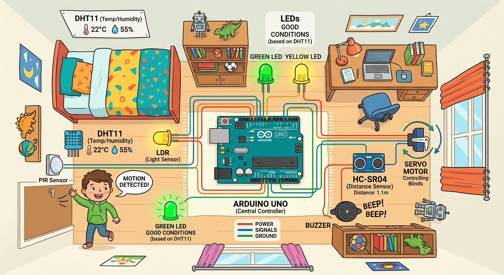
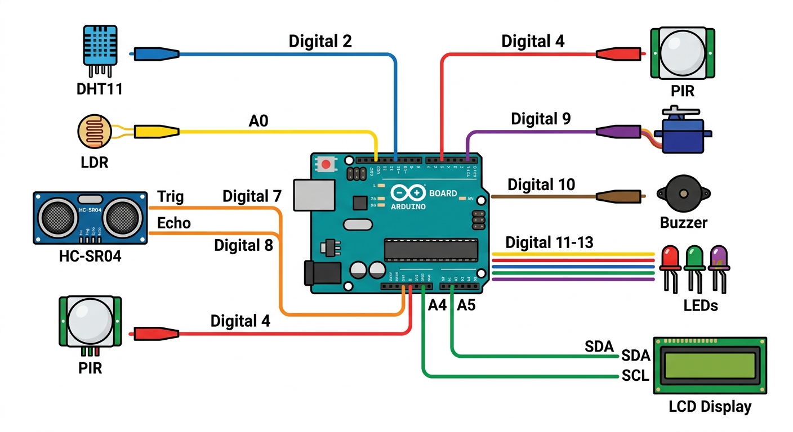
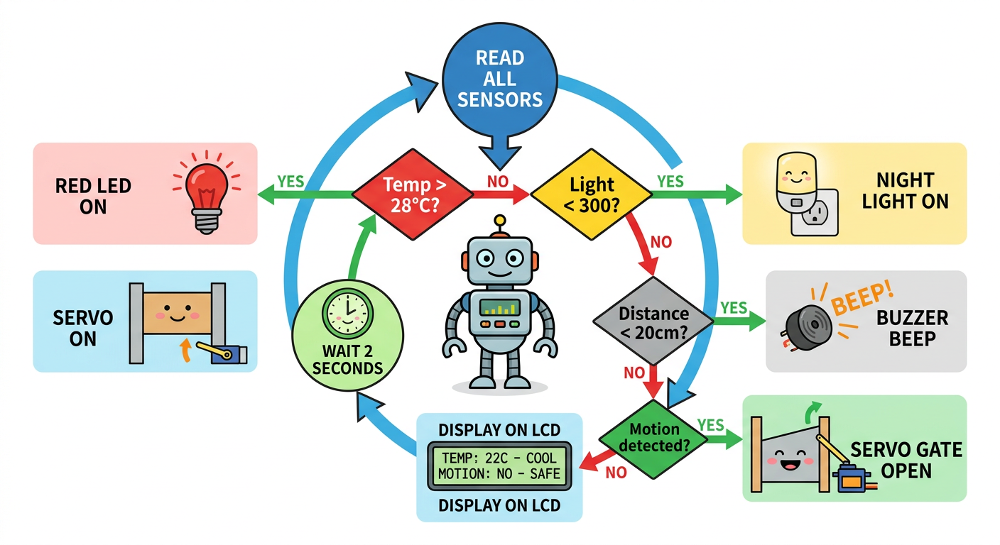

# Lesson 42: Project -- Smart Room -- Quick Reference

**Age:** 6--12 years | **Time:** 120--150 min | **XP:** 360

---

## Building a Smart Room

**Combines EVERYTHING from Module 5:**
- DHT11 (temperature + humidity)
- LDR (light sensor)
- HC-SR04 (distance sensor)
- PIR (motion sensor)
- Servo motor (gate control)
- Buzzer and LEDs (alerts)
- LCD display (info screen)

**Result:** A fully automated smart room!

---

## Smart Room Overview



**Four automation zones:**
1. 🌡️ **Climate Monitor** -- DHT11 displays temp/humidity on LCD
2. 💡 **Auto Night Light** -- LDR turns on LED when dark
3. 🚪 **Door Alert** -- HC-SR04 beeps when something approaches
4. 🚨 **Motion Gate** -- PIR triggers servo to open gate

---

## Pin Map



| Sensor | Arduino Pin |
|--------|------------|
| DHT11 Data | Digital 2 |
| LDR | Analog A0 |
| HC-SR04 Trig | Digital 7 |
| HC-SR04 Echo | Digital 8 |
| PIR Motion | Digital 4 |
| Servo Signal | Digital 9 |
| Buzzer | Digital 10 |
| LEDs | Digital 11-13 |
| LCD SDA | Analog A4 |
| LCD SCL | Analog A5 |

---

## System Logic



```
Read ALL sensors:
  ├─ Temp > 28°C? → RED LED ON
  ├─ Light < 300? → NIGHT LIGHT ON
  ├─ Distance < 20cm? → BUZZER BEEP!
  └─ Motion detected? → SERVO GATE OPEN

Display on LCD:
  Line 1: "T:22C H:55%"
  Line 2: "Dist:45 Motion:NO"

Repeat every 2 seconds
```

---

## Pseudo-Code (Program Flow)

```cpp
void setup() {
  // Initialize ALL sensors and outputs
  // Start Serial, LCD, etc.
}

void loop() {
  // 1. Read DHT11
  // 2. Read LDR
  // 3. Read HC-SR04 distance
  // 4. Read PIR motion
  // 5. Make decisions for LEDs, buzzer, servo
  // 6. Update LCD display
  // 7. Delay 2 seconds
  // 8. Go back to step 1
}
```

---

## Real-World Smart Rooms

- 🏠 **Home automation** -- Alexa, Google Home
- 🏨 **Hotel rooms** -- auto lights, climate control
- 🏥 **Hospital rooms** -- motion alerts for patients
- 🏢 **Office buildings** -- energy-saving automation
- 🏭 **Industrial facilities** -- security + monitoring

---

## Quick Quiz

**Q1:** How many different sensors does the smart room use?
**A:** 4 sensors: DHT11, LDR, HC-SR04, PIR.

**Q2:** What does the servo gate do?
**A:** Opens when PIR detects motion.

**Q3:** What information appears on the LCD screen?
**A:** Temperature, humidity, distance, and motion status.

---

## Challenge Extensions

**Challenge 1:** Add a rain sensor to water plants when soil is dry

**Challenge 2:** Log all sensor readings to SD card every hour

**Challenge 3:** Add WiFi to send alerts to your phone

**Challenge 4:** Integrate voice control with Alexa/Google

---

## Debugging Tips

| Problem | Check |
|---------|-------|
| DHT11 not working | Data pin, library installed, warm-up time |
| LDR reading constant | Resistor values, analog pin A0 |
| HC-SR04 not reading | Trig/Echo pin timing, 5V supply |
| PIR not triggering | Warm-up time (30-60s), sensitivity trim pot |
| Servo jerky | Power supply (external 5V), PWM pin |
| LCD blank | I2C address (0x27), SDA/SCL wires |

---

*Print this with the pin map and flowchart for complete reference!*
