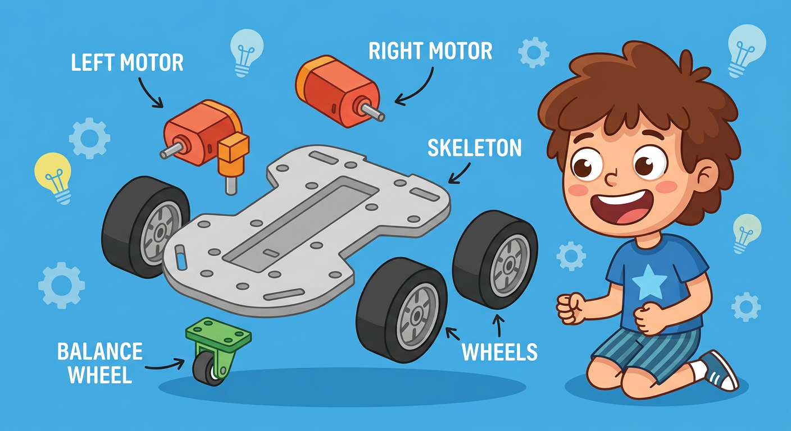
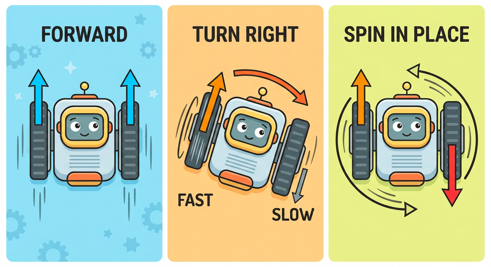
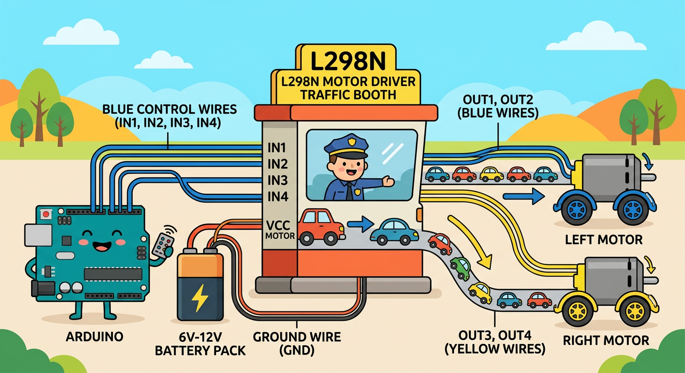

# Lesson 43: Robot Basics -- Chassis, Motors, Power

**Module:** 6 -- Robotics Projects
**Difficulty:** Star-5 Expert
**Session Time:** 50--60 minutes
**Age:** 6--12 years
**XP Available:** 350 XP

---

## Your Mission Today

Robot Builder, the moment you have been training for across FIVE entire modules is finally here! Today you are going to build a REAL ROBOT. Not a drawing. Not a simulation. A real, rolling, moving robot with wheels and motors. You will assemble the chassis (that is the robot's skeleton), wire up the motors, hook up the power, and watch your creation move for the very first time. Let us BUILD!

---

## Learning Objectives

By the end of this lesson, you will be able to:
- Assemble a 2-wheel robot chassis
- Understand what differential drive means and how robots steer
- Wire DC motors to the L298N motor driver
- Set up separate power for motors and Arduino
- Use your Magic Measurement Wand to verify motor voltage and current draw

---

## What You Need

| Item | Qty |
|------|-----|
| 2WD robot chassis kit (chassis plate, 2x DC motors, 2x wheels, 1x caster wheel, screws) | 1 |
| L298N motor driver module | 1 |
| Arduino Uno | 1 |
| 4x AA battery holder (with batteries) | 1 |
| 9V battery + clip (for Arduino) | 1 |
| Jumper wires | 15 |
| Breadboard (small) | 1 |
| Multimeter (your Magic Measurement Wand!) | 1 |
| Screwdriver (small Phillips) | 1 |

---

## How to Teach This Lesson



### Step 1: Hook -- Your Robot Awakens (5 min)

Show the pile of parts: chassis plate, wheels, motors, wires, batteries, driver board, Arduino.

> "Look at all these pieces. Right now they are just plastic, metal, and silicon. But in the next hour, YOU are going to bring them to life. You are going to assemble a robot that can drive around your room. Think about it -- a few months ago, you were just learning what a resistor is. Now you are building a ROBOT. How cool is that?"

Hold up a motor and spin the shaft with your finger:

> "This is the muscle of your robot. When electricity flows through it, the shaft spins and turns the wheel. Two of these working together will make your robot go anywhere!"

**Award: +10 XP for getting excited about robot building!**

---



### Step 2: Meet the Parts (8 min)

Go through each major component:

**The Chassis:**
- The body of the robot -- a flat plate where everything mounts
- Has holes for screws to attach motors and other parts
- Think of it like the skeleton of your robot

**The DC Motors (x2):**
- Small yellow gear motors that spin when powered
- Each motor has 2 wires -- swap the wires and it spins the OTHER way!
- Typical voltage: 3--6V

**The Wheels (x2) + Caster Wheel:**
- Two drive wheels attach to the motors
- One caster wheel (like on a shopping cart) in front for balance

**The L298N Motor Driver:**
- The brain-to-muscle translator
- Arduino sends small signals, the L298N sends BIG power to motors
- Can control 2 motors independently -- speed AND direction

```
  L298N Motor Driver -- Key Pins:

  +----------------------------+
  |  OUT1  OUT2 | OUT3  OUT4   |   <-- Motor connections
  |                            |
  |   12V   GND   5V           |   <-- Power input/output
  |                            |
  |   ENA  IN1  IN2  IN3  IN4  ENB  <-- Arduino control pins
  +----------------------------+

  ENA = speed of Motor A (PWM)
  IN1, IN2 = direction of Motor A
  IN3, IN4 = direction of Motor B
  ENB = speed of Motor B (PWM)
```

**The Power System:**
- 4x AA batteries (6V) power the MOTORS through the L298N
- Separate 9V battery powers the ARDUINO
- NEVER power motors directly from Arduino -- they are too hungry and will starve your Arduino!

> "It is like having two gas tanks in a car -- one for the engine and one for the radio and lights. They need different amounts of power!"

**Award: +10 XP for identifying all robot parts!**

---



### Step 3: Chassis Assembly (15 min)

**Step-by-step assembly:**

1. **Mount the motors** to the chassis plate using the motor brackets and screws
2. **Attach the wheels** by pressing them onto the motor shafts
3. **Attach the caster wheel** to the front (or back) of the chassis with screws
4. **Mount the Arduino** on the chassis (use standoffs, screws, or double-sided tape)
5. **Mount the L298N** on the chassis (near the motors)
6. **Mount the battery holders** (use tape or Velcro to secure them)

```
  Robot Layout (Top View):

  +-----------------------------+
  |                             |
  |   [Arduino]   [L298N]      |
  |                             |
  |   [AA Batt]   [9V Batt]    |
  |                             |
  [Left Motor] O      O [Right Motor]
  [Left Wheel]          [Right Wheel]
  |                             |
  |       [Caster Wheel]       |
  +-----------------------------+
        Direction of travel -->
```

> "Take your time with the screws. Robots need to be sturdy! If something is wobbly, fix it now before we start driving."

**Award: +30 XP for assembling the complete chassis!**

---

### Step 4: Understanding Differential Drive (5 min)

> "How does a robot with only two motors steer? It does not have a steering wheel like a car. Instead, it uses a trick called DIFFERENTIAL DRIVE."

**Differential drive** means steering by making one wheel spin faster or differently than the other:

```
  Both wheels FORWARD         = Go straight
  Left FAST, Right SLOW       = Turn right (gentle)
  Left FORWARD, Right STOP    = Turn right (sharp)
  Left FORWARD, Right BACKWARD= Spin in place (right)
  Both wheels BACKWARD        = Go backward
  Both wheels STOP             = Stop!
```

> "It is like a kayak! If you paddle harder on the left, the kayak turns right. If you paddle forward on the left and backward on the right, the kayak spins in a circle!"

Try spinning both motor shafts by hand in different combinations to visualize.

**Award: +10 XP for understanding differential drive!**

---

### Step 5: Wiring the Robot (12 min)

Now for the big moment -- connecting everything together!

**Wiring Diagram:**

```
  4x AA Batteries (6V)
  (+) -----> L298N 12V pin
  (-) -----> L298N GND pin

  9V Battery
  (+) -----> Arduino Vin pin
  (-) -----> Arduino GND pin

  IMPORTANT: Connect Arduino GND to L298N GND (common ground!)

  Left Motor wires  --> L298N OUT1 and OUT2
  Right Motor wires --> L298N OUT3 and OUT4

  L298N        Arduino
  ------       -------
  ENA   -----> Pin 9  (PWM -- left motor speed)
  IN1   -----> Pin 2  (left motor direction)
  IN2   -----> Pin 3  (left motor direction)
  IN3   -----> Pin 4  (right motor direction)
  IN4   -----> Pin 5  (right motor direction)
  ENB   -----> Pin 10 (PWM -- right motor speed)
```

> "Double-check every wire! One wrong connection and your robot might spin in circles when you want it to go straight. Or worse -- it might not move at all."

**IMPORTANT:** Remove the ENA and ENB jumpers on the L298N board so you can control speed with PWM!

**Award: +30 XP for completing all wiring!**

---

### Step 6: First Test Sketch (8 min)

Upload this sketch to test your motors:

```cpp
// Lesson 43: Robot Basic Motor Test
// Tests each motor direction one at a time

// Left motor pins
int leftENA = 9;   // PWM speed
int leftIN1 = 2;   // direction
int leftIN2 = 3;   // direction

// Right motor pins
int rightENB = 10;  // PWM speed
int rightIN3 = 4;   // direction
int rightIN4 = 5;   // direction

void setup() {
  // Set all motor pins as outputs
  pinMode(leftENA, OUTPUT);
  pinMode(leftIN1, OUTPUT);
  pinMode(leftIN2, OUTPUT);
  pinMode(rightENB, OUTPUT);
  pinMode(rightIN3, OUTPUT);
  pinMode(rightIN4, OUTPUT);

  Serial.begin(9600);
  Serial.println("Robot Motor Test Starting!");
  delay(2000);  // 2 second countdown
}

void loop() {
  // Test 1: Left motor forward
  Serial.println("Left motor FORWARD");
  digitalWrite(leftIN1, HIGH);
  digitalWrite(leftIN2, LOW);
  analogWrite(leftENA, 180);  // 70% speed
  delay(2000);
  stopAll();
  delay(1000);

  // Test 2: Right motor forward
  Serial.println("Right motor FORWARD");
  digitalWrite(rightIN3, HIGH);
  digitalWrite(rightIN4, LOW);
  analogWrite(rightENB, 180);
  delay(2000);
  stopAll();
  delay(1000);

  // Test 3: Both motors forward
  Serial.println("BOTH motors FORWARD -- robot drives!");
  digitalWrite(leftIN1, HIGH);
  digitalWrite(leftIN2, LOW);
  digitalWrite(rightIN3, HIGH);
  digitalWrite(rightIN4, LOW);
  analogWrite(leftENA, 180);
  analogWrite(rightENB, 180);
  delay(2000);
  stopAll();
  delay(3000);  // pause before repeating
}

void stopAll() {
  digitalWrite(leftIN1, LOW);
  digitalWrite(leftIN2, LOW);
  digitalWrite(rightIN3, LOW);
  digitalWrite(rightIN4, LOW);
  analogWrite(leftENA, 0);
  analogWrite(rightENB, 0);
  Serial.println("STOPPED");
}
```

**Watch your robot!**
- Does the left motor spin the correct direction?
- Does the right motor spin the correct direction?
- When both run, does the robot go straight?

> "If a motor spins the wrong way, just swap its two wires at the L298N output terminals. No code change needed!"

**Award: +40 XP for getting your robot to move for the first time!**

---

### Step 7: Wand Check -- Motor Voltage and Current Draw (10 min)

> "Your robot is alive! But a smart Robot Builder always checks the health of their creation. Time for your Magic Measurement Wand!"

**Measurement 1: Battery Voltage**

Set the Wand to DC Volts. Measure the 4x AA battery pack:

```
| Measurement          | Expected    | Your Reading |
|----------------------|-------------|-------------|
| 4x AA battery pack   | 5.5--6.5V   |             |
| 9V battery (Arduino) | 8.5--9.5V   |             |
```

**Measurement 2: Motor Voltage While Running**

With the motors running (upload the test sketch), carefully touch the Wand probes to the L298N output terminals (OUT1 and OUT2 for the left motor):

```
| Measurement              | Expected   | Your Reading |
|--------------------------|-----------|-------------|
| Left motor voltage       | 4.0--5.5V  |             |
| Right motor voltage      | 4.0--5.5V  |             |
```

> "Why is it less than the battery voltage? Because the L298N uses some voltage for itself -- about 1-2V. This is called VOLTAGE DROP. Your Wand just proved it!"

**Measurement 3: Motor Current Draw (Advanced)**

Set the Wand to DC Amps (A or mA). You need to measure current IN SERIES with the motor. The easiest way:

1. Disconnect one motor wire from the L298N terminal
2. Touch one Wand probe to the disconnected wire, the other to the terminal
3. Run the motor -- read the current

```
| Measurement          | Expected      | Your Reading |
|----------------------|--------------|-------------|
| Left motor current   | 100--300 mA   |             |
| Right motor current  | 100--300 mA   |             |
```

> "Each motor drinks about 100-300 milliamps. That is why we use the battery pack and not the Arduino pins -- Arduino pins can only give about 40 milliamps. The motors would starve!"

**Award: +50 XP for completing all Wand measurements!**

---

## Fun Extension: The Speed Test

If time allows, try different speed values in the code:

```
| PWM Value | Speed Description | Robot Behavior |
|-----------|------------------|----------------|
| 100       | Low speed         |                |
| 150       | Medium speed      |                |
| 200       | Fast              |                |
| 255       | Maximum!          |                |
```

> "What is the MINIMUM PWM value that makes your robot actually move? Below a certain value, the motors whine but the wheels do not turn. Find that number -- it is your robot's stall speed!"

---

## Quick Quiz -- Earn Bonus XP!

**Question 1:** Why do we use a separate battery pack for the motors instead of powering them from the Arduino?

- A) Because motors are too noisy
- B) Because motors need more current than Arduino can provide
- C) Because Arduino does not have any pins

**(Correct: B -- +20 XP!)**

**Question 2:** What is "differential drive"?

- A) Driving with a differential gear
- B) Steering by making each wheel spin at different speeds or directions
- C) Driving in a straight line only

**(Correct: B -- +20 XP!)**

**Question 3:** Your Wand reads 4.8V at the motor terminals but the battery is 6V. Why?

- A) The battery is broken
- B) The Wand is broken
- C) The L298N motor driver uses about 1-2V for itself (voltage drop)

**(Correct: C -- +20 XP!)**

**Question 4:** If you want the robot to spin in place to the right, what do you do?

- A) Turn off both motors
- B) Left motor forward, right motor backward
- C) Both motors forward but faster

**(Correct: B -- +20 XP!)**

---

## Lesson 43 Complete!

```
  =============================================

     ROBOT BUILDER BADGE UNLOCKED!

     Skills unlocked:
     [check] Assembled robot chassis
     [check] Wired motors to L298N driver
     [check] Set up dual power supply
     [check] Understood differential drive
     [check] Measured motor voltage and current
     [check] Robot moved for the first time!

  =============================================
```

**XP Breakdown:**
| Activity | XP |
|----------|-----|
| Hook excitement | 10 |
| Identifying parts | 10 |
| Chassis assembly | 30 |
| Differential drive | 10 |
| Complete wiring | 30 |
| First movement test | 40 |
| Wand Check (all measurements) | 50 |
| Quiz (4 questions) | 80 |
| Speed test bonus | 20 |
| **TOTAL POSSIBLE** | **280** |

---

## Coming Up Next...

In **Lesson 44**, you will write **movement functions** -- clean, reusable code that makes your robot drive forward, backward, turn left, turn right, and stop with a single command. Then you will program your robot to drive in a square and even a figure-8. Your robot is about to get SMART!

---

## Troubleshooting

| Problem | Fix |
|---------|-----|
| Motors do not spin at all | Check battery polarity, check ENA/ENB jumpers are removed, check wiring |
| One motor spins wrong direction | Swap the two motor wires at the L298N output terminals |
| Robot curves instead of going straight | Motors have slightly different speeds -- we will fix this in Lesson 44 |
| L298N gets very hot | Normal for heavy use, but check for short circuits if extremely hot |
| Arduino resets when motors start | Power supplies not separated -- make sure Arduino and motors have different batteries |
| Wand reads 0V at motor terminals | Motor driver not receiving enable signal -- check ENA/ENB wiring |

---

## Navigation

| | |
|:---|---:|
| [← Module Overview](README.md) | [Lesson 44: Robot Movement Functions →](lesson-44-robot-movement-functions.md) |
