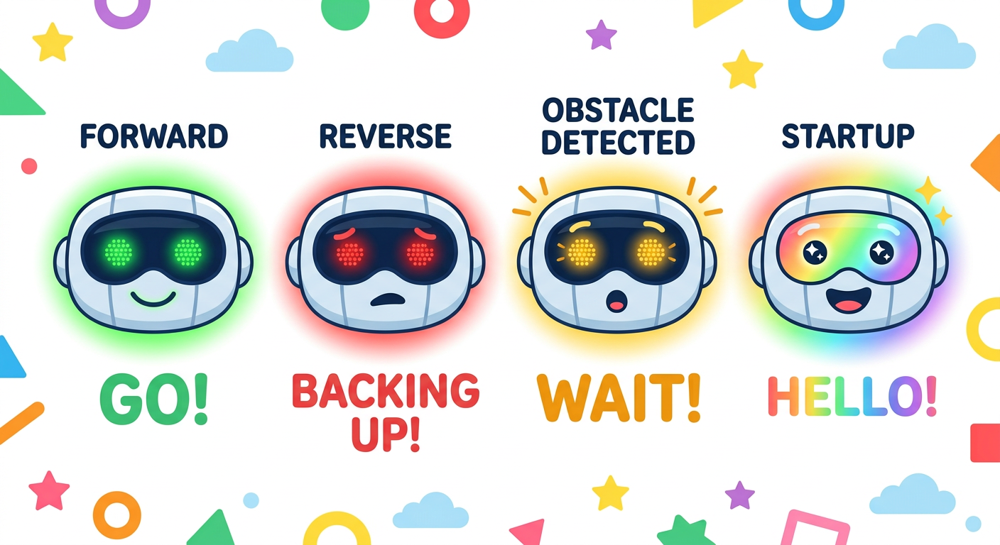
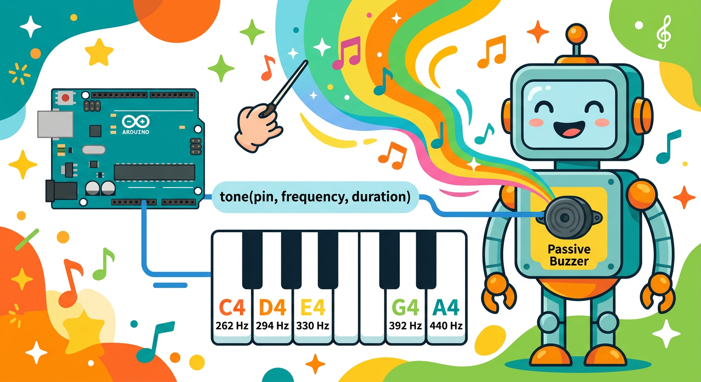

# Lesson 47: Adding a Buzzer and LEDs -- Robot Personality

**Module:** 6 -- Robotics Projects
**Difficulty:** Star-5 Expert
**Session Time:** 45--55 minutes
**Age:** 6--12 years
**XP Available:** 300 XP

---

## Your Mission Today

Robot Designer, your robot can drive, follow lines, and dodge obstacles -- but right now it is SILENT and DARK. A great robot tells you what it is thinking! Today you are going to give your robot a **personality** by adding LED "eyes" and a buzzer "voice." Your robot will flash green when driving forward, flash red when reversing, beep when it detects an obstacle, and play a startup melody when it wakes up. By the end of today, your robot will feel ALIVE!

---

## Learning Objectives

By the end of this lesson, you will be able to:
- Wire LEDs and a buzzer to the robot
- Program LED patterns that indicate the robot's current state
- Create sound effects and melodies using the tone() function
- Combine lights and sounds with the obstacle-avoidance code
- Use your Magic Measurement Wand to verify LED voltage drops and buzzer signal voltage

---

## What You Need

| Item | Qty |
|------|-----|
| Your obstacle-avoiding robot from Lesson 46 | 1 |
| Green LEDs | 2 |
| Red LEDs | 2 |
| Blue or white LED | 1 |
| 330-ohm resistors | 5 |
| Passive or active buzzer | 1 |
| Small breadboard (mounted on robot) | 1 |
| Jumper wires | 10 |
| Multimeter (your Magic Measurement Wand!) | 1 |

---

## How to Teach This Lesson



### Step 1: Hook -- The Talking Robot (5 min)

> "Think about a car. When it backs up, what does it do? BEEP BEEP BEEP! When it turns, what happens? The blinker flashes. When the engine starts, you hear it roar to life. Cars use sounds and lights to COMMUNICATE. Your robot should too!"

> "Right now, your robot is like a ninja -- silent and invisible. That is cool for a ninja, but bad for a robot. If your robot is about to bump into someone, they should HEAR it coming. If it is thinking about which way to turn, you should SEE the lights change. Let us give your robot a voice and eyes!"

**Award: +10 XP for planning your robot's personality!**

---



### Step 2: Wiring the LEDs and Buzzer (10 min)

**LED Layout on Robot:**

```
  Front of Robot:

     [Green]  [Blue]  [Green]     <-- Headlights
       |       |        |
       |    (status)    |
       |                |
   +---+----------------+---+
   |                         |
   |       [ROBOT]           |
   |                         |
   +---+----------------+---+
       |                |
     [Red]            [Red]       <-- Taillights
```

**Pin Assignments:**

```
  Component       | Arduino Pin | Resistor
  ----------------+-------------+---------
  Left Green LED  | Pin A1       | 330 ohm
  Right Green LED | Pin A2       | 330 ohm
  Left Red LED    | Pin A3       | 330 ohm
  Right Red LED   | Pin A4       | 330 ohm
  Blue Status LED | Pin 13       | 330 ohm (onboard LED works too)
  Buzzer          | Pin 8        | None needed
```

**Wiring each LED:**

```
  Arduino Pin ---[330 ohm]--- LED (+) --- LED (-) --- GND
```

**Wiring the buzzer:**

```
  Arduino Pin 8 --- Buzzer (+) --- Buzzer (-) --- GND
```

> "Mount the LEDs where they look like headlights and taillights. Use the small breadboard on the robot or tape wires along the chassis. Make it look cool -- this is YOUR robot's face!"

**Award: +20 XP for wiring all LEDs and buzzer!**

---

### Step 3: Startup Sequence (8 min)

Every great robot needs a dramatic power-on sequence!

```cpp
// Lesson 47: Robot Personality
// Pin definitions for lights and sound

// LED pins
int greenLeft = A1;
int greenRight = A2;
int redLeft = A3;
int redRight = A4;
int blueStatus = 13;

// Buzzer pin
int buzzerPin = 8;

// Musical notes
#define NOTE_C4 262
#define NOTE_D4 294
#define NOTE_E4 330
#define NOTE_F4 349
#define NOTE_G4 392
#define NOTE_A4 440
#define NOTE_B4 494
#define NOTE_C5 523
#define NOTE_G5 784

void setupLights() {
  pinMode(greenLeft, OUTPUT);
  pinMode(greenRight, OUTPUT);
  pinMode(redLeft, OUTPUT);
  pinMode(redRight, OUTPUT);
  pinMode(blueStatus, OUTPUT);
  pinMode(buzzerPin, OUTPUT);
}

void startupSequence() {
  Serial.println("=== ROBOT BOOTING UP ===");

  // Light show: LEDs turn on one by one
  digitalWrite(blueStatus, HIGH);
  tone(buzzerPin, NOTE_C4, 150);
  delay(200);

  digitalWrite(greenLeft, HIGH);
  tone(buzzerPin, NOTE_E4, 150);
  delay(200);

  digitalWrite(greenRight, HIGH);
  tone(buzzerPin, NOTE_G4, 150);
  delay(200);

  digitalWrite(redLeft, HIGH);
  tone(buzzerPin, NOTE_C5, 150);
  delay(200);

  digitalWrite(redRight, HIGH);
  tone(buzzerPin, NOTE_G5, 300);
  delay(400);

  // All off briefly
  allLightsOff();
  delay(200);

  // All flash together 3 times
  for (int i = 0; i < 3; i++) {
    allLightsOn();
    delay(100);
    allLightsOff();
    delay(100);
  }

  // Final fanfare
  tone(buzzerPin, NOTE_C4, 100); delay(120);
  tone(buzzerPin, NOTE_E4, 100); delay(120);
  tone(buzzerPin, NOTE_G4, 100); delay(120);
  tone(buzzerPin, NOTE_C5, 400); delay(500);
  noTone(buzzerPin);

  Serial.println("=== ROBOT READY! ===");
}

void allLightsOn() {
  digitalWrite(greenLeft, HIGH);
  digitalWrite(greenRight, HIGH);
  digitalWrite(redLeft, HIGH);
  digitalWrite(redRight, HIGH);
  digitalWrite(blueStatus, HIGH);
}

void allLightsOff() {
  digitalWrite(greenLeft, LOW);
  digitalWrite(greenRight, LOW);
  digitalWrite(redLeft, LOW);
  digitalWrite(redRight, LOW);
  digitalWrite(blueStatus, LOW);
}
```

> "Upload this and watch your robot wake up! The lights cascade on, everything flashes, and it plays a little melody. THAT is how a proper robot says hello!"

**Award: +30 XP for creating the startup sequence!**

---

### Step 4: State-Based LED Patterns (10 min)

Now let us make the LEDs show what the robot is DOING:

```cpp
// State indicator functions

void lightsForward() {
  // Green headlights on, red taillights off
  digitalWrite(greenLeft, HIGH);
  digitalWrite(greenRight, HIGH);
  digitalWrite(redLeft, LOW);
  digitalWrite(redRight, LOW);
  digitalWrite(blueStatus, HIGH);
}

void lightsBackward() {
  // Red taillights on (like a car reversing), green off
  digitalWrite(greenLeft, LOW);
  digitalWrite(greenRight, LOW);
  digitalWrite(redLeft, HIGH);
  digitalWrite(redRight, HIGH);
  digitalWrite(blueStatus, LOW);
}

void lightsTurnLeft() {
  // Blink left side only (like a turn signal!)
  digitalWrite(greenLeft, HIGH);
  digitalWrite(greenRight, LOW);
  digitalWrite(redLeft, HIGH);
  digitalWrite(redRight, LOW);
}

void lightsTurnRight() {
  // Blink right side only
  digitalWrite(greenLeft, LOW);
  digitalWrite(greenRight, HIGH);
  digitalWrite(redLeft, LOW);
  digitalWrite(redRight, HIGH);
}

void lightsObstacle() {
  // All lights flash as warning
  allLightsOn();
  delay(100);
  allLightsOff();
  delay(100);
  allLightsOn();
}

void lightsStopped() {
  // Blue status blinks slowly
  allLightsOff();
  digitalWrite(blueStatus, HIGH);
}
```

**Award: +20 XP for programming all state light patterns!**

---

### Step 5: Sound Effects (5 min)

```cpp
// Sound effect functions

void soundObstacle() {
  // Quick warning beeps
  tone(buzzerPin, 1000, 100);
  delay(150);
  tone(buzzerPin, 1500, 100);
  delay(150);
  noTone(buzzerPin);
}

void soundReverse() {
  // Classic backup beep
  tone(buzzerPin, 800, 200);
  delay(400);
  tone(buzzerPin, 800, 200);
  delay(400);
  noTone(buzzerPin);
}

void soundTurn() {
  // Quick chirp
  tone(buzzerPin, 2000, 50);
  delay(60);
  noTone(buzzerPin);
}

void soundHappy() {
  // Happy melody when path is clear after being stuck
  tone(buzzerPin, NOTE_C5, 100); delay(120);
  tone(buzzerPin, NOTE_E4, 100); delay(120);
  tone(buzzerPin, NOTE_G4, 200); delay(250);
  noTone(buzzerPin);
}
```

**Award: +10 XP for creating sound effects!**

---

### Step 6: Putting It All Together (10 min)

Now integrate the lights and sounds into the obstacle-avoidance code from Lesson 46. Add these calls to your main loop:

```cpp
// Updated obstacle-avoidance loop with personality!

void setup() {
  // Motor setup (from Lesson 44)
  pinMode(leftENA, OUTPUT);
  pinMode(leftIN1, OUTPUT);
  pinMode(leftIN2, OUTPUT);
  pinMode(rightENB, OUTPUT);
  pinMode(rightIN3, OUTPUT);
  pinMode(rightIN4, OUTPUT);

  // Sensor setup
  pinMode(trigPin, OUTPUT);
  pinMode(echoPin, INPUT);
  scanServo.attach(servoPin);
  scanServo.write(90);

  // Lights and sound setup
  setupLights();

  Serial.begin(9600);

  // THE BIG BOOT-UP!
  startupSequence();
  delay(1000);
}

void loop() {
  int distance = getDistance();

  if (distance > dangerDistance) {
    // Path clear -- drive forward with green lights
    lightsForward();
    forward(driveSpeed);
  } else {
    // OBSTACLE! Flash warning + beep
    lightsObstacle();
    soundObstacle();
    stopRobot();
    delay(300);

    // Scan left and right
    scanServo.write(10);
    delay(500);
    int leftDist = getDistance();

    scanServo.write(170);
    delay(500);
    int rightDist = getDistance();

    scanServo.write(90);
    delay(300);

    // Choose direction
    if (leftDist > rightDist && leftDist > dangerDistance) {
      lightsTurnLeft();
      soundTurn();
      turnLeft(turnSpeed);
      delay(500);
    } else if (rightDist > dangerDistance) {
      lightsTurnRight();
      soundTurn();
      turnRight(turnSpeed);
      delay(500);
    } else {
      // Trapped! Back up with reverse lights and sound
      lightsBackward();
      soundReverse();
      backward(driveSpeed);
      delay(800);
      lightsTurnRight();
      turnRight(turnSpeed);
      delay(700);
    }
    stopRobot();
    lightsStopped();
    delay(200);
  }

  delay(50);
}
```

> "Now watch your robot! Green lights when driving, flashing when it spots danger, beeping when it backs up, and a cool startup sequence. It has a PERSONALITY now!"

**Award: +30 XP for integrating lights and sounds with obstacle avoidance!**

---

### Step 7: Wand Check -- LED and Buzzer Voltages (8 min)

> "Time for your Magic Measurement Wand to check the electrical personality of your robot!"

Set the Wand to **DC Volts**.

**Measurement 1: LED Voltage Drops**

While LEDs are on, measure the voltage ACROSS each LED (not across the resistor):

```
| LED              | Expected Drop | Your Reading |
|------------------|-------------|-------------|
| Green LED (left) | 2.0--2.2V    |             |
| Green LED (right)| 2.0--2.2V    |             |
| Red LED (left)   | 1.8--2.0V    |             |
| Red LED (right)  | 1.8--2.0V    |             |
| Blue LED         | 3.0--3.4V    |             |
```

> "Different LED colors have different voltage drops. Red LEDs use the least voltage. Blue and white use the most. Your Wand can see this difference!"

**Measurement 2: Resistor Voltage**

Measure the voltage across one of the 330-ohm resistors while its LED is on:

```
| Measurement                        | Expected | Your Reading |
|------------------------------------|---------|-------------|
| Voltage across 330-ohm (green LED) | ~2.8--3V |             |
| Voltage across 330-ohm (red LED)   | ~3.0--3.2V|            |
```

> "The resistor voltage + the LED voltage should add up to 5V. That is Ohm's Law in action -- the voltage divides between the resistor and the LED!"

**Measurement 3: Buzzer Signal**

Measure the voltage at the buzzer pin while a tone is playing:

```
| Measurement           | Expected     | Your Reading |
|-----------------------|-------------|-------------|
| Buzzer pin (tone on)  | ~2.5V avg    |             |
| Buzzer pin (tone off) | 0V           |             |
```

> "The buzzer gets a PWM signal -- rapidly switching between 0 and 5V. Your Wand shows the AVERAGE, which is about 2.5V."

**Award: +40 XP for all Wand measurements!**

---

## Fun Extension: Design Your Own Personality

Challenge the kid to create their own robot personality:

- **Angry Robot:** Red LEDs always on, aggressive beeps at obstacles
- **Friendly Robot:** Happy melodies, gentle green glow, chirps at people
- **Stealth Robot:** No lights, no sound, only blue status blink
- **Party Robot:** Random light patterns, plays songs while driving

> "What personality will YOUR robot have?"

---

## Quick Quiz -- Earn Bonus XP!

**Question 1:** Why do we use a 330-ohm resistor with each LED?

- A) To make the LED brighter
- B) To limit current so the LED does not burn out
- C) To make the LED blink

**(Correct: B -- +20 XP!)**

**Question 2:** The green LED drops 2.1V and the resistor drops 2.9V. What do they add up to?

- A) 3.0V
- B) 5.0V
- C) 9.0V

**(Correct: B -- +20 XP!)**

**Question 3:** Why does the robot flash its red LEDs when reversing?

- A) Red means it is angry
- B) Just like a real car, it signals to others that it is going backward
- C) The red LEDs use less power

**(Correct: B -- +20 XP!)**

---

## Lesson 47 Complete!

```
  =============================================

     ROBOT PERSONALITY DESIGNER BADGE UNLOCKED!

     Skills unlocked:
     [check] Wired LEDs and buzzer to robot
     [check] Created startup sequence
     [check] Programmed state-based light patterns
     [check] Created sound effects
     [check] Integrated personality with navigation
     [check] Measured LED and buzzer voltages

  =============================================
```

**XP Breakdown:**
| Activity | XP |
|----------|-----|
| Personality planning | 10 |
| Wiring LEDs and buzzer | 20 |
| Startup sequence | 30 |
| State light patterns | 20 |
| Sound effects | 10 |
| Full integration | 30 |
| Wand Check (all measurements) | 40 |
| Quiz (3 questions) | 60 |
| **TOTAL POSSIBLE** | **220** |

---

## Coming Up Next...

In **Lesson 48**, your robot goes WIRELESS! You will add a **Bluetooth module** so you can control your robot from your phone. Drive it around the room like a remote-controlled car -- but with the code YOU wrote!

---

## Troubleshooting

| Problem | Fix |
|---------|-----|
| LED does not light up | Check polarity (long leg to resistor, short leg to GND) |
| Buzzer is very quiet | Make sure it is a passive buzzer for tone(), or active buzzer for direct power |
| Buzzer plays wrong notes | Double-check frequency values in note definitions |
| Startup sequence plays but robot does not move | Motor code might be missing from sketch -- merge both programs |
| LEDs flicker during motor start | Normal -- motors cause small power fluctuations |
| Wand reads 0V across LED when on | Probes might be on wrong side -- measure across the LED, not the resistor |

---

## Navigation

| | |
|:---|---:|
| [← Lesson 46: Obstacle-Avoiding Robot](lesson-46-obstacle-avoiding-robot.md) | [Lesson 48: Remote-Controlled Robot (Bluetooth) →](lesson-48-remote-controlled-robot-bluetooth.md) |
