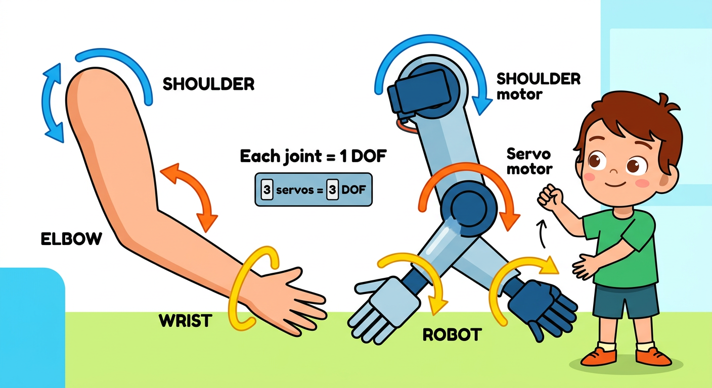
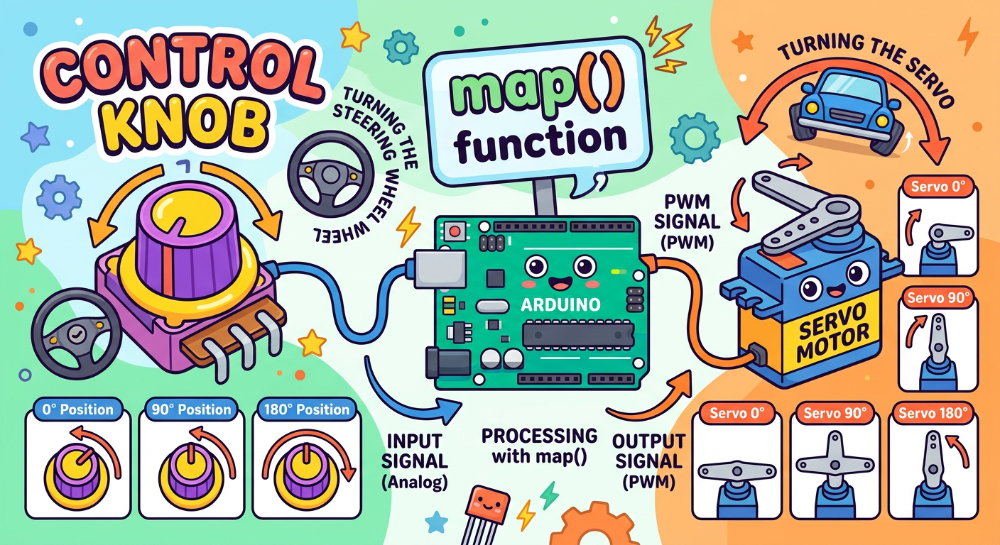
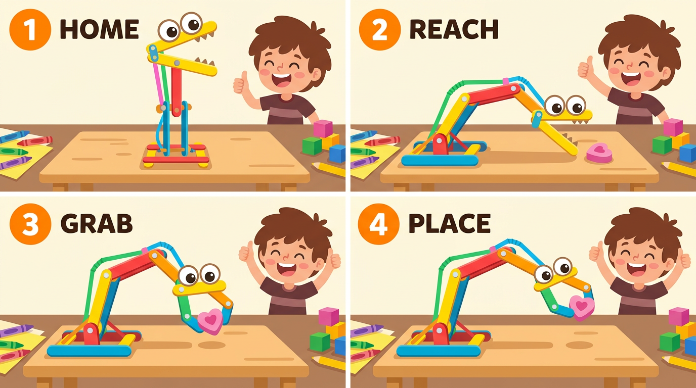

# Lesson 49: Robot Arm Introduction (Servo-Based)

**Module:** 6 -- Robotics Projects
**Difficulty:** Star-5 Expert
**Session Time:** 55--65 minutes
**Age:** 6--12 years
**XP Available:** 350 XP

---

## Your Mission Today

Robot Mechanic, today you are building a completely different kind of robot -- a **robot arm**! Instead of wheels and driving, this robot uses servo motors as joints to reach, grab, and move objects. Think of those giant robot arms in car factories, or the claw machine at the arcade. You are building your own version with popsicle sticks, servos, and Arduino. By the end of today, you will pick up a small object and move it to a new location using YOUR robot arm!

---

## Learning Objectives

By the end of this lesson, you will be able to:
- Explain what degrees of freedom (DOF) means for a robot arm
- Build a 3-DOF robot arm from simple materials
- Control servo angles with potentiometers
- Program preset arm positions (pick up, move, drop)
- Use your Magic Measurement Wand to measure servo power consumption and signal voltages

---

## What You Need

| Item | Qty |
|------|-----|
| SG90 servo motors | 3 |
| 10k-ohm potentiometers | 3 |
| Arduino Uno | 1 |
| Breadboard | 1 |
| Popsicle sticks (craft sticks) | 10 |
| Cardboard pieces | several |
| Hot glue gun (adult supervised!) | 1 |
| Rubber bands or binder clips (for gripper) | 3 |
| Small lightweight objects to pick up (eraser, candy, LEGO) | 5 |
| Jumper wires | 15 |
| Multimeter (your Magic Measurement Wand!) | 1 |
| USB cable | 1 |
| External 5V power supply or 4x AA batteries (recommended) | 1 |

---

## How to Teach This Lesson



### Step 1: Hook -- The Claw Machine (5 min)

> "Have you ever played a claw machine at an arcade? You move a joystick, the claw slides over, drops down, grabs a prize (hopefully!), and lifts it up. That claw machine is a ROBOT ARM!"

> "A robot arm is different from a driving robot. Instead of moving the whole body, a robot arm stays in one place and reaches out to touch the world. Robot arms build cars, perform surgery, sort packages, and even cook food in some restaurants!"

Show the three servos:

> "Each of these servos will be a JOINT in your arm -- like your shoulder, elbow, and wrist. Together, they give the arm three different ways to move. In robotics, we call each way of moving a DEGREE OF FREEDOM."

```
  Your Arm vs Robot Arm:

  Human Arm:           Robot Arm:
  [Shoulder] = rotate  [Base Servo] = rotate left/right
  [Elbow]    = bend    [Shoulder Servo] = reach up/down
  [Wrist]    = tilt    [Elbow Servo] = extend/retract
  [Hand]     = grab    [Gripper] = open/close
```

**Award: +10 XP for understanding degrees of freedom!**

---



### Step 2: Building the Arm Structure (18 min)

This is the most hands-on part! Build the arm step by step:

**Base (Joint 1 -- Rotation):**

```
  Base Assembly:

  +--[Cardboard Base Plate]--+
  |                           |
  |     [Servo 1 -- Base]     |
  |         ^ shaft           |
  |         |                 |
  +---------+---------+
            |
        [Horn/Arm]
            |
        Attach next section here
```

1. Glue Servo 1 to a sturdy cardboard base (this servo rotates the whole arm)
2. Attach a servo horn pointing upward
3. This is the "shoulder" -- it controls left/right rotation

**Shoulder (Joint 2 -- Up/Down):**

```
  Shoulder Assembly (side view):

      [Popsicle Stick Arm Segment 1]
       |
  [Servo 2]----[Mounted on Base Horn]
       |
  [Base]
```

1. Mount Servo 2 on the base servo's horn using hot glue or a cardboard bracket
2. Attach 2 popsicle sticks glued together (for strength) to Servo 2's horn
3. This is the "upper arm" -- it goes up and down

**Elbow (Joint 3 -- Extend/Retract):**

```
  Complete Arm (side view):

  [Gripper]---[Popsicle Arm 2]---[Servo 3]---[Popsicle Arm 1]---[Servo 2]
                                                                      |
                                                                 [Servo 1]
                                                                      |
                                                                 [BASE]
```

1. At the end of Arm Segment 1, mount Servo 3 (the elbow)
2. Attach another popsicle stick arm segment to Servo 3's horn
3. At the end of Arm Segment 2, create a simple gripper

**Simple Gripper:**

```
  Gripper Design:

  Option A: Binder Clip Gripper      Option B: Rubber Band Gripper
  Glue a binder clip to the          Wrap rubber bands around two
  end of the arm. Squeeze to         popsicle sticks. Servo
  grab!                              pushes them apart to release.

      [Binder Clip]                    / [Stick 1] /
       ___|___                        /    grab!  /
      /       \                      / [Stick 2] /
     |  GRAB   |
      \_______/
```

> "The arm does not need to look perfect! What matters is that each servo can move freely and the joints are sturdy. Use extra hot glue if anything wobbles."

**Award: +40 XP for building the complete arm structure!**

---



### Step 3: Wiring the Arm (8 min)

**Servo Wiring:**

```
  Servo 1 (Base):      Servo 2 (Shoulder):   Servo 3 (Elbow):
  Red   --> 5V          Red   --> 5V           Red   --> 5V
  Brown --> GND          Brown --> GND          Brown --> GND
  Signal -> Pin 3        Signal -> Pin 5        Signal -> Pin 6
```

**Potentiometer Wiring (for manual control):**

```
  Pot 1 (controls Base):
  Left pin  --> GND
  Right pin --> 5V
  Middle pin -> A0

  Pot 2 (controls Shoulder):
  Left pin  --> GND
  Right pin --> 5V
  Middle pin -> A1

  Pot 3 (controls Elbow):
  Left pin  --> GND
  Right pin --> 5V
  Middle pin -> A2
```

**IMPORTANT POWER NOTE:**

> "Three servos running at the same time can draw A LOT of current -- more than the Arduino's USB port can handle. If the servos jitter, twitch, or the Arduino resets, you need an external 5V power supply. Connect the servo power wires to the external supply instead of Arduino 5V, but keep all GND wires connected together!"

**Award: +20 XP for wiring the arm and potentiometers!**

---

### Step 4: Manual Control Code (8 min)

```cpp
// Lesson 49: Robot Arm -- Potentiometer Control
#include <Servo.h>

Servo baseServo;      // Joint 1: left/right rotation
Servo shoulderServo;  // Joint 2: up/down
Servo elbowServo;     // Joint 3: extend/retract

// Potentiometer pins
int basePot = A0;
int shoulderPot = A1;
int elbowPot = A2;

void setup() {
  baseServo.attach(3);
  shoulderServo.attach(5);
  elbowServo.attach(6);

  Serial.begin(9600);
  Serial.println("Robot Arm Ready!");
  Serial.println("Use potentiometers to control joints.");

  // Start in home position
  baseServo.write(90);
  shoulderServo.write(90);
  elbowServo.write(90);
  delay(1000);
}

void loop() {
  // Read potentiometers (0-1023) and map to servo angles (0-180)
  int baseAngle = map(analogRead(basePot), 0, 1023, 0, 180);
  int shoulderAngle = map(analogRead(shoulderPot), 0, 1023, 0, 180);
  int elbowAngle = map(analogRead(elbowPot), 0, 1023, 0, 180);

  // Move servos
  baseServo.write(baseAngle);
  shoulderServo.write(shoulderAngle);
  elbowServo.write(elbowAngle);

  // Display angles
  Serial.print("Base: ");
  Serial.print(baseAngle);
  Serial.print("  Shoulder: ");
  Serial.print(shoulderAngle);
  Serial.print("  Elbow: ");
  Serial.println(elbowAngle);

  delay(20);  // Small delay for smooth movement
}
```

> "Turn the potentiometers and watch each joint move! The first knob rotates the base. The second knob lifts the shoulder. The third knob bends the elbow. You are controlling a robot arm with YOUR hands!"

**Award: +20 XP for controlling the arm with potentiometers!**

---

### Step 5: Programmed Movements (8 min)

Now let us teach the arm to perform a pick-and-place sequence automatically:

```cpp
// Lesson 49: Robot Arm -- Programmed Pick and Place
#include <Servo.h>

Servo baseServo;
Servo shoulderServo;
Servo elbowServo;

void setup() {
  baseServo.attach(3);
  shoulderServo.attach(5);
  elbowServo.attach(6);
  Serial.begin(9600);

  // Start in home position
  homePosition();
  delay(2000);
  Serial.println("Starting pick-and-place sequence!");
}

void loop() {
  // Step 1: Move to pick-up position
  Serial.println("Moving to pick-up zone...");
  moveArm(45, 60, 120);   // base=45, shoulder=60, elbow=120
  delay(1000);

  // Step 2: Lower to grab
  Serial.println("Lowering to grab...");
  moveArm(45, 30, 150);   // Lower shoulder, extend elbow
  delay(1000);

  // Step 3: Grab! (if using gripper servo, close it here)
  Serial.println("GRABBING!");
  delay(500);

  // Step 4: Lift up
  Serial.println("Lifting...");
  moveArm(45, 80, 90);    // Raise shoulder, retract elbow
  delay(1000);

  // Step 5: Rotate to drop-off position
  Serial.println("Rotating to drop-off zone...");
  moveArm(135, 80, 90);   // Rotate base to other side
  delay(1000);

  // Step 6: Lower to drop
  Serial.println("Lowering to drop...");
  moveArm(135, 40, 130);  // Lower shoulder
  delay(1000);

  // Step 7: Release!
  Serial.println("RELEASING!");
  delay(500);

  // Step 8: Return home
  Serial.println("Returning home...");
  homePosition();
  delay(3000);
}

void homePosition() {
  moveArm(90, 90, 90);
}

void moveArm(int baseAngle, int shoulderAngle, int elbowAngle) {
  baseServo.write(baseAngle);
  shoulderServo.write(shoulderAngle);
  elbowServo.write(elbowAngle);

  Serial.print("Arm: B=");
  Serial.print(baseAngle);
  Serial.print(" S=");
  Serial.print(shoulderAngle);
  Serial.print(" E=");
  Serial.println(elbowAngle);
}
```

**The Pick-and-Place Challenge:**

1. Place a small object (eraser, candy) at the "pick-up zone"
2. Run the code and watch the arm reach for it
3. Adjust the angle values until the arm lands right on the object
4. Add a gripper close/open step if you have one

> "Getting the angles right takes trial and error. Write down the angles that work for each position. This is called TEACHING the robot -- in real factories, they move the arm by hand to teach it positions, then replay the movements!"

**Award: +30 XP for programming a pick-and-place sequence!**

---

### Step 6: Smooth Movement (5 min)

The arm jumps between positions too suddenly. Let us make it move smoothly:

```cpp
// Smooth movement function
void moveArmSmooth(int targetBase, int targetShoulder, int targetElbow) {
  int currentBase = baseServo.read();
  int currentShoulder = shoulderServo.read();
  int currentElbow = elbowServo.read();

  // Move in small steps
  for (int step = 0; step <= 50; step++) {
    int b = map(step, 0, 50, currentBase, targetBase);
    int s = map(step, 0, 50, currentShoulder, targetShoulder);
    int e = map(step, 0, 50, currentElbow, targetElbow);

    baseServo.write(b);
    shoulderServo.write(s);
    elbowServo.write(e);
    delay(20);  // Adjust for speed: lower = faster
  }
}
```

> "Now the arm glides smoothly instead of jerking! This is called INTERPOLATION -- moving from one position to another in small steps. Real robot arms do this with even more precision."

**Award: +20 XP for implementing smooth movement!**

---

### Step 7: Wand Check -- Servo Power and Signals (8 min)

> "Robot arms use a lot of power! Let us check the health of our arm with the Magic Measurement Wand."

Set the Wand to **DC Volts**.

**Measurement 1: Power Supply Under Load**

Measure the 5V rail while the arm is moving vs idle:

```
| Measurement                 | Expected     | Your Reading |
|-----------------------------|-------------|-------------|
| 5V rail (arm idle)          | 4.8--5.0V    |             |
| 5V rail (arm moving)        | 4.2--5.0V    |             |
| 5V rail (all servos active) | 4.0--5.0V    |             |
```

> "When the servos are working hard, they pull lots of current and the voltage DROPS. If it drops below 4V, your servos will jitter and your Arduino might reset. That means you need a stronger power supply!"

**Measurement 2: Servo Signal Pins**

Measure the voltage on each servo signal wire during movement:

```
| Servo           | Signal Voltage (avg) |
|-----------------|---------------------|
| Base (Pin 3)    |                     |
| Shoulder (Pin 5)|                     |
| Elbow (Pin 6)   |                     |
```

> "Servo signals are PWM pulses. Your Wand will show an average voltage around 1-2V. The exact average changes depending on the angle -- a different pulse width means a different average!"

**Measurement 3: Current Draw (Advanced)**

If your Wand has a DC Amps mode, measure the total current draw:

```
| Measurement             | Expected     | Your Reading |
|-------------------------|-------------|-------------|
| Arm idle (holding)      | 100--300 mA  |             |
| Arm moving (all servos) | 300--800 mA  |             |
| Single servo stall      | 500+ mA      |             |
```

> "Each servo can draw 500+ milliamps when working hard. Three servos together might need 1.5 amps! That is why external power is so important for robot arms."

**Award: +50 XP for all arm Wand measurements!**

---

## Quick Quiz -- Earn Bonus XP!

**Question 1:** What does "degrees of freedom" (DOF) mean for a robot arm?

- A) How hot the motors get
- B) The number of independent ways the arm can move
- C) The maximum angle of each joint

**(Correct: B -- +20 XP!)**

**Question 2:** Why do we need an external power supply for three servos?

- A) Servos need special batteries
- B) Three servos draw more current than Arduino USB can provide
- C) External power makes them spin faster

**(Correct: B -- +20 XP!)**

**Question 3:** The map() function converts a potentiometer reading (0-1023) to what range for servos?

- A) 0 to 1000
- B) 0 to 180
- C) 0 to 255

**(Correct: B -- +20 XP!)**

---

## Lesson 49 Complete!

```
  =============================================

     ROBOT ARM ENGINEER BADGE UNLOCKED!

     Skills unlocked:
     [check] Built a 3-DOF robot arm
     [check] Manual control with potentiometers
     [check] Programmed pick-and-place sequence
     [check] Implemented smooth interpolated movement
     [check] Measured servo power and signals
     [check] Understood degrees of freedom

  =============================================
```

**XP Breakdown:**
| Activity | XP |
|----------|-----|
| Hook (DOF understanding) | 10 |
| Building arm structure | 40 |
| Wiring arm + potentiometers | 20 |
| Potentiometer manual control | 20 |
| Pick-and-place programming | 30 |
| Smooth movement bonus | 20 |
| Wand Check (all measurements) | 50 |
| Quiz (3 questions) | 60 |
| **TOTAL POSSIBLE** | **250** |

---

## Coming Up Next...

**Lesson 50** is the GRAND FINALE of the entire course! You will choose one of four **Capstone Projects** -- Maze Solver, Delivery Bot, Security Bot, or Robot Arm Game -- and build it from scratch. This is your chance to combine EVERYTHING you have learned across all 6 modules into one amazing creation. Get ready for the ultimate challenge!

---

## Troubleshooting

| Problem | Fix |
|---------|-----|
| Servos jitter or twitch | Power supply too weak -- use external 5V supply |
| Arduino resets when servos move | Current draw too high -- use external power for servos |
| Arm is too wobbly | Reinforce joints with extra popsicle sticks and hot glue |
| Potentiometer has dead zones | Make sure wiring is correct -- left to GND, right to 5V, middle to analog pin |
| Servo does not go to correct angle | servo.write() expects 0-180 -- check your map() range |
| Arm drops when servos de-energize | Normal -- servos only hold position when powered |
| Hot glue joints break | Re-glue with more glue surface area -- roughen surfaces first |

---

## Navigation

| | |
|:---|---:|
| [← Lesson 48: Remote-Controlled Robot (Bluetooth)](lesson-48-remote-controlled-robot-bluetooth.md) | [Lesson 50: Final Capstone Project -- Your Robot Challenge →](lesson-50-final-capstone-project.md) |
