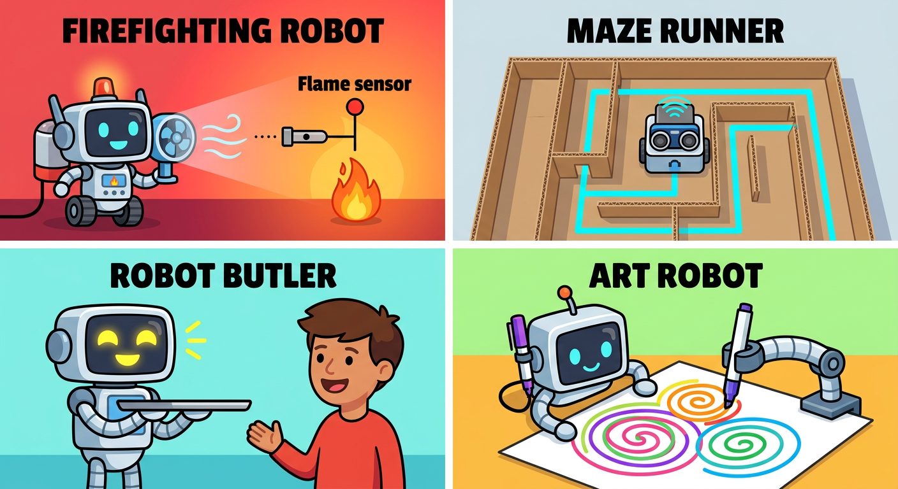
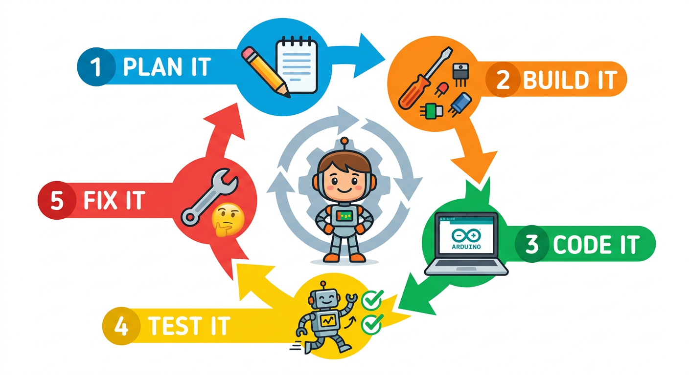

# Lesson 50: Final Capstone Project -- Your Robot Challenge

**Module:** 6 -- Robotics Projects (GRAND FINALE)
**Difficulty:** Star-5 Expert
**Session Time:** 90--120 minutes (split across 2--3 sessions)
**Age:** 6--12 years
**XP Available:** 500 XP (the biggest XP haul of the entire course!)

---

## Your Mission Today

**THIS IS IT, Robot Master!** The grand finale. The ultimate challenge. The moment everything comes together!

You have traveled an incredible journey -- from learning what electricity is in Lesson 1, to holding your Magic Measurement Wand for the first time in Lesson 2, to soldering your first circuit, programming your first Arduino sketch, reading sensors, controlling motors, and building a driving, thinking, seeing robot.

Now it is YOUR turn to create something amazing. Choose one of four **Capstone Projects** below, plan it, build it, program it, test it, and present it. This is YOUR robot. YOUR creation. YOUR masterpiece. Let us go!

---

## Learning Objectives

This capstone project brings together skills from ALL 6 modules:
- Module 1: Component identification, circuit basics, multimeter skills
- Module 2: Ohm's Law, series/parallel circuits, power management
- Module 3: IC understanding, timing circuits, logic
- Module 4: Arduino programming, functions, loops, variables
- Module 5: Sensors, servos, motor control, LCD display
- Module 6: Robot chassis, movement, line following, obstacle avoidance, Bluetooth, robot arm

---

## What You Need

Materials depend on which project you choose -- see individual project sections below. All projects require:

| Item | Qty |
|------|-----|
| Arduino Uno | 1 |
| Your assembled robot platform | 1 |
| USB cable | 1 |
| Multimeter (your Magic Measurement Wand!) | 1 |
| Jumper wires | 20+ |
| Breadboard | 1 |
| Batteries (AA pack + 9V) | as needed |

---

## Choose Your Capstone Project!

```
  +-----------------------------------------------------------+
  |                                                           |
  |   CHOOSE YOUR CHALLENGE:                                  |
  |                                                           |
  |   [A] MAZE SOLVER         -- The Navigator                |
  |   [B] DELIVERY BOT        -- The Courier                  |
  |   [C] SECURITY BOT        -- The Guardian                 |
  |   [D] ROBOT ARM GAME      -- The Crane Operator           |
  |                                                           |
  |   All projects earn the same XP.                          |
  |   Pick the one that excites YOU the most!                 |
  |                                                           |
  +-----------------------------------------------------------+
```



---

## Option A: The Maze Solver

### The Challenge

Build a robot that can navigate through a cardboard maze from start to finish, completely on its own. The robot uses the "left-wall following" algorithm -- it always keeps a wall to its left, which guarantees it will eventually find the exit of any simply-connected maze.

### Extra Materials Needed

| Item | Qty |
|------|-----|
| HC-SR04 ultrasonic sensor | 1 |
| SG90 servo (for scanning) | 1 |
| Cardboard boxes (for maze walls) | 10+ |
| LEDs (green + red) | 2 each |
| Buzzer | 1 |

### How It Works

```
  Left-Wall Following Algorithm:

  1. Check LEFT -- is there a wall?
     YES --> Check AHEAD
     NO  --> Turn LEFT and go forward

  2. Check AHEAD -- is there a wall?
     YES --> Turn RIGHT
     NO  --> Go FORWARD

  3. Repeat forever!

  This simple rule solves most mazes!
```

### The Code

```cpp
// Capstone Option A: Maze Solver Robot
#include <Servo.h>

Servo scanServo;

// Motor pins
int leftENA = 9, leftIN1 = 2, leftIN2 = 3;
int rightENB = 10, rightIN3 = 4, rightIN4 = 5;

// Sensor pins
int trigPin = 11, echoPin = 12;
int servoPin = 6;

// LED and buzzer
int greenLED = A1;
int redLED = A3;
int buzzerPin = 8;

// Settings
int wallDistance = 20;     // cm: anything closer is a wall
int driveSpeed = 160;
int turnSpeed = 170;

void setup() {
  pinMode(leftENA, OUTPUT); pinMode(leftIN1, OUTPUT);
  pinMode(leftIN2, OUTPUT); pinMode(rightENB, OUTPUT);
  pinMode(rightIN3, OUTPUT); pinMode(rightIN4, OUTPUT);
  pinMode(trigPin, OUTPUT); pinMode(echoPin, INPUT);
  pinMode(greenLED, OUTPUT); pinMode(redLED, OUTPUT);
  pinMode(buzzerPin, OUTPUT);

  scanServo.attach(servoPin);
  scanServo.write(90);
  Serial.begin(9600);
  Serial.println("MAZE SOLVER READY!");

  // Startup signal
  tone(buzzerPin, 1000, 300); delay(400);
  tone(buzzerPin, 1500, 300); delay(400);
  tone(buzzerPin, 2000, 500); delay(600);
  noTone(buzzerPin);
  delay(2000);
}

void loop() {
  // Step 1: Check LEFT
  scanServo.write(10);     // Look left
  delay(400);
  int leftDist = getDistance();

  // Step 2: Check AHEAD
  scanServo.write(90);     // Look forward
  delay(400);
  int frontDist = getDistance();

  Serial.print("Left: "); Serial.print(leftDist);
  Serial.print("  Front: "); Serial.println(frontDist);

  if (leftDist > wallDistance) {
    // No wall on left -- turn left!
    Serial.println("-> Turn LEFT (no left wall)");
    digitalWrite(greenLED, HIGH);
    turnLeft(turnSpeed);
    delay(500);
    forward(driveSpeed);
    delay(600);
  }
  else if (frontDist > wallDistance) {
    // Wall on left, but path ahead is clear -- go straight
    Serial.println("-> Go FORWARD");
    digitalWrite(greenLED, HIGH);
    digitalWrite(redLED, LOW);
    forward(driveSpeed);
    delay(400);
  }
  else {
    // Wall on left AND ahead -- turn right
    Serial.println("-> Turn RIGHT (wall ahead)");
    digitalWrite(redLED, HIGH);
    tone(buzzerPin, 800, 100); delay(150); noTone(buzzerPin);
    stopRobot();
    delay(200);
    turnRight(turnSpeed);
    delay(500);
  }

  stopRobot();
  delay(100);
}

int getDistance() {
  digitalWrite(trigPin, LOW); delayMicroseconds(2);
  digitalWrite(trigPin, HIGH); delayMicroseconds(10);
  digitalWrite(trigPin, LOW);
  long dur = pulseIn(echoPin, HIGH, 30000);
  if (dur == 0) return 999;
  return dur * 0.034 / 2;
}

void forward(int speed) {
  digitalWrite(leftIN1, HIGH); digitalWrite(leftIN2, LOW);
  digitalWrite(rightIN3, HIGH); digitalWrite(rightIN4, LOW);
  analogWrite(leftENA, speed); analogWrite(rightENB, speed);
}

void turnLeft(int speed) {
  digitalWrite(leftIN1, LOW); digitalWrite(leftIN2, HIGH);
  digitalWrite(rightIN3, HIGH); digitalWrite(rightIN4, LOW);
  analogWrite(leftENA, speed); analogWrite(rightENB, speed);
}

void turnRight(int speed) {
  digitalWrite(leftIN1, HIGH); digitalWrite(leftIN2, LOW);
  digitalWrite(rightIN3, LOW); digitalWrite(rightIN4, HIGH);
  analogWrite(leftENA, speed); analogWrite(rightENB, speed);
}

void stopRobot() {
  digitalWrite(leftIN1, LOW); digitalWrite(leftIN2, LOW);
  digitalWrite(rightIN3, LOW); digitalWrite(rightIN4, LOW);
}
```

### Build the Maze

```
  Example Maze (top view):

  +--+--+--+--+--+
  |START|     |   |
  +  +--+  +  +  +
  |  |     |     |
  +  +  +--+--+  +
  |     |        |
  +--+  +  +--+--+
  |     |  |     |
  +  +--+  +  +  +
  |           |END|
  +--+--+--+--+--+

  Use cardboard walls at least 15cm tall.
  Make corridors wide enough for the robot + 5cm on each side.
```

### Success Criteria

- Robot enters the maze and navigates without human help
- Robot reaches the exit (or makes significant progress)
- LEDs indicate robot state (green = moving, red = wall detected)
- Buzzer sounds when wall is detected ahead

---

## Option B: The Delivery Bot

### The Challenge

Build a robot that follows a line track with multiple "stations." At each station, the robot stops, plays a delivery notification sound, waits 3 seconds, then continues to the next station. It even counts how many deliveries it has made and displays the count on the Serial Monitor (or LCD if available).

### Extra Materials Needed

| Item | Qty |
|------|-----|
| IR line sensors | 2 |
| Black electrical tape | 1 roll |
| White poster board | 1 large sheet |
| Colored tape or markers (for station markers) | 1 |
| LEDs (green + yellow) | 2 each |
| Buzzer | 1 |
| LCD display with I2C (optional) | 1 |

### How It Works

```
  Delivery Route:

  [START/HOME]
      |
      | (black line)
      |
  [Station 1] -- BEEP! Wait 3 sec
      |
      | (black line)
      |
  [Station 2] -- BEEP! Wait 3 sec
      |
      | (black line)
      |
  [Station 3] -- BEEP! Wait 3 sec
      |
      | (black line)
      |
  [START/HOME] -- All deliveries complete!
```

Stations are marked by a perpendicular black tape line crossing the track. When BOTH sensors see black at the same time, the robot knows it has arrived at a station.

### The Code

```cpp
// Capstone Option B: Delivery Bot
// Line following with station stops

// Motor pins
int leftENA = 9, leftIN1 = 2, leftIN2 = 3;
int rightENB = 10, rightIN3 = 4, rightIN4 = 5;

// Sensor pins
int leftSensor = 7;
int rightSensor = 8;

// LED and buzzer
int greenLED = A1;
int yellowLED = A2;
int buzzerPin = A5;

// Delivery tracking
int deliveryCount = 0;
int totalStations = 3;
bool atStation = false;

// Speed settings
int driveSpeed = 150;
int turnSpeed = 130;

void setup() {
  pinMode(leftENA, OUTPUT); pinMode(leftIN1, OUTPUT);
  pinMode(leftIN2, OUTPUT); pinMode(rightENB, OUTPUT);
  pinMode(rightIN3, OUTPUT); pinMode(rightIN4, OUTPUT);
  pinMode(leftSensor, INPUT); pinMode(rightSensor, INPUT);
  pinMode(greenLED, OUTPUT); pinMode(yellowLED, OUTPUT);
  pinMode(buzzerPin, OUTPUT);

  Serial.begin(9600);
  Serial.println("=== DELIVERY BOT READY ===");
  Serial.print("Stations to deliver: ");
  Serial.println(totalStations);

  // Startup jingle
  tone(buzzerPin, 523, 150); delay(200);
  tone(buzzerPin, 659, 150); delay(200);
  tone(buzzerPin, 784, 300); delay(400);
  noTone(buzzerPin);
  delay(2000);
}

void loop() {
  int L = digitalRead(leftSensor);
  int R = digitalRead(rightSensor);

  // Check for station (both sensors on black)
  if (L == LOW && R == LOW) {
    if (!atStation) {
      // ARRIVED AT STATION!
      atStation = true;
      deliveryCount++;
      stopRobot();

      Serial.print("DELIVERY #");
      Serial.print(deliveryCount);
      Serial.println(" -- ARRIVED AT STATION!");

      // Delivery notification
      digitalWrite(yellowLED, HIGH);
      digitalWrite(greenLED, LOW);

      // Play delivery sound
      for (int i = 0; i < 3; i++) {
        tone(buzzerPin, 1200, 200); delay(300);
      }
      noTone(buzzerPin);

      Serial.println("Delivering... please wait");
      delay(3000);  // Simulate delivery time

      Serial.println("Delivery complete! Moving on...");
      digitalWrite(yellowLED, LOW);

      // Check if all deliveries done
      if (deliveryCount >= totalStations) {
        Serial.println("=== ALL DELIVERIES COMPLETE! ===");
        celebrationDance();
        while(1);  // Stop program
      }

      // Drive forward past the station marker
      forward(driveSpeed);
      delay(500);
    }
  }
  else {
    atStation = false;

    // Standard line following
    if (L == HIGH && R == HIGH) {
      forward(driveSpeed);
      digitalWrite(greenLED, HIGH);
    }
    else if (L == LOW && R == HIGH) {
      // Turn left
      digitalWrite(leftIN1, LOW); digitalWrite(leftIN2, LOW);
      digitalWrite(rightIN3, HIGH); digitalWrite(rightIN4, LOW);
      analogWrite(leftENA, 0); analogWrite(rightENB, turnSpeed);
    }
    else if (L == HIGH && R == LOW) {
      // Turn right
      digitalWrite(leftIN1, HIGH); digitalWrite(leftIN2, LOW);
      digitalWrite(rightIN3, LOW); digitalWrite(rightIN4, LOW);
      analogWrite(leftENA, turnSpeed); analogWrite(rightENB, 0);
    }
  }

  delay(10);
}

void celebrationDance() {
  Serial.println("*** CELEBRATION DANCE! ***");
  for (int i = 0; i < 3; i++) {
    turnLeft(180); delay(500);
    turnRight(180); delay(500);
  }
  stopRobot();
  // Victory melody
  tone(buzzerPin, 523, 200); delay(250);
  tone(buzzerPin, 659, 200); delay(250);
  tone(buzzerPin, 784, 200); delay(250);
  tone(buzzerPin, 1047, 500); delay(600);
  noTone(buzzerPin);
}

void forward(int speed) {
  digitalWrite(leftIN1, HIGH); digitalWrite(leftIN2, LOW);
  digitalWrite(rightIN3, HIGH); digitalWrite(rightIN4, LOW);
  analogWrite(leftENA, speed); analogWrite(rightENB, speed);
}

void turnLeft(int speed) {
  digitalWrite(leftIN1, LOW); digitalWrite(leftIN2, HIGH);
  digitalWrite(rightIN3, HIGH); digitalWrite(rightIN4, LOW);
  analogWrite(leftENA, speed); analogWrite(rightENB, speed);
}

void turnRight(int speed) {
  digitalWrite(leftIN1, HIGH); digitalWrite(leftIN2, LOW);
  digitalWrite(rightIN3, LOW); digitalWrite(rightIN4, HIGH);
  analogWrite(leftENA, speed); analogWrite(rightENB, speed);
}

void stopRobot() {
  digitalWrite(leftIN1, LOW); digitalWrite(leftIN2, LOW);
  digitalWrite(rightIN3, LOW); digitalWrite(rightIN4, LOW);
}
```

### Build the Delivery Route

- Create a loop track with black tape on white poster board
- Add perpendicular black tape lines at 3 "stations"
- Label each station with a number

### Success Criteria

- Robot follows the line smoothly
- Stops at each station and plays notification sound
- Counts deliveries correctly
- Celebration dance after all deliveries complete

---

## Option C: The Security Bot

### The Challenge

Build a robot that patrols a pre-programmed route autonomously, using a PIR motion sensor to detect intruders. When motion is detected, the robot stops, flashes red warning lights, sounds an alarm, and displays "INTRUDER ALERT!" on the Serial Monitor. After 5 seconds, it resumes patrol.

### Extra Materials Needed

| Item | Qty |
|------|-----|
| PIR motion sensor | 1 |
| HC-SR04 ultrasonic sensor | 1 |
| Red LEDs | 2 |
| Blue LEDs | 2 |
| Buzzer | 1 |
| LCD display with I2C (optional) | 1 |

### How It Works

```
  Security Bot Behavior:

  PATROL MODE:
  - Blue LEDs on (police lights!)
  - Drives a pre-programmed patrol route
  - Ultrasonic sensor avoids obstacles
  - PIR sensor constantly watching for movement

  ALERT MODE (motion detected):
  - STOP immediately
  - Red LEDs flash rapidly
  - Alarm sounds (loud buzzer!)
  - Serial/LCD shows "INTRUDER ALERT!"
  - Wait 5 seconds
  - Return to PATROL MODE
```

### The Code

```cpp
// Capstone Option C: Security Bot

// Motor pins
int leftENA = 9, leftIN1 = 2, leftIN2 = 3;
int rightENB = 10, rightIN3 = 4, rightIN4 = 5;

// Sensor pins
int pirPin = A0;
int trigPin = 11, echoPin = 12;

// LED and buzzer
int blueLED1 = A1;
int blueLED2 = A2;
int redLED1 = A3;
int redLED2 = A4;
int buzzerPin = 8;

// State
bool patrolMode = true;
int patrolStep = 0;
unsigned long patrolTimer = 0;

// Patrol route timing (in milliseconds)
int patrolRoute[][2] = {
  {1, 3000},   // 1=forward for 3 seconds
  {2, 600},    // 2=turn right for 0.6 seconds
  {1, 2000},   // forward 2 seconds
  {2, 600},    // turn right
  {1, 3000},   // forward 3 seconds
  {2, 600},    // turn right
  {1, 2000},   // forward 2 seconds
  {2, 600}     // turn right (completes the rectangle)
};
int routeLength = 8;

int driveSpeed = 160;

void setup() {
  pinMode(leftENA, OUTPUT); pinMode(leftIN1, OUTPUT);
  pinMode(leftIN2, OUTPUT); pinMode(rightENB, OUTPUT);
  pinMode(rightIN3, OUTPUT); pinMode(rightIN4, OUTPUT);
  pinMode(pirPin, INPUT);
  pinMode(trigPin, OUTPUT); pinMode(echoPin, INPUT);
  pinMode(blueLED1, OUTPUT); pinMode(blueLED2, OUTPUT);
  pinMode(redLED1, OUTPUT); pinMode(redLED2, OUTPUT);
  pinMode(buzzerPin, OUTPUT);

  Serial.begin(9600);
  Serial.println("=== SECURITY BOT ACTIVATED ===");
  Serial.println("Patrol mode: ON");
  Serial.println("PIR sensor calibrating...");

  delay(10000);  // PIR needs 10 seconds to calibrate
  Serial.println("PIR calibrated. Starting patrol!");

  patrolTimer = millis();
}

void loop() {
  // Check PIR sensor ALWAYS
  if (digitalRead(pirPin) == HIGH) {
    intruderAlert();
    patrolTimer = millis();  // Reset patrol timer after alert
  }

  // Check for obstacles
  int dist = getDistance();
  if (dist < 20 && dist > 0) {
    // Obstacle in path -- stop and turn
    stopRobot();
    delay(300);
    turnRight(180);
    delay(600);
    patrolTimer = millis();
    return;
  }

  // Execute patrol route
  unsigned long elapsed = millis() - patrolTimer;
  int action = patrolRoute[patrolStep][0];
  int duration = patrolRoute[patrolStep][1];

  if (elapsed < (unsigned long)duration) {
    // Still executing current step
    if (action == 1) {
      forward(driveSpeed);
      // Police light effect
      policeLights();
    } else {
      turnRight(180);
    }
  } else {
    // Move to next step
    patrolStep = (patrolStep + 1) % routeLength;
    patrolTimer = millis();
    Serial.print("Patrol step: ");
    Serial.println(patrolStep);
  }
}

void intruderAlert() {
  Serial.println("!!! INTRUDER ALERT !!!");
  stopRobot();

  // Flash red lights and sound alarm for 5 seconds
  unsigned long alertStart = millis();
  while (millis() - alertStart < 5000) {
    // Flash red LEDs
    digitalWrite(redLED1, HIGH); digitalWrite(redLED2, LOW);
    tone(buzzerPin, 1500, 100);
    delay(150);
    digitalWrite(redLED1, LOW); digitalWrite(redLED2, HIGH);
    tone(buzzerPin, 2000, 100);
    delay(150);
  }
  noTone(buzzerPin);
  digitalWrite(redLED1, LOW);
  digitalWrite(redLED2, LOW);
  Serial.println("Alert cleared. Resuming patrol.");
}

void policeLights() {
  // Alternating blue LEDs
  static unsigned long lastToggle = 0;
  static bool toggle = false;
  if (millis() - lastToggle > 300) {
    toggle = !toggle;
    digitalWrite(blueLED1, toggle ? HIGH : LOW);
    digitalWrite(blueLED2, toggle ? LOW : HIGH);
    lastToggle = millis();
  }
}

int getDistance() {
  digitalWrite(trigPin, LOW); delayMicroseconds(2);
  digitalWrite(trigPin, HIGH); delayMicroseconds(10);
  digitalWrite(trigPin, LOW);
  long dur = pulseIn(echoPin, HIGH, 30000);
  if (dur == 0) return 999;
  return dur * 0.034 / 2;
}

void forward(int speed) {
  digitalWrite(leftIN1, HIGH); digitalWrite(leftIN2, LOW);
  digitalWrite(rightIN3, HIGH); digitalWrite(rightIN4, LOW);
  analogWrite(leftENA, speed); analogWrite(rightENB, speed);
}

void turnRight(int speed) {
  digitalWrite(leftIN1, HIGH); digitalWrite(leftIN2, LOW);
  digitalWrite(rightIN3, LOW); digitalWrite(rightIN4, HIGH);
  analogWrite(leftENA, speed); analogWrite(rightENB, speed);
}

void stopRobot() {
  digitalWrite(leftIN1, LOW); digitalWrite(leftIN2, LOW);
  digitalWrite(rightIN3, LOW); digitalWrite(rightIN4, LOW);
}
```

### Success Criteria

- Robot patrols a rectangular route repeatedly
- PIR sensor detects human movement
- Alarm activates with flashing red lights and buzzer
- Robot resumes patrol after alert clears
- Avoids obstacles during patrol

---

## Option D: The Robot Arm Game

### The Challenge

Build a timed game using your robot arm! Set up a game board with target zones. The player controls the arm with potentiometers (or joystick), picks up small objects, and tries to place them in the correct zones before the timer runs out. Score points for each successful placement!

### Extra Materials Needed

| Item | Qty |
|------|-----|
| SG90 servo motors | 3 |
| 10k-ohm potentiometers | 3 |
| Buzzer | 1 |
| LEDs (green, yellow, red) | 1 each |
| Small objects (erasers, LEGO, candy) | 6 |
| Cardboard for game board | 1 |
| Markers/tape (for target zones) | 1 |
| LCD display with I2C (optional) | 1 |

### How It Works

```
  Game Board Layout:

  +-------+-------+-------+
  |  RED  | GREEN | BLUE  |   <-- Target Zones (5 pts each)
  | ZONE  | ZONE  | ZONE  |
  +-------+-------+-------+
  |                       |
  |   [Objects to pick up]|   <-- Starting area
  |    o  o  o  o  o  o   |
  |                       |
  +-------+-------+-------+
              ^
              |
         [ROBOT ARM]
```

### The Code

```cpp
// Capstone Option D: Robot Arm Game
#include <Servo.h>

Servo baseServo;
Servo shoulderServo;
Servo elbowServo;

// Potentiometer pins
int basePot = A0;
int shoulderPot = A1;
int elbowPot = A2;

// Game elements
int buzzerPin = 8;
int greenLED = A3;
int yellowLED = A4;
int redLED = A5;
int scoreButton = 7;  // Press when item placed in zone

// Game state
int score = 0;
int gameTime = 60;  // seconds
unsigned long gameStart;
bool gameActive = false;

// Note definitions
#define NOTE_C4 262
#define NOTE_E4 330
#define NOTE_G4 392
#define NOTE_C5 523

void setup() {
  baseServo.attach(3);
  shoulderServo.attach(5);
  elbowServo.attach(6);

  pinMode(buzzerPin, OUTPUT);
  pinMode(greenLED, OUTPUT);
  pinMode(yellowLED, OUTPUT);
  pinMode(redLED, OUTPUT);
  pinMode(scoreButton, INPUT_PULLUP);

  Serial.begin(9600);
  Serial.println("=== ROBOT ARM GAME ===");
  Serial.println("Place objects in the starting area.");
  Serial.println("Press the score button to start!");

  // Home position
  baseServo.write(90);
  shoulderServo.write(90);
  elbowServo.write(90);

  // Wait for button press to start
  Serial.println("Press button to START...");
  while (digitalRead(scoreButton) == HIGH) {
    // Blink yellow LED while waiting
    digitalWrite(yellowLED, HIGH);
    delay(300);
    digitalWrite(yellowLED, LOW);
    delay(300);
  }

  // Countdown
  Serial.println("3...");
  tone(buzzerPin, NOTE_C4, 300); delay(1000);
  Serial.println("2...");
  tone(buzzerPin, NOTE_C4, 300); delay(1000);
  Serial.println("1...");
  tone(buzzerPin, NOTE_C4, 300); delay(1000);
  Serial.println("GO!!!");
  tone(buzzerPin, NOTE_C5, 500); delay(600);
  noTone(buzzerPin);

  gameActive = true;
  gameStart = millis();
  digitalWrite(greenLED, HIGH);
}

void loop() {
  if (!gameActive) return;

  // Check timer
  unsigned long elapsed = (millis() - gameStart) / 1000;
  int remaining = gameTime - elapsed;

  if (remaining <= 0) {
    // GAME OVER!
    gameOver();
    return;
  }

  // Time warnings
  if (remaining <= 10) {
    digitalWrite(greenLED, LOW);
    digitalWrite(redLED, HIGH);
    if (remaining <= 5) {
      // Urgent beeping
      tone(buzzerPin, 2000, 50); delay(60); noTone(buzzerPin);
    }
  } else if (remaining <= 30) {
    digitalWrite(greenLED, LOW);
    digitalWrite(yellowLED, HIGH);
  }

  // Read potentiometers and control arm
  int baseAngle = map(analogRead(basePot), 0, 1023, 0, 180);
  int shoulderAngle = map(analogRead(shoulderPot), 0, 1023, 0, 180);
  int elbowAngle = map(analogRead(elbowPot), 0, 1023, 0, 180);

  baseServo.write(baseAngle);
  shoulderServo.write(shoulderAngle);
  elbowServo.write(elbowAngle);

  // Check for score button press
  if (digitalRead(scoreButton) == LOW) {
    score += 5;
    Serial.print("SCORE! Total: ");
    Serial.print(score);
    Serial.print(" pts | Time left: ");
    Serial.print(remaining);
    Serial.println(" sec");

    // Score sound
    tone(buzzerPin, NOTE_E4, 100); delay(120);
    tone(buzzerPin, NOTE_G4, 200); delay(250);
    noTone(buzzerPin);

    delay(500);  // Debounce
  }

  // Print status every second
  static unsigned long lastPrint = 0;
  if (millis() - lastPrint > 1000) {
    Serial.print("Time: "); Serial.print(remaining);
    Serial.print("s  Score: "); Serial.print(score);
    Serial.print("  Arm: B="); Serial.print(baseAngle);
    Serial.print(" S="); Serial.print(shoulderAngle);
    Serial.print(" E="); Serial.println(elbowAngle);
    lastPrint = millis();
  }

  delay(20);
}

void gameOver() {
  gameActive = false;
  stopArm();

  Serial.println("========================");
  Serial.println("   GAME OVER!");
  Serial.print("   FINAL SCORE: ");
  Serial.print(score);
  Serial.println(" pts");
  Serial.println("========================");

  // Game over melody
  tone(buzzerPin, NOTE_G4, 300); delay(350);
  tone(buzzerPin, NOTE_E4, 300); delay(350);
  tone(buzzerPin, NOTE_C4, 600); delay(700);
  noTone(buzzerPin);

  // Flash all LEDs
  for (int i = 0; i < 10; i++) {
    digitalWrite(greenLED, HIGH); digitalWrite(yellowLED, HIGH);
    digitalWrite(redLED, HIGH);
    delay(200);
    digitalWrite(greenLED, LOW); digitalWrite(yellowLED, LOW);
    digitalWrite(redLED, LOW);
    delay(200);
  }

  // Show rating
  if (score >= 25) Serial.println("RATING: ROBOT CHAMPION!");
  else if (score >= 15) Serial.println("RATING: Skilled Operator!");
  else if (score >= 5) Serial.println("RATING: Getting There!");
  else Serial.println("RATING: Keep Practicing!");
}

void stopArm() {
  baseServo.write(90);
  shoulderServo.write(90);
  elbowServo.write(90);
}
```

### Success Criteria

- Arm responds smoothly to potentiometer input
- Timer counts down and game ends at 0
- Score button works and tracks points
- LED colors change based on time remaining
- Fun game-over sequence plays

---

## For ALL Capstone Projects



### Step 1: Plan It (15 min)

Before building, answer these questions:

```
MY CAPSTONE PROJECT PLAN
========================

Project chosen: _________ (A, B, C, or D)

Sensors I will use:
1. _________________
2. _________________
3. _________________

Actuators I will use:
1. _________________
2. _________________

What my robot needs to do:
1. _________________
2. _________________
3. _________________

Materials I need to gather: _________________

Biggest challenge I expect: _________________
```

**Award: +20 XP for completing the project plan!**

---

### Step 2: Build It (30--45 min)

- Assemble hardware
- Wire all connections
- Double-check EVERYTHING before powering on

**Award: +40 XP for completing the build!**

---

### Step 3: Code It (20--30 min)

- Use the starter code for your chosen project
- Customize settings for your robot
- Upload and test

**Award: +40 XP for getting the code running!**

---

### Step 4: Test and Tune (15--20 min)

- Run the project multiple times
- Adjust speed, timing, threshold values
- Fix any bugs

**Award: +30 XP for successful testing!**

---

### Step 5: Wand Check -- Full Robot Health Check (10 min)

> "Before the big demo, let us run a FULL diagnostic on your robot using your Magic Measurement Wand. This is what engineers do before every important test!"

**Complete Robot Health Check:**

```
ROBOT DIAGNOSTIC REPORT
=======================

1. Power Systems:
| Measurement               | Expected     | Reading | Pass? |
|---------------------------|-------------|---------|-------|
| Motor battery voltage     | 5.5--6.5V    |         |       |
| Arduino battery voltage   | 8.5--9.5V    |         |       |
| 5V rail (under load)      | 4.5--5.0V    |         |       |

2. Motor System:
| Measurement               | Expected     | Reading | Pass? |
|---------------------------|-------------|---------|-------|
| Left motor voltage (running) | 4.0--5.5V |         |       |
| Right motor voltage (running)| 4.0--5.5V |         |       |

3. Sensors:
| Measurement               | Expected     | Reading | Pass? |
|---------------------------|-------------|---------|-------|
| Sensor VCC                | 5.0V         |         |       |
| Sensor signal (active)    | 0--5V range  |         |       |

4. Communication:
| Measurement               | Expected     | Reading | Pass? |
|---------------------------|-------------|---------|-------|
| Bluetooth VCC (if used)   | 5.0V         |         |       |

5. Continuity Checks:
| Connection                | Beep? |
|---------------------------|-------|
| GND rail continuity       |       |
| Motor wires to driver     |       |
| Sensor wires              |       |
```

> "If ALL checks pass, your robot is READY for the big demo. If anything fails, track down the problem and fix it. A good engineer never demos without a full diagnostic!"

**Award: +50 XP for completing the full robot health check!**

---

### Step 6: Demo Day! (10--15 min)

**Present your robot to family, friends, or class!**

Your presentation should include:
1. **Introduction:** What is your robot? What does it do?
2. **Components Tour:** Point to and name at least 5 components
3. **Live Demo:** Show the robot in action
4. **How It Works:** Explain the code logic in simple terms
5. **Wand Demo:** Show one measurement with the Magic Measurement Wand
6. **What I Learned:** Share the coolest thing you learned in this course

> "You are not just showing a robot. You are showing EVERYTHING you learned across 50 lessons. You went from 'What is electricity?' to building a thinking, moving, sensing robot. That is incredible!"

**Award: +50 XP for a successful demo presentation!**

---

## Quick Quiz -- Earn Bonus XP!

**Question 1:** How many modules are in the Electronics to Robotics course?

- A) 4
- B) 5
- C) 6

**(Correct: C -- +20 XP!)**

**Question 2:** What are the three superpowers of the Magic Measurement Wand?

- A) Voltage, resistance, and continuity
- B) Speed, distance, and temperature
- C) Color, brightness, and sound

**(Correct: A -- +20 XP!)**

**Question 3:** What does "autonomous" mean for a robot?

- A) It is very expensive
- B) It makes its own decisions and operates without human control
- C) It only works indoors

**(Correct: B -- +20 XP!)**

**Question 4:** Why do professional engineers run diagnostics before a demo?

- A) To waste time
- B) To find and fix problems BEFORE they cause failures during the demo
- C) To impress people with their multimeter

**(Correct: B -- +20 XP!)**

---

## Lesson 50 Complete!


```
  =============================================

     ROBOT MASTER BADGE UNLOCKED!
     CIRCUIT CHAMPION BADGE UNLOCKED!

     *** COURSE GRADUATION ***

     _____________________ has completed the
     Electronics to Robotics Course!

     50 Lessons Mastered!

     Skills unlocked across ALL modules:
     [check] Electronic component identification
     [check] Resistor color codes
     [check] Circuit building (series + parallel)
     [check] Ohm's Law calculations
     [check] Multimeter mastery (voltage, resistance, continuity)
     [check] IC circuits (555 timer, logic gates)
     [check] Arduino programming
     [check] Sensor interfacing
     [check] Motor and servo control
     [check] Robot chassis assembly
     [check] Line following
     [check] Obstacle avoidance
     [check] Wireless Bluetooth control
     [check] Robot arm mechanics
     [check] Capstone project completion!

  =============================================
```

**XP Breakdown:**
| Activity | XP |
|----------|-----|
| Project planning | 20 |
| Build completion | 40 |
| Code running | 40 |
| Testing and tuning | 30 |
| Full Wand health check | 50 |
| Demo presentation | 50 |
| Quiz (4 questions) | 80 |
| **TOTAL POSSIBLE** | **310** |

---

## COURSE COMPLETE -- CELEBRATION!

```
  =====================================================================

     CONGRATULATIONS, ROBOT MASTER!

     You have completed the ENTIRE Electronics to Robotics course!

     You started as someone who had never touched a circuit.
     Now you BUILD ROBOTS.

     Think about everything you learned:
     - What electricity IS
     - How every component works
     - How to read your Magic Measurement Wand like a pro
     - How to write code that brings machines to life
     - How to build a robot that THINKS FOR ITSELF

     That is not just learning electronics.
     That is ENGINEERING.

     You are now officially a ROBOT MASTER and CIRCUIT CHAMPION.

     What will you build NEXT?

  =====================================================================
```

---

## Cumulative XP -- All 6 Modules

| Module | Topic | Total XP |
|--------|-------|----------|
| 1 | Electronic Components Basics | 2,030 |
| 2 | Building Simple Circuits | 2,100 |
| 3 | Integrated Circuits (ICs) | 2,200 |
| 4 | Arduino Microcontroller | 2,400 |
| 5 | Sensors and Actuators | 2,300 |
| 6 | Robotics Projects | 2,490 |
| **GRAND TOTAL** | | **13,520** |

**Grand XP Ranks:**
| Rank | XP Required |
|------|-------------|
| Beginner Tinkerer | 0--2,000 |
| Circuit Explorer | 2,001--5,000 |
| Electronics Builder | 5,001--8,000 |
| Arduino Engineer | 8,001--11,000 |
| Robot Master | 11,001--13,000 |
| Circuit Champion | 13,001--13,520 |

---

## All Module 6 Badges

| Badge | Lesson |
|-------|--------|
| Robot Builder | Lesson 43 |
| Movement Master | Lesson 44 |
| Line Tracker | Lesson 45 |
| Obstacle Navigator | Lesson 46 |
| Robot Personality Designer | Lesson 47 |
| Wireless Commander | Lesson 48 |
| Robot Arm Engineer | Lesson 49 |
| Robot Master + Circuit Champion | Lesson 50 |

---

## Reflection Questions (Talk Through Together)

> "What was the hardest lesson in the entire course? How did you get past it?"

> "What was your favorite project across all 50 lessons?"

> "Which Magic Measurement Wand superpower did you use the most?"

> "If you could build any robot in the world, what would it do?"

> "Who would you like to teach about electronics?"

---

## What is Next?

The course is complete, but the journey never ends! Here are ideas for continuing:

**Level Up Projects:**
- Build a robot with a camera (Raspberry Pi + OpenCV)
- Create a 3D-printed custom robot chassis
- Enter a robotics competition (First LEGO League, VEX, Science Olympiad)
- Build a quadcopter drone
- Create a home automation system

**Learn More:**
- Python programming for Raspberry Pi
- PCB design (KiCad)
- 3D modeling and printing (TinkerCAD, Fusion 360)
- Advanced sensors (GPS, IMU, cameras)
- Machine learning for robotics

**Communities:**
- Local maker spaces
- School robotics clubs
- Arduino and Raspberry Pi forums
- YouTube: Paul McWhorter, Great Scott, Andreas Spiess

---

## Parent/Instructor Notes

- The capstone project is designed for 2--3 sessions. Do not rush it!
- Let the child CHOOSE their project -- ownership drives motivation.
- The demo presentation is extremely important -- it solidifies learning through teaching.
- Consider recording the demo for a portfolio.
- The full robot diagnostic with the Wand is a professional engineering skill -- celebrate how far they have come.
- If possible, invite family or friends to watch the demo. Audience motivates excellence!
- Print a certificate of completion -- the "Robot Master + Circuit Champion" badge is their graduation.
- This course has built real engineering skills: systematic thinking, debugging, measurement, documentation, and presentation. These skills transfer to ANY field.

---

## Troubleshooting (General Capstone)

| Problem | Fix |
|---------|-----|
| Not sure which project to pick | Pick the one that sounds the most FUN |
| Project feels too hard | Use the starter code as-is first, then modify |
| Running out of Arduino pins | Use analog pins (A0-A5) as digital pins |
| Robot does not work during demo | Run the full Wand diagnostic to find the issue |
| Servo/motor draws too much power | Use external battery pack for motors/servos |
| Code too complex to debug | Add Serial.println() statements to trace the problem |
| Lost motivation | Look back at Lesson 1 -- see how far you have come! |

---

## Navigation

| | |
|:---|---:|
| [← Lesson 49: Robot Arm Introduction (Servo-Based)](lesson-49-robot-arm-introduction.md) | [Module Overview →](README.md) |
