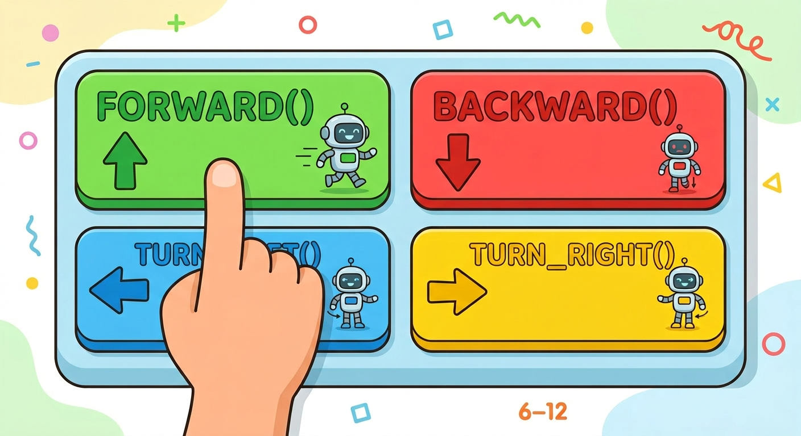
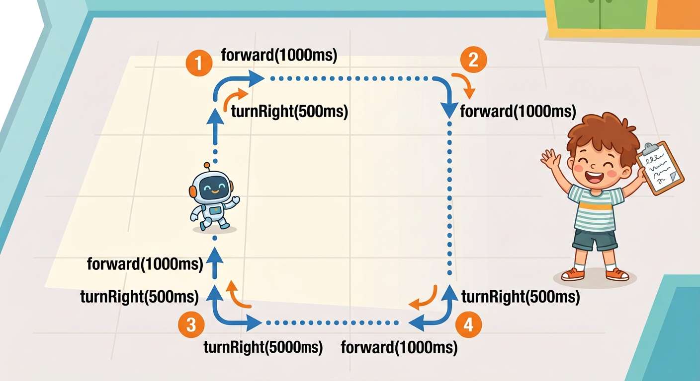

# Lesson 44: Robot Movement Functions -- Quick Reference

**Age:** 6--12 years | **Time:** 45--50 min | **XP:** 220

---

## Reusable Movement Commands



**Instead of controlling motors directly, use movement functions:**

```cpp
void forward(int duration) {
  digitalWrite(motorLeftPos, HIGH);
  digitalWrite(motorRightPos, HIGH);
  delay(duration);
}

void backward(int duration) {
  digitalWrite(motorLeftPos, LOW);
  digitalWrite(motorRightPos, LOW);
  delay(duration);
}

void turnRight(int duration) {
  digitalWrite(motorLeftPos, HIGH);
  digitalWrite(motorRightPos, LOW);
  delay(duration);
}

void turnLeft(int duration) {
  digitalWrite(motorLeftPos, LOW);
  digitalWrite(motorRightPos, HIGH);
  delay(duration);
}
```

**Why functions?** Write code ONCE, use it ANYWHERE. Like a video game remote control!

---

## Program the Square



**In setup():**
```cpp
forward(1000);      // 1 second forward
turnRight(500);     // 0.5 second turn
forward(1000);      // 1 second forward
turnRight(500);     // 0.5 second turn
// ... repeat for all 4 sides
```

**Result:** Robot drives a perfect square!

---

## Function Benefits

| Benefit | Example |
|---------|---------|
| **Reusable** | Call `forward(1000)` as many times as you want |
| **Readable** | `forward()` is clearer than 4 digitalWrite() calls |
| **Changeable** | Modify the function once, all calls update automatically |
| **Scalable** | Build complex paths from simple commands |

---

## Real-World Uses

- 🤖 **Warehouse robots** - Navigate using simple movement commands
- 🎮 **Game robots** - Respond to player input with pre-programmed moves
- 🏭 **Factory automation** - Follow patterns and routes
- 🚗 **Self-driving cars** - Build routes from basic maneuvers

---

## Quick Quiz

**Q1:** What is the advantage of using movement functions?
**A:** You write the code once and reuse it many times.

**Q2:** How would you make the robot drive a circle?
**A:** Use `forward()` and small `turnRight()` commands in rapid sequence.

**Q3:** What does `delay()` do?
**A:** It pauses the robot's motion for a specified time in milliseconds.

---

## Challenge

**Make a triangle path:** Program your robot to drive in an equilateral triangle. Hint: You'll need different forward and turn times!

---

*Print this with the square path diagram for reference!*
