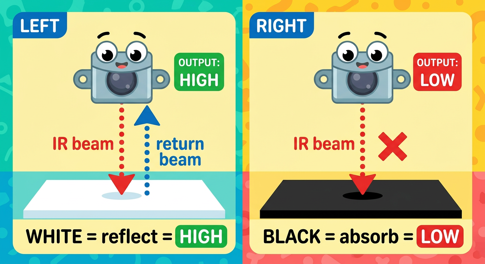
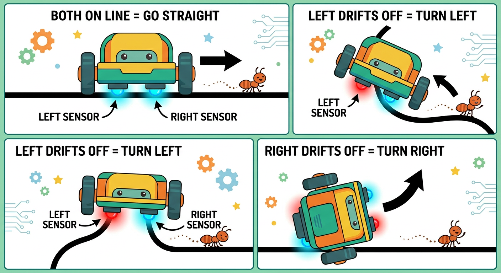

# Lesson 45: Line-Following Robot -- Quick Reference

**Age:** 6--12 years | **Time:** 60--70 min | **XP:** 280

---

## How IR Line Sensors Work



**IR (Infrared) sensors detect light reflection:**

| Surface | IR Light | Output |
|---------|----------|--------|
| WHITE | Bounces back (reflects) | HIGH (1) |
| BLACK | Absorbs (no reflection) | LOW (0) |

**Analogy:** A flashlight bouncing off a mirror vs absorbing into black velvet!

---

## The Line-Following Algorithm



**Your robot has TWO IR sensors underneath:**

```cpp
if (leftSensor == HIGH && rightSensor == HIGH) {
  // Both on white = go straight
  forward(100);
}
else if (leftSensor == LOW && rightSensor == HIGH) {
  // Left drifted onto black line = turn left
  turnLeft(50);
}
else if (leftSensor == HIGH && rightSensor == LOW) {
  // Right drifted onto black line = turn right
  turnRight(50);
}
```

---

## Wiring the IR Sensors

| IR Sensor | Arduino Pin |
|-----------|------------|
| VCC | 5V |
| GND | GND |
| OUT (Left) | Digital 7 |
| OUT (Right) | Digital 8 |

---

## Real-World Uses

- 🏗️ **Warehouse delivery robots** - Follow painted floor lines
- 🚗 **Self-driving cars** - Lane detection and lane-keeping
- 🤖 **Factory robots** - Navigate assembly lines
- 🎮 **Robot competitions** - Line maze races

---

## Quick Quiz

**Q1:** What does an IR sensor detect?
**A:** It detects whether a surface is black (absorbs) or white (reflects) infrared light.

**Q2:** What happens when the left sensor goes LOW (drifts onto black)?
**A:** The robot turns left to stay on the white road.

**Q3:** How many IR sensors does the line-following robot have?
**A:** Two — one left, one right.

---

## Challenge

**Speed optimization:** Increase the speed of line-following without losing the track. What's the fastest speed your robot can follow the line reliably?

---

*Print this with the IR sensor diagram and algorithm flowchart for reference!*
