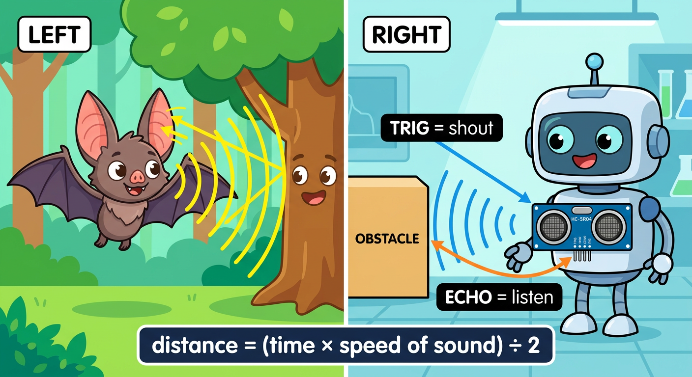
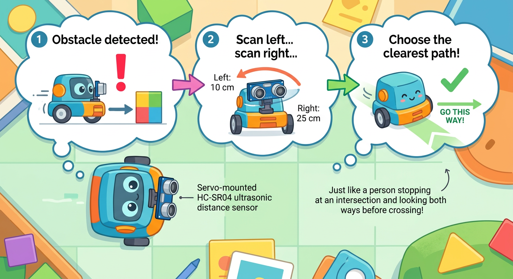

# Lesson 46: Obstacle-Avoiding Robot -- Quick Reference

**Age:** 6--12 years | **Time:** 70--80 min | **XP:** 300

---

## The Bat Analogy



**Bats use echolocation — sound bounces off objects and returns!**

**HC-SR04 ultrasonic sensor uses the same idea:**

| Component | Bat | HC-SR04 |
|-----------|-----|---------|
| "Shout" | Sound wave from mouth | TRIG pin fires pulse |
| "Listen" | Sound echo in ears | ECHO pin receives return |
| Calculate | Brain times the echo | Arduino measures time |
| Find distance | Distance = (time × speed) ÷ 2 | Same formula! |

---

## Obstacle Detection



**The robot's three-step decision process:**

1. **SCAN:** Send ultrasonic pulse, measure distance
2. **DECIDE:** Is obstacle close (< 20cm)?
3. **ACT:** Stop, turn, and rescan

```cpp
int distance = measureDistance(); // Get distance in cm

if (distance < 20) {
  // Obstacle close! Stop and scan
  forward(0);
  delay(100);

  // Scan left
  int distLeft = scanLeft();

  // Scan right
  int distRight = scanRight();

  // Choose clearer path
  if (distLeft > distRight) {
    turnLeft(300);
  } else {
    turnRight(300);
  }
}
else {
  // No obstacle = go forward!
  forward(200);
}
```

---

## HC-SR04 Wiring

| HC-SR04 Pin | Arduino Pin |
|-----------|------------|
| VCC | 5V |
| GND | GND |
| TRIG | Digital 9 |
| ECHO | Digital 10 |

**Distance formula:**
```
Distance (cm) = (Echo Time in microseconds × 0.0343) ÷ 2
```

---

## Real-World Uses

- 🚗 **Self-driving cars** - Parking sensors and collision avoidance
- 🤖 **Warehouse robots** - Navigate aisles autonomously
- 📦 **Delivery drones** - Detect and avoid obstacles mid-flight
- 🏗️ **Construction robots** - Map environments safely

---

## Quick Quiz

**Q1:** How does an HC-SR04 sensor work?
**A:** It fires an ultrasonic pulse, measures how long the echo takes to return, and calculates distance.

**Q2:** What does "TRIG" stand for?
**A:** Trigger — it sends the ultrasonic pulse.

**Q3:** If the ECHO time is 600 microseconds, what is the distance?
**A:** (600 × 0.0343) ÷ 2 = ~10.3 cm

---

## Challenge

**Build a safety perimeter:** Program your robot to maintain a 30cm distance from any obstacle. It should follow objects while maintaining that distance!

---

*Print this with the ultrasonic and decision flowchart diagrams for reference!*
