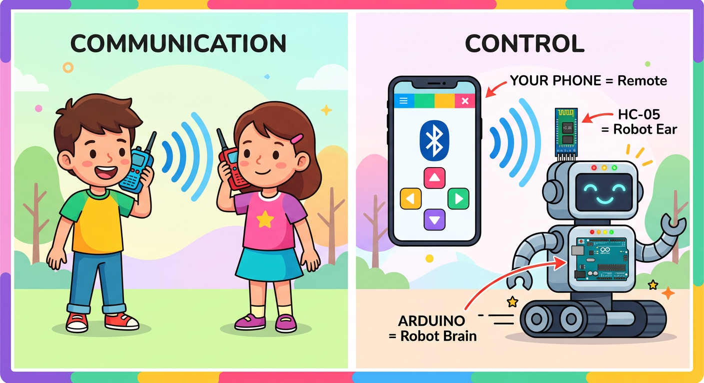
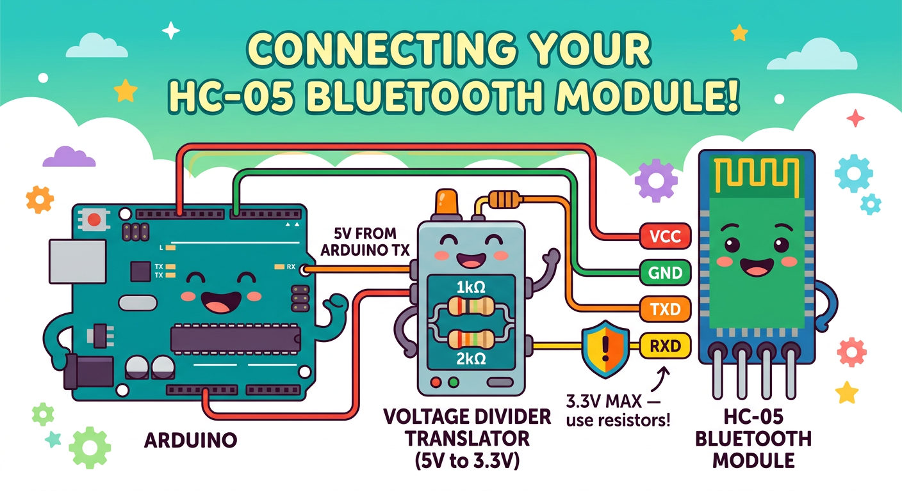

# Lesson 48: Remote-Controlled Robot (Bluetooth) -- Quick Reference

**Age:** 6--12 years | **Time:** 80--90 min | **XP:** 320

---

## Wireless Control with Bluetooth



**Bluetooth = Walkie-talkie communication:**

| Walkie-Talkie | Bluetooth Robot |
|---------------|-----------------|
| Two kids talk wirelessly | Your phone talks to robot |
| Radio waves in the air | Bluetooth radio waves |
| "Come here!" is the command | Tap a button on your phone |
| Other radio hears and responds | HC-05 module hears and responds |
| Both sides receive instantly | Instant wireless control |

**Parts:**
- **Your Phone** = Remote control
- **HC-05 Module** = Robot's wireless ear
- **Arduino** = Robot's brain interpreting commands

---

## Bluetooth Module Wiring



**The HC-05 module has 4 pins:**

| HC-05 Pin | Arduino Pin | Notes |
|-----------|------------|-------|
| VCC | 5V | Power from Arduino |
| GND | GND | Ground |
| TXD | RX (0) | Data OUT from HC-05 → Arduino RX |
| RXD | TX (1) with divider | Data IN to HC-05 ← Arduino TX |

**⚠️ IMPORTANT:** HC-05 RXD expects 3.3V max, but Arduino TX outputs 5V!

**Voltage divider resistors for RXD:**
- 1kΩ resistor from Arduino TX
- 2kΩ resistor to GND
- Junction connects to HC-05 RXD
- This divides 5V down to ~3.3V safely!

---

## Read Bluetooth Commands

```cpp
char command;

void setup() {
  Serial.begin(9600);  // HC-05 usually runs at 9600 baud
}

void loop() {
  if (Serial.available()) {
    command = Serial.read();

    if (command == 'F') {
      forward(500);    // Forward
    }
    else if (command == 'B') {
      backward(500);   // Backward
    }
    else if (command == 'L') {
      turnLeft(300);   // Turn left
    }
    else if (command == 'R') {
      turnRight(300);  // Turn right
    }
    else if (command == 'S') {
      forward(0);      // Stop
    }
  }
}
```

---

## Real-World Bluetooth Applications

- 🎮 **Game controllers** - Wireless game pads
- 🎧 **Headphones** - Bluetooth audio streaming
- 📱 **Smart home** - Phone controls lights, locks, thermostats
- 🤖 **Drones** - Remote control via smartphone app
- ⌚ **Smartwatches** - Connected to your phone

---

## Quick Quiz

**Q1:** What does HC-05 do?
**A:** Receives Bluetooth signals from your phone and sends them to the Arduino via serial communication.

**Q2:** Why do we need a voltage divider on RXD?
**A:** HC-05 expects 3.3V max, but Arduino TX outputs 5V. The resistor divider steps it down safely.

**Q3:** What serial speed does HC-05 typically use?
**A:** 9600 baud (bits per second).

---

## Challenge

**Custom app commands:** Extend the code to accept additional commands like 'H' for speed boost, 'X' for spin, and '?' to beep the buzzer!

---

*Print this with the HC-05 wiring diagram and voltage divider resistor values for reference!*
